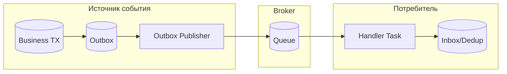

[← Назад к индексу части](index.md)
[↑ К глобальному плану](../../mastery_plan.md)

## 20.4 Event-driven handlers

### Цель раздела

Понять, как строить реакцию на доменные события через Celery без потери согласованности и с контролируемой повторной обработкой.

### В этом разделе главное

- событие — это факт, а не удаленный вызов произвольного кода;
- outbox/inbox закрывают дыры между транзакцией и доставкой;
- reprocessing должен быть встроен заранее, а не "когда-нибудь потом".

### Термины

| Термин | Определение |
|---|---|
| **Domain event** | Событие предметной области, фиксирующее факт изменения состояния бизнеса. |
| **Outbox table** | Таблица в БД источника, где надежно фиксируются события для дальнейшей публикации. |
| **Inbox dedup** | Хранилище у потребителя, фиксирующее уже обработанные event_id. |
| **Replay** | Повторное воспроизведение событий из истории. |

### Теория и правила

Без outbox возможна "дыра": бизнес-коммит успешен, но публикация в брокер не произошла из-за сбоя сети/брокера.

Outbox-подход:

1. В той же транзакции сохраняем бизнес-изменение и запись в outbox.
2. Отдельный publisher читает outbox и отправляет в брокер.
3. После подтверждения помечает запись доставленной.

Inbox-подход у потребителя:

- до применения side effects проверяем, не обрабатывали ли `event_id` ранее;
- если обрабатывали, пропускаем без повторного эффекта.

Почему это дает слабую связность сервисов:

- producer не знает внутреннюю логику consumer-а;
- consumer не блокирует producer и не увеличивает latency его API;
- добавление нового consumer-а обычно не требует изменений в producer-е.

#### Mermaid-схема

### Пошагово

1. Зафиксируй event schema и versioning.
2. Включи outbox в транзакционный контур источника.
3. Реализуй надежный publisher.
4. На стороне consumer добавь inbox-дедупликацию.
5. Добавь процесс безопасного replay.

Мини-runbook reprocessing:

1. Выбрать период/набор `event_id`, который нужно переиграть.
2. Проверить совместимость текущих consumers с историческими версиями событий.
3. Запустить replay в отдельной очереди с ограничением throughput.
4. Сверить контрольные метрики и только потом "долить" в основной контур.

### Граничные случаи (edge cases)

- событие пришло в consumer раньше, чем локальная read-model успела обновиться;
- часть consumers перешла на новую версию payload, часть — еще нет;
- replay запускается повторно по тому же диапазону и обязан быть безопасным.

Для таких случаев:

- добавляй versioned handlers;
- не смешивай "бизнес обработано" и "инфраструктурно доставлено";
- сохраняй reason codes для пропуска/повтора обработки.

### Практика / реальные сценарии

- "Заказ подтвержден" -> обновить CRM, отправить уведомления, обновить аналитику;
- "Платеж принят" -> выдать доступ, обновить подписку, записать аудит;
- "Документ загружен" -> стартовать модерацию, OCR и enrichment.

### Как запомнить

Событие — это "мы сообщаем факт", а не "мы удаленно командуем сервисом сделать как надо".

### Типичные ошибки

- смешивать доменные события и внутренние технические логи в одной схеме;
- делать handler неидемпотентным;
- не хранить event version и ломать старых consumers.

### Что будет, если...

- **...нет inbox-дедупа у потребителя?**  
  При redelivery легко получить повторные списания/уведомления/изменения статусов.

- **...нет replay-механизма?**  
  После бага или простоя ты не сможешь корректно восстановить пропущенную обработку.

### Проверь себя

1. Почему `transaction.on_commit` и outbox — не одно и то же?

Ответ

`on_commit` лишь откладывает действие до коммита, но не гарантирует надежную доставку в брокер после него. Outbox дает устойчивую запись события в той же транзакции и возможность дозагрузки при сбоях.

2. Зачем у consumer хранить inbox, если producer уже "старается не дублировать"?

Ответ

Потому что дубли могут появиться на любом участке доставки. Защита должна быть end-to-end: и у источника, и у получателя.

### Запомните

Event-driven архитектура на Celery требует не только очереди, но и дисциплины данных: outbox, inbox, versioning, replay.

---
