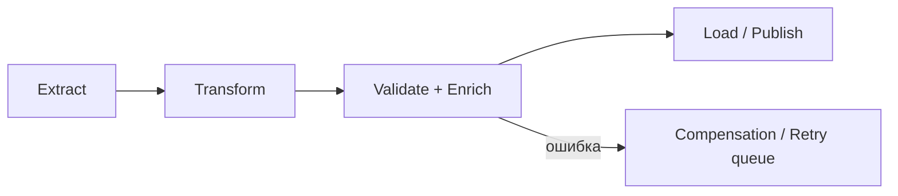

[← Назад к индексу части](index.md)
[↑ К глобальному плану](../../mastery_plan.md)

## 20.5 Pipeline processing

### Цель раздела

Научиться проектировать многошаговые цепочки обработки (ETL, документы, модерация, enrichment) так, чтобы каждая стадия была прозрачной, тестируемой и восстанавливаемой.

### В этом разделе главное

- пайплайн должен иметь явные стадии и контракты между ними;
- между стадиями лучше передавать ссылку на артефакт и метаданные, а не тяжелые payload;
- нужны checkpoints и стратегия компенсации при сбоях.

### Термины

| Термин | Определение |
|---|---|
| **Stage contract** | Явный формат входа/выхода отдельного шага пайплайна. |
| **Artifact store** | Хранилище промежуточных данных (S3/MinIO/Blob), куда кладутся крупные артефакты. |
| **Compensation** | Действия по откату или нейтрализации последствий в случае сбоя. |

### Теория и правила

Пайплайновая обработка обычно включает:

1. Extract (получили/прочитали данные),
2. Transform (преобразовали),
3. Validate/Enrich (обогатили, проверили),
4. Load/Publish (сохранили/отдали downstream).

Ключевая идея: каждый шаг должен быть независимым модулем, а не "внутренним if-ом" одной большой задачи.

Связь с подпунктами плана:

- `extract -> transform -> load` — основной каркас;
- `document/image processing` — частный случай пайплайна с тяжелыми артефактами;
- `data enrichment` — обогащение через внешние источники;
- `moderation pipelines` — многослойная проверка контента с разными SLA по этапам.

#### Картинка в голове



### Пошагово

1. Выдели стадии с четкими границами ответственности.
2. Для каждой стадии определи вход, выход, SLA, retry policy.
3. Крупные файлы выноси в object storage, в задачу передавай ссылку.
4. Реализуй централизованный job run tracker.
5. Добавь компенсационные шаги для необратимых операций.

### Практический шаблон stage-контракта

```json
{
  "pipeline_run_id": "run_2026_04_21_001",
  "stage": "transform",
  "input_ref": "s3://bucket/raw/doc_555.json",
  "output_ref": "s3://bucket/normalized/doc_555.json",
  "schema_version": "v2",
  "trace_id": "9b8b4afc9c8f",
  "attempt": 1
}
```

### Пример сценария

**Модерация изображений:**

- Stage 1: загрузить файл и сохранить в object storage;
- Stage 2: сделать ресайз и нормализацию;
- Stage 3: прогнать модель модерации;
- Stage 4: записать вердикт и уведомить клиента.

### Как запомнить

Pipeline = "конвейер станков": каждый станок делает свою операцию, и его можно чинить/масштабировать отдельно.

### Типичные ошибки

- склеить все стадии в одну задачу "для простоты";
- не хранить промежуточные статусы;
- передавать мегабайты бинарных данных прямо в broker payload.

### Что будет, если...

- **...нет stage-level метрик?**  
  Невозможно понять, где именно бутылочное горлышко: в I/O, CPU, внешнем API или финальной записи.

- **...нет компенсации для частично завершенного пайплайна?**  
  Система оставляет "полузавершенные" артефакты и нечистые состояния.

- **...все стадии используют одинаковый retry-policy без учета природы ошибок?**  
  Одни этапы будут ретраиться бессмысленно (логические ошибки), а другие — недоретраиваться (временные сетевые сбои).

### Проверь себя

1. Почему пайплайн из независимых стадий обычно лучше giant task?

<details><summary>Ответ</summary>

Потому что дает наблюдаемость, выборочные ретраи, масштабирование по стадиям и более простое тестирование/изменение отдельных шагов.

</details>

2. Зачем выносить тяжелые данные в object storage?

<details><summary>Ответ</summary>

Чтобы не перегружать брокер большими payload, уменьшить serialization overhead и сделать передачу между стадиями более устойчивой.

</details>

### Запомните

Pipeline — это архитектура стадий и контрактов, а не просто цепочка вызовов.

---
