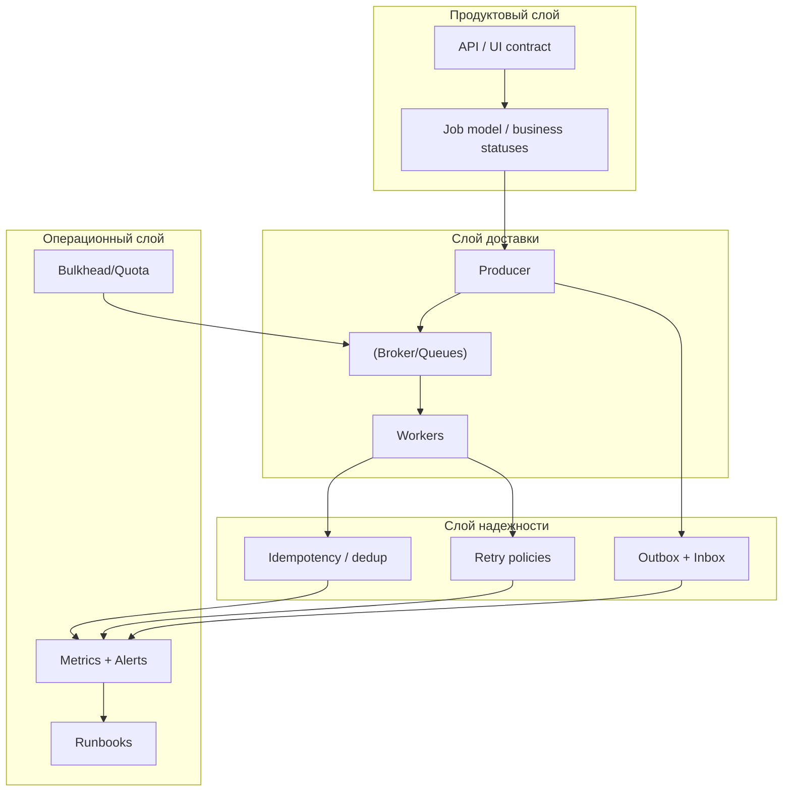

[← Назад к индексу части](index.md)
[↑ К глобальному плану](../../mastery_plan.md)

## 20.8 Практический операционный контур (дополнение к части 20)

Этот раздел сохраняет прикладные материалы части 20, но вынесен перед финальными блоками, чтобы структура конца файла соответствовала принятому шаблону.

### Сквозные production-кейсы (с цифрами)

#### Кейс 1. E-commerce: отчеты и платежи в одном кластере

**Проблема:** ночной batch отчетов блокировал обработку критичных post-payment задач.  
**Симптомы до исправления:**

- `critical` queue age p95: 8-12 минут;
- 3 инцидента за месяц по задержке фискальных уведомлений;
- перегрузка worker-ов в ночное окно.

**Решение:**

1. Введен `Bulkhead`: отдельные очереди `critical.billing` и `batch.analytics`.
2. Выделены отдельные worker-пулы и квоты concurrency.
3. Для batch включен ограниченный window запуска и лимиты на fan-out.

**Результат через 2 недели:**

- `critical` queue age p95 снизился до 20-35 секунд;
- инциденты по платежному постпроцессингу: 0;
- общий wall-clock batch вырос на 12%, но бизнес-SLA критичного контура стабилизирован.

#### Проверь себя

1. Почему рост wall-clock batch на 12% в этом кейсе считается приемлемым?

<details><summary>Ответ</summary>

Потому что основная цель — защитить critical SLA. Замедление вторичного контура допустимо, если оно контролируемо и не бьет по ключевому бизнес-потоку.

</details>

#### Кейс 2. Media platform: модерация контента

**Проблема:** giant task модерации (resize + OCR + ML + notification) часто падал и трудно дебажился.  
**Симптомы до исправления:**

- среднее время расследования инцидента: 2-3 часа;
- retry повторял весь "комбайн", включая уже успешные шаги;
- нагрузка на broker росла из-за больших payload.

**Решение:**

1. Перевод на `Pipeline` из 4 стадий с stage-контрактами.
2. Тяжелые артефакты вынесены в object storage, в payload оставлены ссылки.
3. Введены stage-level метрики и checkpoint-и.

**Результат через месяц:**

- MTTR снизился до 25-40 минут;
- доля повторной лишней работы уменьшилась примерно на 60%;
- стабильность SLA по модерации выросла, несмотря на рост входного потока.

#### Проверь себя

1. Что дало основной вклад в снижение MTTR в этом кейсе?

<details><summary>Ответ</summary>

Разбиение giant task на стадии и stage-level наблюдаемость. Это позволило быстро локализовать место сбоя и чинить точечно, а не в рамках всего "комбайна".

</details>

### Диагностика: симптом -> что проверить -> что делать

| Симптом | Что проверить сначала | Типовое действие |
|---|---|---|
| `202` отдается, но пользователь "не видит результата" | Есть ли отдельный `job store` и переходы статусов | Внедрить/починить async request/reply контракт |
| Быстро растет lag в critical задачах | Не делят ли те же worker-ы best-effort и critical | Включить bulkhead, разнести capacity |
| Много дублей side effects | Есть ли idempotency key + inbox dedup | Добавить дедуп в producer/consumer контур |
| Batch нестабилен и дорог в повторном запуске | Как устроены chunking/checkpoint/retry | Перейти на selective retry и чекпоинты |
| Event replay ломает consumers | Есть ли versioned schema/handlers | Ввести versioning и backward-compatible обработку |
| Pipeline "черный ящик" | Есть ли stage-level метрики и trace id | Разбить наблюдаемость по стадиям |

#### Проверь себя

1. Почему в таблице сначала "что проверить", а не "сразу что делать"?

<details><summary>Ответ</summary>

Потому что без диагностики легко лечить не ту причину. Последовательность "симптом -> проверка -> действие" уменьшает риск ошибочного и дорогого вмешательства.

</details>

### Карта "пункт плана -> практическая реализация"

Этот блок нужен для финальной самопроверки полноты: не только "тема упомянута", но и "понятно, что делать руками".

| Пункт плана | Где раскрыт | Что внедрить на практике |
|---|---|---|
| `20.1 уведомления / вторичные события / не-критичные интеграции` | `20.1` | Fire-and-forget + idempotency + метрики side effects |
| `20.2 пользователь запускает job / читает статус / хранит результат` | `20.2` | Job API (`POST/GET`), status model, retention policy |
| `20.3 nightly jobs / pagination / fan-out / aggregation` | `20.3` | Seek pagination, chunking, selective retry, finalize step |
| `20.4 доменные события / слабая связность / outbox-inbox / повторная обработка` | `20.4` | Outbox publisher, inbox dedup, replay runbook |
| `20.5 ETL / document-image / enrichment / moderation` | `20.5` | Stage contracts, object storage refs, stage-level SLA |
| `20.6 очереди важное-неважное / защита критичного фона / quota` | `20.6` | Separate queues + worker pools + domain quotas |
| `20.7 Celery вместо дизайна / костыль контрактов / god-task / каскад без диагностики` | `20.7` | ADR, schema versioning, decomposition, correlation observability |

#### Проверь себя

1. Как эта карта помогает не "проскочить" подпункт плана при внедрении?

<details><summary>Ответ</summary>

Каждому подпункту сопоставлено конкретное действие. Если действие не внедрено, значит подпункт не закрыт практически, даже если теоретически описан.

</details>

### Runbook первых 15 минут инцидента

Когда фон "поехал", важно не угадывать, а действовать в порядке снижения неопределенности.

1. **Понять масштаб:** какие очереди/домены затронуты, есть ли влияние на critical SLA.
2. **Проверить слой доставки:** publish rate, queue depth, age, worker liveness.
3. **Проверить слой исполнения:** какие типы задач падают/висят, есть ли retry storm.
4. **Проверить слой контрактов:** не было ли свежего релиза со сменой payload/schema.
5. **Ограничить blast radius:** включить/ужесточить bulkhead, временно приглушить best-effort.
6. **Стабилизировать и только потом чинить глубоко:** сначала восстановить SLA критичных задач, затем проводить root-cause анализ.

Короткая визуальная памятка:

```text
Detect -> Scope -> Isolate -> Stabilize -> Diagnose -> Recover -> Postmortem
```

#### Проверь себя

1. Почему изоляция (`Isolate`) поставлена раньше глубокого анализа причины?

<details><summary>Ответ</summary>

Потому что в инциденте сначала важно ограничить ущерб и стабилизировать SLA. Root-cause анализ нужен, но после снижения текущего воздействия.

</details>

### Мини-checklist перед внедрением паттерна в production

Перед запуском любого из паттернов проверь:

- определен ли явный контракт payload + версия;
- есть ли ответственный owner за контур;
- есть ли метрики "публикация -> очередь -> выполнение -> результат";
- определены ли retryable и non-retryable ошибки;
- подготовлены ли runbook-и на "backlog growth", "retry storm", "stuck tasks";
- проверена ли изоляция критичного и вторичного фона.

#### Проверь себя

1. Какой пункт checklist чаще всего пропускают и почему это опасно?

<details><summary>Ответ</summary>

Часто пропускают явные runbook-и. В итоге при инциденте команда импровизирует, теряет время и может усилить проблему неверными действиями.

</details>

### Архитектурные слои и границы ответственности

Чтобы не смешивать роли компонентов, полезно держать в голове многослойную картину:



Ключевая идея этой схемы: паттерн считается зрелым только тогда, когда есть не только код задач, но и явные решения в слоях надежности и эксплуатации.

#### Проверь себя

1. Что будет, если в системе хорошо проработан слой доставки, но провален операционный слой?

<details><summary>Ответ</summary>

Система может "работать в обычный день", но становиться непрозрачной и дорогой в инцидентах: без метрик, алертов и runbook-ов сложно быстро восстановить SLA.

</details>

### Метрики качества реализации паттернов

Ниже практическая матрица: что измерять, чтобы понимать, что паттерн не просто "запустился", а реально работает стабильно.

| Паттерн | Минимальные метрики | Что считать тревожным |
|---|---|---|
| Fire-and-forget | success rate, queue age p95, retry rate | длительный рост age и retries без восстановления |
| Async request/reply | job completion time p95, stuck jobs count, cancel success rate | много job в `running` без прогресса, растущий SLA breach |
| Batch | chunk success ratio, total wall-clock, failed chunk density | повторяющиеся сбои одних и тех же чанков |
| Event-driven | publish->consume lag, dedup hit rate, replay success ratio | высокая доля дублей без safe skip |
| Pipeline | stage latency p95, stage failure ratio, compensation rate | один stage стабильно bottleneck |
| Bulkhead | critical queue lag, quota violations, cross-lane starvation | деградация critical lane при нагрузке best-effort |

Практический совет: не начинай с десятков дашбордов. Сначала введи 5-7 главных метрик, напрямую связанных с рисками части 20, и только потом детализацию.

#### Проверь себя

1. Почему "больше метрик" не всегда означает "лучше наблюдаемость"?

<details><summary>Ответ</summary>

Избыточные метрики без приоритета создают шум. Важно сначала выбрать небольшое ядро метрик, которое напрямую отражает ключевые риски и SLA.

</details>

### Матрица компромиссов по паттернам

| Паттерн | Сложность внедрения | Стоимость эксплуатации | Гибкость | Типичный риск при ошибочной реализации |
|---|---|---|---|---|
| Fire-and-forget | Низкая | Низкая/средняя | Средняя | "тихая" потеря вторичных эффектов |
| Async request/reply | Средняя | Средняя | Высокая | плохой UX из-за неясного lifecycle |
| Batch | Средняя | Средняя/высокая | Высокая | runaway processing и взрыв стоимости |
| Event-driven | Средняя/высокая | Средняя/высокая | Очень высокая | рассинхрон схем и дубли side effects |
| Pipeline | Высокая | Высокая | Очень высокая | сложность диагностики межстадийных сбоев |
| Bulkhead (поверх других) | Средняя | Средняя | Высокая | формальная изоляция без реального эффекта |

Как применять таблицу:

1. Выбери 2-3 кандидата-паттерна под сценарий.
2. Сравни по "сложность/стоимость/риск" с текущей зрелостью команды.
3. Зафиксируй компромисс явно в ADR/архитектурной заметке.

#### Проверь себя

1. Почему нельзя выбирать паттерн только по "самой низкой сложности внедрения"?

<details><summary>Ответ</summary>

Потому что простое внедрение сегодня может дать высокую эксплуатационную стоимость и риски завтра. Нужен баланс сложности, гибкости и устойчивости.

</details>

### Шаблон ADR для выбора паттерна

Чтобы архитектурное решение не терялось в устных договоренностях, фиксируй его в коротком ADR (Architecture Decision Record).

```markdown
# ADR-00X: Выбор паттерна Celery для <сценарий>
