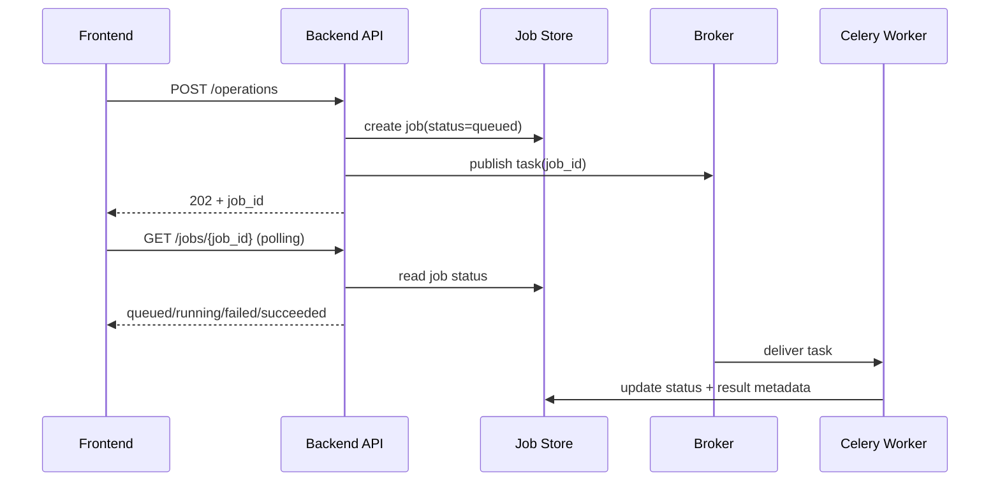

[← Назад к индексу части](index.md)
[↑ К глобальному плану](../celery_mastery_plan.md)

## План ревизии решения
- Когда пересматриваем выбор (триггеры: рост нагрузки, инциденты, новый продуктовый режим)
```

Практический эффект ADR: через 3-6 месяцев команда понимает не только "что сделали", но и "почему именно так", и может безопасно пересмотреть решение.

#### Проверь себя

1. Как ADR снижает вероятность антипаттерна "договорились в чате"?

<details><summary>Ответ</summary>

ADR фиксирует контекст, выбор и причины формально. Это делает решение проверяемым, воспроизводимым и пересматриваемым, а не зависящим от памяти отдельных участников.

</details>

### Как тестировать паттерны (минимальная стратегия)

| Паттерн | Unit | Integration | E2E | Failure/chaos |
|---|---|---|---|---|
| Fire-and-forget | проверка idempotency и retry-классификации | публикация задачи и корректный payload | пользовательский сценарий без блокировки UI/API | отказ внешнего провайдера, оценка retry storm |
| Async request/reply | переходы статусов job | API + broker + worker + job-store | клиентский polling/webhook flow | stuck job, timeout worker, корректность cancel/retry |
| Batch | chunk splitter и aggregate logic | запуск батча на тестовом датасете | полный nightly run в staging | частичные падения chunk-ов, replay по checkpoint |
| Event-driven | versioned handler и dedup logic | outbox publisher + consumer inbox | межсервисный сценарий на событии | дубли, reorder, delayed delivery |
| Pipeline | stage contract validation | связка нескольких stage-очередей | прогон полного pipeline run | падение отдельной стадии, компенсация |
| Bulkhead | routing policy checks | изоляция очередей и worker-пулов | mixed-load сценарий | нагрузочный всплеск best-effort и проверка critical SLA |

Минимальный практический стандарт: на каждый паттерн нужны хотя бы один integration-тест и один failure-сценарий. Без этого архитектура выглядит красивой только "на бумаге".

#### Проверь себя

1. Почему для архитектурных паттернов обязательно иметь failure/chaos сценарии?

<details><summary>Ответ</summary>

Потому что ключевые риски этих паттернов проявляются именно при сбоях: повторы, задержки, перегрузка, частичные отказы. Без таких тестов надежность остается недоказанной.

</details>

### Когда паттерн применять НЕ стоит

Иногда самое сильное архитектурное решение — осознанно не применять конкретный паттерн.

| Паттерн | Когда лучше не использовать | Чем заменить / что рассмотреть |
|---|---|---|
| Fire-and-forget | Когда нужен гарантированный бизнес-результат "здесь и сейчас" | Синхронный API с явной транзакционной границей |
| Async request/reply | Когда операция быстрая и стабильная (< обычного timeout) | Простой синхронный endpoint |
| Batch | Когда данные требуют мгновенной реакции в реальном времени | Event-driven потоковая обработка |
| Event-driven | Когда доменная модель не готова к явным событиям и контрактам | Сначала стабилизировать domain/API контракты |
| Pipeline | Когда нет независимых стадий и этапы логически неразделимы | Упрощенный workflow без искусственного дробления |
| Bulkhead | Когда нагрузка маленькая и нет конфликтующих SLA | Базовая схема, но с готовностью к будущей изоляции |

Ключевая мысль: "больше паттернов" не значит "лучше архитектура". Цель — минимально достаточная сложность под текущие требования.

#### Проверь себя

1. Почему умение "не применять паттерн" считается признаком зрелой архитектуры?

<details><summary>Ответ</summary>

Потому что зрелость — это управление сложностью. Если задача решается проще и надежнее без дополнительного паттерна, усложнение только увеличит стоимость сопровождения.

</details>

### Сквозная схема: фронтенд -> API -> Celery -> результат

Эта диаграмма помогает увидеть общий поток данных и точки, где чаще всего возникают ложные ожидания пользователя.



Где чаще всего ошибаются:

- фронтенд трактует `202` как "операция завершена";
- API не хранит продуктовый статус отдельно от инфраструктурного;
- worker не пишет прогресс/ошибку в понятном для UI формате.

#### Проверь себя

1. Какой самый частый продуктовый баг в этой схеме и почему он возникает?

<details><summary>Ответ</summary>

Ложное ожидание мгновенного результата после `202 Accepted`. Возникает из-за смешения "задача поставлена" и "операция завершена".

</details>

---
