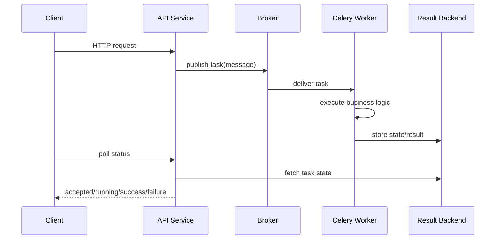

[← Назад к индексу части](index.md)
[↑ К глобальному плану](../../mastery_plan.md)

## Сквозная картина эксплуатации

Иногда сложно понять, где именно "живет" проблема: в API-публикации, брокере, worker-е или backend статусов. Ниже — упрощенная диаграмма сквозного потока, на которую удобно опираться при диагностике.

Как читать эту схему в production:

- если не проходит шаг `API -> Broker`, смотри runbook `broker outage`;
- если проходит `Broker -> Worker`, но нет прогресса, смотри `stuck workers`;
- если `Worker -> Result Backend` нестабилен, смотри `backend outage`;
- если статус долго не меняется при живых шагах, проверяй lag/retry и autoscaling.

---
