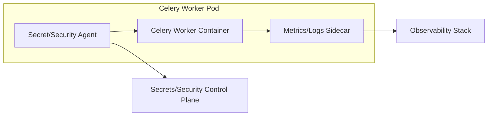

[← Назад к индексу части](index.md)
[↑ К глобальному плану](../mastery_plan.md)

## 21.1 Deployment модели

### Цель раздела

Научиться выбирать модель развертывания Celery по требованиям надежности, команды и инфраструктуры, а не по привычке.

### В этом разделе главное

- одна и та же задача Celery ведет себя по-разному в разных операционных средах;
- главное отличие моделей — не "как запустить", а "как обслуживать, обновлять и чинить";
- stateful/stateless для worker-а — вопрос природы задач и зависимостей.

### Термины

| Термин | Смысл |
|---|---|
| **systemd service** | Юнит Linux для управления процессом worker/beat на VM/bare metal. |
| **Docker Compose** | Локальная/простая оркестрация контейнеров, полезна для небольших продов и staging. |
| **Kubernetes Deployment** | Декларативное управление pod-ами с rolling update и self-healing. |
| **Stateful concern** | Состояние, которое нельзя потерять между рестартами без последствий. |
| **Sidecar/agent** | Соседний контейнер/процесс в pod/host для логов, метрик, secret refresh и др. |

### Теория и правила

1. **systemd** хорошо работает, когда у тебя VM-архитектура, предсказуемый масштаб и опыт ops-команды в Linux.
2. **Docker Compose** удобен для небольших инсталляций, но ограничен по автоматизации recovery и масштабированию.
3. **Kubernetes** дает богатые механизмы жизненного цикла, но требует зрелой платформенной дисциплины.
4. В большинстве случаев Celery worker логически **stateless**, если:
   - все важные данные хранятся вне процесса (БД, object storage, broker/backend),
   - задача идемпотентна и может быть повторена.
5. Worker начинает выглядеть **stateful**, если:
   - есть локальные кэши/файлы, критичные для прогресса;
   - длинные задачи без checkpointing теряют часы работы при рестарте;
   - есть привязка к локальным ресурсам (GPU-модели, локальные индексы).
6. **Sidecar/agent integrations** нужны не "для красоты", а как эксплуатационный слой:
   - лог-агенты собирают stdout/stderr worker-ов централизованно;
   - метрик-агенты/экспортеры публикуют queue lag, failures, retries;
   - secret-агенты обновляют креды без ручного рестарта всего стека;
   - security-агенты (runtime policy, eBPF, audit) повышают контроль прода.

### Пошагово: как выбрать deployment модель

1. Оцени зрелость платформы команды: VM-first или Kubernetes-first.
2. Зафиксируй требования к RTO/RPO и частоте релизов.
3. Определи профиль задач: короткие/длинные, CPU/IO/GPU, доля retriable.
4. Проверь нужную глубину observability и automation.
5. Выбери базовую модель и сразу опиши runbook-и деплоя/rollback.
6. Отдельно определи, какие sidecar/agent-компоненты обязательны для security и observability.

### Сравнение deployment-моделей

| Модель | Сильные стороны | Ограничения | Когда выбирать |
|---|---|---|---|
| **systemd** | Низкий порог, понятные процессы, минимум абстракций | Больше ручной работы при масштабировании/rollout | Небольшой/средний VM-прод |
| **Docker Compose** | Быстрый старт, единый декларативный файл | Слабая история с HA и autoscaling на большом масштабе | Малый прод, staging, внутренние сервисы |
| **Kubernetes** | Сильный lifecycle, autoscaling, self-healing, политики размещения | Высокая сложность платформы | Большой масштаб, много сервисов, частые релизы |

#### Проверь себя (сравнение deployment-моделей)

1. Почему переход с `systemd` на Kubernetes без роста зрелости команды может ухудшить стабильность, а не улучшить?

<details><summary>Ответ</summary>

Потому что добавляется сложность платформы: больше точек отказа, больше операционных концепций (scheduling, probes, policies, rollout semantics). Без дисциплины и опыта команда начинает чаще ошибаться в настройках и реакции на инциденты.

</details>

2. В каком случае `Docker Compose` в проде может быть оправданным, а не «плохой практикой по умолчанию»?

<details><summary>Ответ</summary>

Когда система небольшая, команда компактная, нагрузка предсказуема, а риски и SLA умеренные. Тогда выигрыш в простоте может быть важнее сложности оркестратора.

</details>

### Диаграмма: где живут sidecar/agent



#### Проверь себя (sidecar/agent)

1. Почему sidecar для метрик и логов лучше рассматривать как часть эксплуатации, а не как «опциональный бонус»?

<details><summary>Ответ</summary>

Потому что без централизованного сбора телеметрии сложно быстро локализовать инцидент и доказать, что система восстановилась. Это прямая часть MTTR, а не косметика.

</details>

2. Что сломается в процессах ротации секретов, если игнорировать agent-интеграции?

<details><summary>Ответ</summary>

Часто возникает ручной рестарт сервисов, окно рассинхронизации credentials и повышенный риск аварийного отказа аутентификации в runtime.

</details>

### Простыми словами

Deployment модель — это "дом", где живут worker-ы. Важно не только, как быстро построить дом, но и как там чинить трубы, менять проводку и эвакуироваться при аварии.

### Картинка в голове

```text
           Уровень сложности эксплуатации
systemd  -> низкий порог, ручные процессы
compose  -> средний порог, ограниченная автоматизация
k8s      -> высокий порог, сильная автоматизация и масштаб
```

### Как запомнить

**Формула:** `deployment choice = команда + надежность + частота изменений + профиль задач`.

### Примеры

#### Пример 1: `systemd` для VM-кластера

```ini
[Unit]
Description=Celery Worker
After=network.target redis.service

[Service]
Type=simple
User=celery
WorkingDirectory=/opt/app
Environment="CELERY_APP=app.celery_app"
ExecStart=/opt/venv/bin/celery -A app.celery_app worker -l INFO -Q critical,default --concurrency=8
Restart=always
RestartSec=5

[Install]
WantedBy=multi-user.target
```

#### Пример 2: Deployment в Kubernetes

```yaml
apiVersion: apps/v1
kind: Deployment
metadata:
  name: celery-worker-default
spec:
  replicas: 3
  selector:
    matchLabels:
      app: celery-worker-default
  template:
    metadata:
      labels:
        app: celery-worker-default
    spec:
      containers:
        - name: worker
          image: my-registry/celery-worker:1.0.0
          args: ["celery", "-A", "app.celery_app", "worker", "-l", "INFO", "-Q", "default", "--concurrency=8"]
```

### Практика / реальные сценарии

- **Небольшой SaaS на 3 VM:** часто разумнее начать с `systemd`, но сразу ввести хорошие runbook-и.
- **Платформа с десятками микросервисов:** Kubernetes обычно выигрывает за счет консистентного lifecycle и autoscaling.
- **ML/видео пайплайны:** выделенные worker-группы и отдельные узлы по `nodeSelector/affinity` критичны.

### Типичные ошибки

- переносить локальные "docker-compose привычки" в большой прод без готовности к инцидентам;
- смешивать в одном deployment и критичные, и тяжелые аналитические задачи;
- считать, что наличие оркестратора автоматически делает систему надежной.

### Что будет, если...

- **если модель выбрана слишком сложная для команды:** инциденты будут дольше, чем выгода от автоматизации;
- **если модель слишком простая при высокой нагрузке:** ручные операции станут узким горлышком и источником рисков.

### Проверь себя

1. Почему "Kubernetes всегда лучше" — неверное правило?

<details><summary>Ответ</summary>

Потому что выгода Kubernetes проявляется только при достаточной операционной зрелости и масштабе. Иначе сложность платформы съедает время команды и увеличивает риск ошибок.

</details>

2. Когда worker логически перестает быть stateless?

<details><summary>Ответ</summary>

Когда его корректная работа зависит от локального, трудно воспроизводимого состояния (длинный прогресс без checkpointing, локальные данные/артефакты, привязка к хосту).

</details>

### Запомните

Deployment-модель выбирают не "по моде", а по способности команды стабильно эксплуатировать Celery.

---
