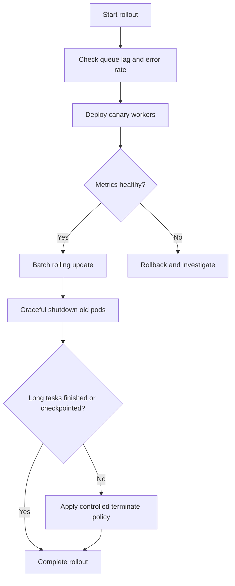

[← Назад к индексу части](index.md)
[↑ К глобальному плану](../mastery_plan.md)

## 21.2 Rolling updates и graceful shutdown

### Цель раздела

Освоить безопасный цикл обновления и перезапуска worker-ов, чтобы не терять контроль над задачами во время деплоя.

### В этом разделе главное

- деплой Celery = работа с задачами, которые уже "в полете";
- правильный drain и graceful shutdown снижают дубли, незавершенные операции и ложные инциденты;
- long-running задачи требуют отдельной стратегии.

### Термины

| Термин | Смысл |
|---|---|
| **Drain** | Перестать брать новые задачи и "доработать хвост". |
| **Graceful shutdown** | Мягкая остановка с шансом корректно завершить текущие задачи. |
| **Revoke** | Отмена задачи (обычно до старта; для выполняемой задачи возможны ограничения). |
| **Terminate** | Принудительное завершение процесса задачи, риск порчи промежуточного состояния. |

### Теория и правила

1. В деплое важно согласовать **time budget**:
   - время завершения коротких задач,
   - timeout на graceful,
   - политика принудительного terminate.
2. Для long-running задач нужны:
   - checkpointing (фиксировать прогресс),
   - дробление на подзадачи,
   - специальная очередь/worker pool.
3. Перед rollout полезно:
   - снизить приток новых задач (если возможно),
   - проверить backlog/lag,
   - убедиться, что мониторинг и алерты в норме.
4. `revoke` и `terminate` — разные инструменты:
   - `revoke` безопаснее и предпочтителен для задач, которые еще не исполняются;
   - `terminate` применяют только при зависании/неуправляемом вреде и всегда с планом компенсации.
5. Безопасный restart worker-а = "новая версия приняла нагрузку, старая корректно осушила in-flight хвост, мониторинг подтверждает норму".

### Пошагово: безопасный rolling update

1. Зафиксируй релизную версию и ее совместимость со старыми сообщениями.
2. Запусти canary worker-ы новой версии на части нагрузки.
3. Проверь ключевые метрики (`queue depth`, `task failures`, `retries`, latency).
4. Запускай rolling update батчами.
5. При остановке pod/process:
   - сигнал на graceful,
   - дождаться drain,
   - только потом hard terminate (если не уложились в окно).
6. После rollout проверь runbook smoke-check.

### Диаграмма жизненного цикла обновления



### Простыми словами

Rolling update — это не "убить старое, поднять новое". Это аккуратная передача эстафеты между worker-ами, чтобы задачи не "упали на землю" посередине пути.

### Картинка в голове

Представь поезд: старый локомотив (старая версия) тянет состав задач. Новый локомотив подцепляется плавно. Нельзя просто отцепить старый на полном ходу.

### Примеры

#### Пример: preStop hook в Kubernetes

```yaml
lifecycle:
  preStop:
    exec:
      command: ["/bin/sh", "-c", "echo 'draining worker'; sleep 20"]
terminationGracePeriodSeconds: 120
```

Идея: дать worker-у шанс завершить текущие короткие задачи до SIGKILL.

#### Пример: последовательность безопасного restart одного worker-а

```text
1) Mark instance for drain
2) Stop consuming new tasks
3) Wait until active tasks <= threshold
4) Revoke queued leftovers if policy allows
5) Restart process/pod
6) Verify: heartbeat OK, consume rate restored, error rate unchanged
```

### Практика / реальные сценарии

- **Сервис с короткими задачами (до 5-10 секунд):** достаточно корректного graceful окна.
- **Сервис с задачами по 30+ минут:** обязательно проектировать checkpointing и отдельный rollout-процесс.
- **Смешанный workload:** разделяй очереди и worker deployment-ы, чтобы длинные задачи не мешали регулярному обновлению.

### Типичные ошибки

- ставить слишком короткий `terminationGracePeriodSeconds`;
- обновлять код, несовместимый с сообщениями, уже лежащими в очереди;
- делать массовый rollout без canary-проверки.

### Что будет, если...

- **если сразу terminate long-running задачи:** можешь потерять часы вычислений и получить дубли после retry;
- **если вообще не контролировать drain:** рост ошибок "task lost in transition" и операционный шум.

### Граничные случаи: когда `terminate` почти всегда плохая идея

| Сценарий | Почему опасно | Что делать вместо |
|---|---|---|
| Задача в середине необратимого внешнего вызова (платеж/списание) | Риск "подвешенного" состояния и дубля при повторе | Дожидаться завершения + компенсационная логика |
| Задача пишет большой результат в хранилище чанками | Terminate может оставить полубитый артефакт | Checkpoint + валидация целостности + controlled retry |
| Массовый terminate при rollout | Одновременный всплеск повторов и backlog | Batch drain и поэтапный restart |

#### Проверь себя (граничные случаи terminate)

1. Почему массовый `terminate` во время деплоя часто создает вторичный инцидент?

<details><summary>Ответ</summary>

Потому что одновременно растут повторы и очередь, увеличивается нагрузка на broker/backend/downstream. Вместо контролируемого обновления система получает «шторм» задач.

</details>

2. Какой принцип должен быть базовым перед применением `terminate`?

<details><summary>Ответ</summary>

Сначала оценить цену потери in-flight прогресса и подготовить компенсацию/безопасный повтор. `Terminate` — крайний аварийный инструмент, а не стандартный шаг rollout.

</details>

### Проверь себя

1. Почему canary перед rolling update важен именно для Celery?

<details><summary>Ответ</summary>

Потому что worker взаимодействует с очередями и уже накопленными сообщениями. Canary рано показывает несовместимости payload, неожиданные retriable ошибки и проблемы производительности новой версии.

</details>

2. Когда `terminate` допустим как инструмент?

<details><summary>Ответ</summary>

Когда исчерпано окно graceful shutdown или задача зависла/вредит системе, и есть заранее согласованная политика компенсации и повторной обработки.

</details>

3. Почему long-running задачи нужно проектировать отдельно от деплоя?

<details><summary>Ответ</summary>

Их длительность конфликтует с регулярными релизными окнами. Без checkpointing или разбиения такие задачи превращают каждое обновление в риск потери прогресса.

</details>

### Запомните

Без грамотного shutdown/rollout даже "стабильный" Celery-код быстро превращается в источник продовых инцидентов.

---
