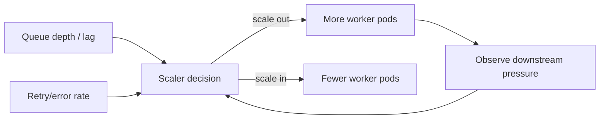

[← Назад к индексу части](index.md)
[↑ К глобальному плану](../mastery_plan.md)

## 21.3 Autoscaling

### Цель раздела

Научиться масштабировать worker-ы по реальной нагрузке так, чтобы уменьшать задержки, но не создавать дребезг и перерасход.

### В этом разделе главное

- autoscaling по CPU одного pod-а часто недостаточен для очередей;
- важны сигналы очереди: depth, lag, rate входа/выхода;
- cooldown и anti-thrashing — обязательные элементы, не "опция".

### Термины

| Термин | Смысл |
|---|---|
| **Queue depth** | Сколько задач сейчас в очереди. |
| **Lag** | Насколько текущая скорость worker-ов отстает от входящего потока. |
| **Cooldown** | Пауза между пересчетами масштаба, чтобы не дергать систему. |
| **Thrashing** | Частое переключение числа реплик вверх-вниз. |
| **KEDA-like scaling** | Масштабирование по внешним метрикам (очереди, lag). |
| **HPA** | Горизонтальное масштабирование в Kubernetes, обычно по CPU/Memory (или custom metrics). |

### Теория и правила

1. Для Celery обычно полезнее масштабировать по **очередной нагрузке**, а не только по CPU.
2. Минимальный набор сигналов:
   - backlog (глубина очереди),
   - lag (время/объем отставания),
   - failure/retry rate.
3. Всегда задавай:
   - `minReplicaCount` (чтобы не уходить в "холодный старт" критичных очередей),
   - `maxReplicaCount` (чтобы не убить кластер и внешние зависимости),
   - cooldown-параметры.
4. Разные классы задач должны масштабироваться независимо.

### HPA vs KEDA-like подход

| Подход | Что хорошо делает | Где слабее | Практический вывод |
|---|---|---|---|
| **HPA по CPU/Memory** | Простая стандартная интеграция, быстрый старт | Не всегда видит реальную "боль" очереди | Подходит как базовый уровень, но часто недостаточен сам по себе |
| **KEDA/queue-metrics** | Учитывает backlog/lag напрямую | Требует качественных метрик и настройки | Для Celery обычно точнее отражает потребность масштабирования |

Практически часто используют комбинацию: queue-based сигнал как основной, а CPU/Memory как защитный ограничитель.

#### Проверь себя (HPA vs KEDA)

1. Почему HPA по CPU может «пропускать» инцидент с lag?

<details><summary>Ответ</summary>

Потому что CPU может быть умеренным, но задачи при этом долгие или блокируются внешними зависимостями. Очередь растет, а CPU-метрика не показывает реальной бизнес-проблемы.

</details>

2. Когда комбинация KEDA + CPU guardrails лучше, чем «только KEDA»?

<details><summary>Ответ</summary>

Когда нужно не только реагировать на очередь, но и ограничивать инфраструктурные риски: перегрев нод, перерасход ресурсов, давление на downstream при слишком быстром scale out.

</details>

### Пошагово: стратегия autoscaling

1. Раздели очереди по бизнес-критичности и профилю задач.
2. Для каждой очереди задай целевую метрику (например, backlog на pod).
3. Настрой правила scale out / scale in.
4. Добавь cooldown и стабилизационное окно.
5. Прогони нагрузочный тест с реалистичным профилем burst.
6. Обнови runbook: что делать, если autoscaling "не догоняет".
7. Проверь downstream-safe лимиты (БД, внешние API, rate limits) и зафиксируй hard guardrails.

### Диаграмма сигналов масштабирования



### Простыми словами

Autoscaling — это термостат для очередей. Но если термостат слишком "нервный", система начинает постоянно включаться/выключаться и жить в нестабильном режиме.

### Картинка в голове

Очередь — это вода в ванне. Входящий поток льет воду, worker-ы сливают. Автомасштабирование должно поддерживать уровень, а не раскачивать ванну волнами.

### Примеры

#### Пример KEDA ScaledObject (упрощенно)

```yaml
apiVersion: keda.sh/v1alpha1
kind: ScaledObject
metadata:
  name: celery-default-scaler
spec:
  scaleTargetRef:
    name: celery-worker-default
  minReplicaCount: 2
  maxReplicaCount: 20
  cooldownPeriod: 120
  triggers:
    - type: redis
      metadata:
        address: redis:6379
        listName: celery
        listLength: "100"
```

### Практика / реальные сценарии

- **Ночной batch burst:** scale out по backlog нужен быстрее обычного, но со строгим `maxReplicaCount`.
- **Критичные платежные задачи:** держим `min replicas` выше нуля для минимальной латентности.
- **Внешний API rate-limited:** scale out worker-ов ограничиваем, чтобы не вызвать лавину 429.

### Когда НЕ нужно масштабировать (сначала лечим причину)

| Симптом | Почему scale out не поможет | Что делать сначала |
|---|---|---|
| Ошибки из-за сломанной внешней зависимости | Больше worker-ов = больше неуспешных вызовов | Ограничить retries, включить backoff/circuit breaker, стабилизировать зависимость |
| Массовые `TypeError`/десериализация после релиза | Проблема в совместимости payload, а не в мощности | Откатить producer или включить dual-read совместимость |
| Одна hot queue/partition перегружена | Бутылочное горлышко в маршрутизации, не в числе pod-ов | Перенастроить routing/sharding, изолировать queue |
| Worker упирается в DB locks | Доп. потребители усиливают contention | Разобрать lock contention, снизить concurrency, оптимизировать запросы |

#### Проверь себя (когда не масштабировать)

1. Почему при `TypeError`/десериализации после релиза масштабирование обычно ухудшает ситуацию?

<details><summary>Ответ</summary>

Потому что увеличивается скорость потребления некорректных сообщений, а значит быстрее растут ошибки/retry/backlog. Нужна совместимость payload, а не больше worker-ов.

</details>

2. Как распознать, что проблема в routing/sharding, а не в нехватке мощности?

<details><summary>Ответ</summary>

Когда перегружен один сегмент/очередь, а остальные worker-ы и очереди недогружены. Это признак дисбаланса распределения, а не общего дефицита compute.

</details>

### Типичные ошибки

- смотреть только CPU и игнорировать реальное отставание очереди;
- агрессивный scale in без стабилизационного окна;
- общая политика autoscaling для всех типов задач.

### Что будет, если...

- **если не задать cooldown:** система войдет в thrashing, а средняя latency может даже вырасти;
- **если слишком высокий max replicas без контроля downstream:** можно "самому себе устроить DDoS" на БД или внешние API.

### Проверь себя

1. Почему queue depth без lag не всегда достаточен?

<details><summary>Ответ</summary>

Одинаковая глубина очереди может означать разную проблему: короткие задачи или очень длинные. Lag добавляет измерение времени/скорости и помогает понять реальную тяжесть отставания.

</details>

2. Что делает cooldown в autoscaling-политике?

<details><summary>Ответ</summary>

Ограничивает частоту пересчета масштаба, чтобы не реагировать на кратковременный шум и не раскачивать систему.

</details>

### Запомните

Хороший autoscaling управляет **очередью как системой**, а не просто "увеличивает pod-ы при высоком CPU".

---
