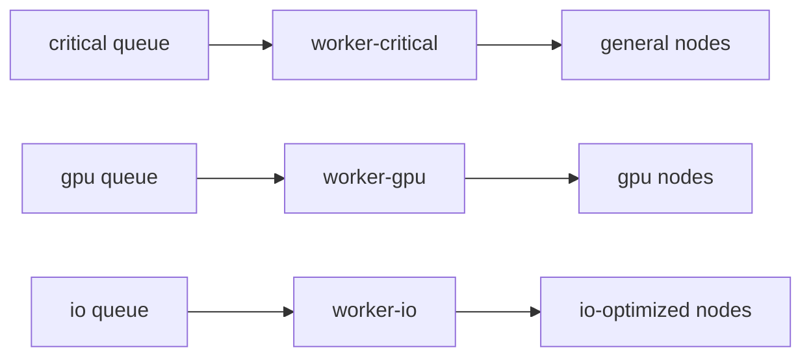

[← Назад к индексу части](index.md)
[↑ К глобальному плану](../mastery_plan.md)

## 21.4 Ресурсы Kubernetes и размещение worker

### Цель раздела

Понять, как правильно задавать ресурсы и placement-политику в Kubernetes, чтобы Celery оставался предсказуемым при реальной нагрузке.

### В этом разделе главное

- requests/limits влияют не только на производительность, но и на стабильность планировщика;
- при долгих задачах отсутствие PDB часто приводит к болезненным прерываниям;
- nodeSelector/affinity нужны для изоляции "особых" worker-ов (GPU, IO-heavy, memory-heavy).

### Термины

| Термин | Смысл |
|---|---|
| **requests** | Гарантированный минимум ресурсов для pod при планировании. |
| **limits** | Верхняя граница ресурсов; при превышении CPU throttling/OOMKill. |
| **PDB** | Ограничение количества pod-ов, которые можно одновременно "выбить" из работы. |
| **nodeSelector/affinity** | Политики размещения pod-а на подходящих нодах. |

### Теория и правила

1. Для Celery нельзя "на глаз" ставить ресурсы: нужен профиль задач.
2. CPU-bound и IO-bound worker-ы должны иметь разные resource class.
3. Для долгих задач PDB и graceful настройки критичны.
4. Отдельные очереди -> отдельные Deployment -> отдельные ресурсы и affinity.

### Пошагово: ресурсная настройка

1. Измерь реальный профиль задачи (CPU, memory, время).
2. Раздели worker-ы по классам нагрузки.
3. Задай адекватные requests/limits.
4. Добавь PDB на критичные deployment-ы.
5. Настрой nodeSelector/affinity для специализированных worker-ов.
6. Проверь поведение при node drain/cluster maintenance.

### Диаграмма размещения worker-ов по типу нод



#### Проверь себя (размещение worker-ов)

1. Что произойдет, если GPU-задачи и обычные задачи смешать в одном пуле без affinity?

<details><summary>Ответ</summary>

Ресурсы будут конкурировать непредсказуемо: дорогие GPU-ноды могут простаивать не на своей нагрузке, а latency обычных задач вырастет из-за конфликтов за ресурсы.

</details>

2. Почему изоляция по типам нод — это не только про производительность, но и про надежность?

<details><summary>Ответ</summary>

Потому что уменьшает blast radius: перегрузка одного класса задач меньше влияет на другие, проще планировать capacity и обслуживать систему.

</details>

### Пример Deployment с ресурсами

```yaml
resources:
  requests:
    cpu: "500m"
    memory: "1Gi"
  limits:
    cpu: "2000m"
    memory: "2Gi"
```

### Пример PDB

```yaml
apiVersion: policy/v1
kind: PodDisruptionBudget
metadata:
  name: celery-critical-pdb
spec:
  minAvailable: 2
  selector:
    matchLabels:
      app: celery-worker-critical
```

### Простыми словами

Requests/limits — это "питание" и "ограничитель". Если дать слишком мало — worker "голодает". Если дать слишком много всем подряд — кластер перегружен и нестабилен.

### Картинка в голове

Представь аэропорт: не все самолеты можно ставить на одну полосу. Тяжелые борта (GPU/IO-heavy задачи) требуют отдельной инфраструктуры и правил размещения.

### Практика / реальные сценарии

- **GPU inference задачи:** отдельная очередь и отдельные GPU-ноды по affinity.
- **IO-heavy enrichment:** ограничиваем concurrency и даем memory запас.
- **Критичный платежный воркер:** PDB + повышенный приоритет + стабильный `min replicas`.

### Типичные ошибки

- одинаковые requests/limits для всех worker-ов;
- отсутствие PDB при регулярном обслуживании кластера;
- размещение тяжелых и легких workload в одном pod-пуле.

### Что будет, если...

- **если limits слишком маленькие:** OOMKill и повторы задач;
- **если limits слишком большие без планирования:** ресурсы "съедаются", а полезный throughput не растет.

### Проверь себя

1. Почему PDB особенно важен для долгих задач?

<details><summary>Ответ</summary>

Потому что без него cluster operations (drain/upgrade) могут одновременно прервать слишком много worker-ов, и долгие задачи потеряют прогресс или уйдут в повторы.

</details>

2. Зачем выделять worker-ы по node affinity?

<details><summary>Ответ</summary>

Чтобы workload попадал на подходящие узлы (GPU/быстрый диск/специальный сетевой профиль) и не конкурировал с неподходящими задачами.

</details>

### Запомните

Ресурсная дисциплина в Kubernetes — это часть надежности Celery, а не "оптимизация на потом".

---
