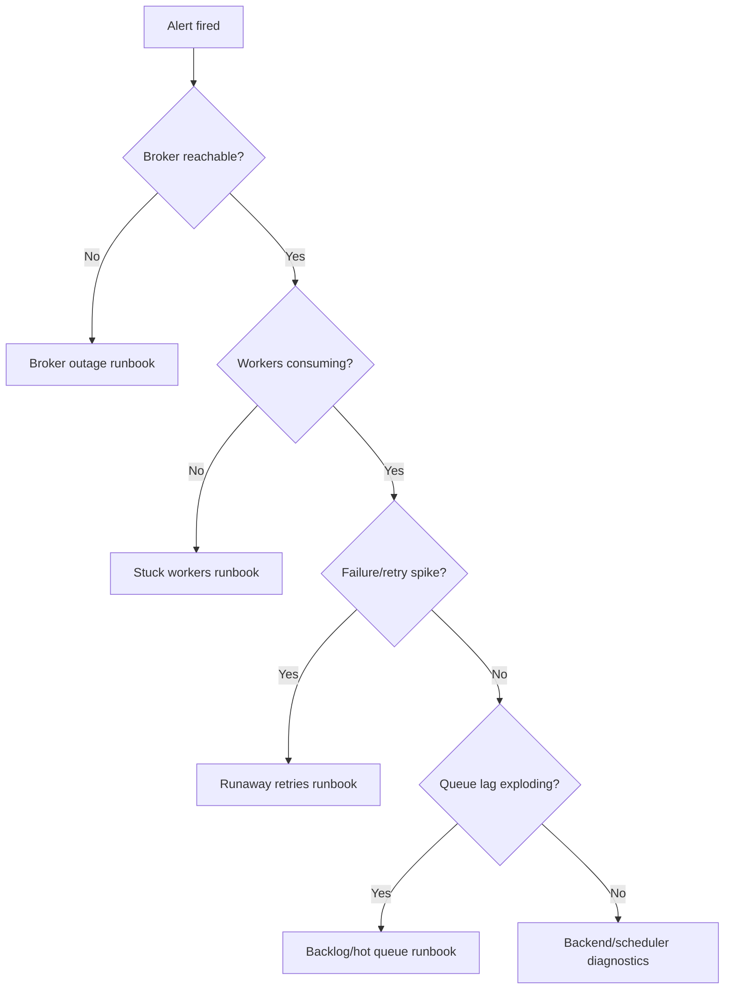

[← Назад к индексу части](index.md)
[↑ К глобальному плану](../mastery_plan.md)

## 21.5 Инциденты и runbooks

### Цель раздела

Сформировать операционное мышление: уметь быстро классифицировать инцидент Celery и действовать по заранее подготовленному алгоритму.

### В этом разделе главное

- runbook сокращает MTTR сильнее, чем "героическое ручное расследование";
- большинство инцидентов Celery диагностируются по понятной цепочке сигналов;
- до выхода в production runbook-и должны быть готовы и проверены.

### Термины

| Термин | Смысл |
|---|---|
| **MTTR** | Среднее время восстановления сервиса. |
| **Broker outage** | Недоступность очереди сообщений. |
| **Backend outage** | Недоступность хранилища результатов/статусов. |
| **Runaway retries** | Неконтролируемый рост повторов задач. |
| **Backlog explosion** | Резкий рост необработанных задач. |
| **Hot partition/queue** | Узкое место в одной очереди/партиции при локальной перегрузке. |

### Теория и правила

Минимальный набор runbook-ов для части 21:

1. **Broker outage**
2. **Backend outage**
3. **Runaway retries**
4. **Stuck workers**
5. **Backlog explosion**
6. **Scheduler duplication**
7. **Hot queue**

У каждого runbook должны быть:

- триггер (какой alert сработал),
- симптомы,
- диагностика (команды/метрики),
- действия по смягчению,
- критерий восстановления,
- postmortem checklist.

### Наблюдаемость для runbook: какие сигналы должны быть заранее

| Сигнал | Зачем нужен | Типичный alert-порог (пример) |
|---|---|---|
| `queue_lag_seconds` | Понять отставание обработки | > 300 сек для critical queue |
| `task_failure_rate` | Раннее обнаружение деградации | > 5% за 5 минут |
| `retry_rate` | Отлов runaway retries | резкий рост > 2x от baseline |
| `consumer_heartbeat_gap` | Выявить stuck worker | heartbeat отсутствует > N секунд |
| `scheduler_fire_count` | Ловить duplication periodic tasks | частота выше ожидаемой в 2x |

Без этой таблицы сигналов runbook остается теорией: оператор не увидит момент старта инцидента вовремя.

#### Проверь себя (наблюдаемость runbook)

1. Почему runbook без заранее согласованных сигналов часто бесполезен в бою?

Ответ

Потому что у команды нет триггера «когда стартовать сценарий» и критериев «когда инцидент действительно стабилизирован». Реакция запаздывает и становится хаотичной.

2. Как метрика `scheduler_fire_count` помогает поймать проблему раньше жалоб пользователей?

Ответ

Она показывает аномальный рост частоты periodic-задач до того, как дубль-эффекты массово проявятся в бизнес-слое.

### Матрица инцидентов: симптом -> первый шаг -> быстрый mitigation

| Инцидент | Первый диагностический вопрос | Быстрый mitigation |
|---|---|---|
| **Broker outage** | Могут ли producer-ы публиковать новые сообщения? | Переключение на standby broker, ограничение некритичных публикаций |
| **Backend outage** | Падают ли только чтения статусов или и исполнение задач? | Временный degraded mode по статусам, приоритет на восстановление backend |
| **Runaway retries** | Что является общим источником ошибок для retry-волны? | Снизить retry-rate, включить backoff/jitter, ограничить проблемный task type |
| **Stuck workers** | Есть heartbeat, но нет consume progression? | Перезапуск застрявшей группы по runbook, проверка pool/IO блокировок |
| **Backlog explosion** | Рост из-за входящего потока или падения throughput? | Временный scale out + приоритизация critical queues |
| **Scheduler duplication** | Запущено ли больше одного активного scheduler/beat? | Оставить один источник расписания, выключить дубликаты |
| **Hot queue/partition** | Концентрируется ли нагрузка в одном routing key/shard? | Перераспределить ключи/шарды, временно выделить отдельный worker-pool |

#### Проверь себя (матрица инцидентов)

1. В чем ценность вопроса «первый диагностический вопрос» в инцидентной матрице?

Ответ

Он сокращает пространство поиска: команда сразу проверяет наиболее вероятный класс причин, вместо хаотичного перебора всех гипотез.

2. Почему быстрый mitigation иногда важнее мгновенного поиска root cause?

Ответ

Потому что сначала нужно остановить рост ущерба и стабилизировать систему. Глубокая первопричина важна, но уже после снижения остроты инцидента.

### Пошагово: универсальный каркас runbook

1. Подтверди инцидент и его область (какие очереди/домены).
2. Зафиксируй impact (какие бизнес-функции затронуты).
3. Проверь "здоровье пути": producer -> broker -> worker -> backend.
4. Примени mitigation (изоляция очереди, пауза producer, scale out/in, rollback).
5. Подтверди восстановление по заранее заданным метрикам.
6. Запусти пост-инцидентный анализ и корректирующие действия.

### Диаграмма диагностики инцидента

### Простыми словами

Runbook — это не "бумажка для аудита", а инструкция, которая экономит десятки минут в острой фазе инцидента, когда команда под давлением и вероятность ошибок выше.

### Картинка в голове

Пожарная карта в здании: когда дым уже есть, никто не обсуждает архитектуру лестниц — люди следуют проверенному маршруту.

### Примеры практических runbook-фрагментов

#### Broker outage (фрагмент)

- **Симптомы:** producers не могут publish, backlog на стороне API, worker idle.
- **Действия:** переключить broker endpoint на standby (если есть), временно ограничить публикацию некритичных задач, поднять priority queue для critical.
- **Проверка восстановления:** успешный publish, падение backlog, нормализация latency.

#### Runaway retries (фрагмент)

- **Симптомы:** резкий рост `retry_count`, очередь "не тает", внешняя зависимость деградировала.
- **Действия:** снизить/отключить агрессивные retry для проблемного task-type, ввести jitter/backoff, при необходимости circuit breaker на source API.
- **Проверка:** retry-rate стабилизирован, новые задачи не "размножаются".

#### Backend outage (фрагмент)

- **Симптомы:** задачи исполняются частично, но статусы/результаты недоступны или нестабильны.
- **Действия:** включить degraded mode для клиентских endpoint-ов статуса, перенаправить усилия на восстановление backend, временно сократить non-critical workload.
- **Проверка:** запись/чтение результатов стабильны, backlog по "status fetch" уменьшается.

#### Stuck workers (фрагмент)

- **Симптомы:** heartbeat есть, но активные задачи "висят" без прогресса.
- **Действия:** проверить блокировки внешних зависимостей, pool starvation и prefetch, выполнить controlled restart группы worker-ов.
- **Проверка:** consume rate восстановлен, среднее время задачи вернулось в норму.

#### Backlog explosion (фрагмент)

- **Симптомы:** очередь растет быстрее, чем обрабатывается, SLA нарушается.
- **Действия:** временно увеличить worker-ы в пределах guardrails, приоритизировать critical queues, отложить non-critical producers.
- **Проверка:** lag стабильно снижается в течение нескольких интервалов наблюдения.

#### Scheduler duplication (фрагмент)

- **Симптомы:** периодические задачи запускаются в 2x/3x.
- **Действия:** найти лишние beat/scheduler процессы, оставить один активный leader, проверить lock/election механизм.
- **Проверка:** частота периодических запусков вернулась к ожидаемой.

#### Hot partition/queue (фрагмент)

- **Симптомы:** одна очередь/partition перегружена, остальные простаивают.
- **Действия:** изменить routing/sharding стратегию, временно выделить отдельный worker pool для горячего сегмента.
- **Проверка:** распределение нагрузки выровнено, latency hotspot-очереди снизилась.

### Типичные ошибки

- runbook существует, но не содержит конкретных шагов и метрик;
- в runbook нет "критерия выхода", и инцидент закрывается слишком рано;
- нет связи между алертом и ответственным владельцем.

### Что будет, если...

- **если нет runbook до production:** каждый инцидент "изобретается заново", MTTR растет;
- **если runbook не тестируется:** документ устаревает и подводит в критический момент.

### Проверь себя

1. Почему "сначала собрать больше логов, потом действовать" не всегда правильно?

Ответ

В остром инциденте нужно сначала стабилизировать систему (mitigation), чтобы остановить ухудшение. Глубокая диагностика и сбор дополнительных логов — следующий шаг.

2. Что важнее: универсальный большой runbook или набор коротких специализированных?

Ответ

Практичнее короткие специализированные runbook-и с четким триггером и шагами. Универсальные документы часто становятся слишком общими и не помогают под давлением времени.

3. Какие runbook-и должны существовать до выхода в production?

Ответ

Минимум по broker/backend outage, runaway retries, stuck workers, backlog explosion, scheduler duplication и hot queue. Это базовые, часто встречающиеся классы инцидентов.

### Запомните

Celery-инциденты почти всегда операционно диагностируемы, если заранее определены метрики, алерты и runbook-и.

---
