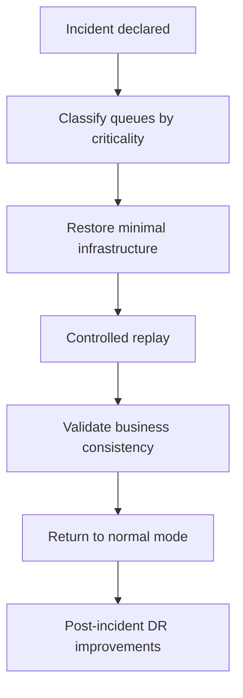

[← Назад к индексу части](index.md)
[↑ К глобальному плану](../../mastery_plan.md)

## 21.6 Disaster recovery

### Цель раздела

Построить практичный recovery-план: понять, что обязательно сохранять, что допустимо потерять, и как безопасно выполнять replay.

### В этом разделе главное

- DR-план начинается с классификации данных и очередей по критичности;
- replay без идемпотентности может принести больше вреда, чем сама авария;
- recovery-план нужно тестировать, иначе в день X он не сработает.

### Термины

| Термин | Смысл |
|---|---|
| **RTO** | Сколько времени допустимо восстанавливать сервис. |
| **RPO** | Сколько данных допустимо потерять. |
| **Replay strategy** | Правило, как и что повторно подавать после аварии. |
| **Recovery drill** | Учебная проверка плана восстановления в контролируемой среде. |

### Теория и правила

1. Нужно явно разделить очереди:
   - **непотеряемые** (критичный бизнес-эффект),
   - **допустимо потеряемые** (например, часть аналитики/кэш-прогонов).
2. Обязательный минимум для хранения:
   - task payload (или ссылка на источник),
   - idempotency key / business key,
   - статус выполнения и ошибки,
   - журнал публикаций (если используешь outbox-подход).
3. Replay должен быть управляемым:
   - по временным диапазонам,
   - по доменам,
   - с лимитами скорости.

### Пошагово: DR-подход

1. Определи RTO/RPO для каждого класса задач.
2. Зафиксируй, что сохраняется и где (broker snapshot, outbox, архив сообщений, object storage).
3. Подготовь скрипты/процедуры replay.
4. Проверь идемпотентность задач, которые будут replay-иться.
5. Проведи recovery drill на staging.
6. Зафиксируй lessons learned и обнови план.

### Что именно нужно сохранить: чеклист

| Категория | Почему важно |
|---|---|
| Конфигурация broker/backend и креды | Без этого нельзя быстро поднять рабочий контур |
| История публикаций (outbox/event log) | Основа управляемого replay после сбоя |
| Бизнес-ключи/idempotency keys | Защита от дублей при восстановлении |
| Runbook-и и скрипты DR | В аварии нет времени "вспоминать вручную" |
| Карта критичных/некритичных очередей | Позволяет быстро расставить приоритеты восстановления |

#### Проверь себя (чеклист DR-артефактов)

1. Почему отсутствие карты критичных очередей сильно замедляет восстановление?

<details><summary>Ответ</summary>

Команда тратит время на согласование приоритетов уже во время инцидента. Восстановление идет «по спору», а не по заранее согласованной бизнес-ценности.

</details>

2. Зачем хранить runbook-и и DR-скрипты как восстановимые артефакты, а не только «в памяти команды»?

<details><summary>Ответ</summary>

Во время аварии могут быть недоступны ключевые люди. Документированные и проверенные артефакты уменьшают зависимость от конкретного эксперта.

</details>

### Диаграмма DR-жизненного цикла



### ASCII-схема восстановления

```text
 [Incident]
     |
     v
 [Classify impacted queues]
     |
     +--> critical queues --> restore + controlled replay + strict monitoring
     |
     +--> non-critical queues --> selective replay or discard (by policy)
```

### Простыми словами

Disaster recovery — это ответ на вопрос: "если завтра все пошло не так, мы знаем что делать по шагам, и эти шаги уже проверены?"

### Картинка в голове

Это как аварийный генератор в больнице: его не покупают "для галочки", его регулярно тестируют, иначе в момент отключения света он может не запуститься.

### Примеры

#### Пример policy-матрицы

| Класс задач | Потеря допустима | Replay | Требование идемпотентности |
|---|---|---|---|
| Платежные подтверждения | Нет | Обязателен | Критично |
| Email-уведомления о маркетинге | Частично | По необходимости | Желательно |
| ETL-агрегации | Да (ограниченно) | Пакетный replay ночью | Высокая |

### Практика / реальные сценарии

- **Сбой broker на 40 минут:** critical очереди replay-ятся первыми, маркетинговые — позже.
- **Потеря backend результатов:** восстановление статусов из доменных БД и повтор отдельных задач.
- **Региональный сбой:** переключение на резервный контур и ограниченный replay с rate-limit.

### Типичные ошибки

- думать, что "backup есть" = DR готов;
- выполнять replay без ограничений и перегружать систему повторно;
- не тестировать recovery-план на реальных данных.

### Что будет, если...

- **если нет классификации очередей по критичности:** при аварии команда тратит время на споры вместо восстановления;
- **если replay без идемпотентности:** вероятны дубли бизнес-эффектов и вторичный инцидент.

### Граничные случаи replay: где чаще всего ошибаются

| Сценарий | Риск | Безопасный подход |
|---|---|---|
| Replay "всей ночи" без фильтрации | Перегрузка downstream и новый инцидент | Replay по временным окнам и доменам |
| Replay без бизнес-ключей | Невозможно отличить дубль от новой операции | Сначала восстановить/проверить idempotency keys |
| Replay сразу в пиковое время | SLA для онлайн-потока резко деградирует | Отложенный/дросселированный replay с приоритетом critical задач |

#### Проверь себя (граничные случаи replay)

1. Почему replay «всего сразу» часто хуже, чем изначальный инцидент?

<details><summary>Ответ</summary>

Потому что создает лавинообразную нагрузку на и так ослабленные зависимости, провоцируя новый отказ уже в процессе восстановления.

</details>

2. Как проверить, что replay действительно безопасен к запуску?

<details><summary>Ответ</summary>

Проверить наличие idempotency keys, лимитов скорости, очередности по критичности и observability-сигналов, которые покажут, что система выдерживает восстановление.

</details>

### Проверь себя

1. Почему RPO/RTO нужно задавать на уровень класса задач, а не "в среднем по Celery"?

<details><summary>Ответ</summary>

Потому что у разных задач разная бизнес-цена потери и задержки. Единое "среднее" скрывает критичные различия и делает recovery-план неуправляемым.

</details>

2. Что важнее в replay: скорость или контролируемость?

<details><summary>Ответ</summary>

Контролируемость. Слишком быстрый replay может обрушить зависимости и создать второй инцидент. Нужны лимиты, очередность и наблюдаемость.

</details>

### Запомните

Идемпотентность — фундамент любого реального recovery-плана Celery.

---
