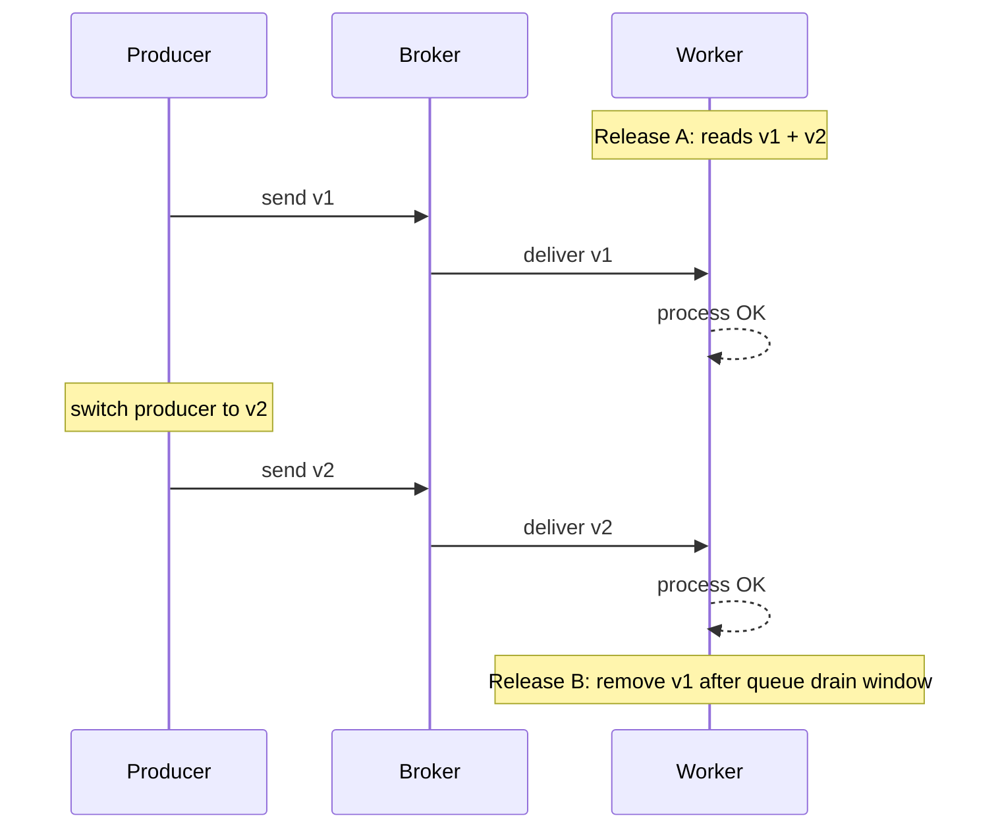

[← Назад к индексу части](index.md)
[↑ К глобальному плану](../celery_mastery_plan.md)

## 21.7 Версионирование задач и backward compatibility

### Цель раздела

Научиться безопасно менять payload, сигнатуры и имена задач при непустых очередях и непрерывных деплоях.

### В этом разделе главное

- во время деплоя старые сообщения в очереди почти неизбежны;
- резкое изменение сигнатуры без совместимости ломает обработку;
- phased rollout и deprecation policy обязательны для зрелого production.

### Термины

| Термин | Смысл |
|---|---|
| **Payload schema evolution** | Постепенное изменение структуры данных задачи. |
| **Backward compatibility** | Новый worker умеет читать старые сообщения. |
| **Task name compatibility** | Стабильность имени задачи для маршрутизации и вызовов. |
| **Phased rollout** | Пошаговый переход между версиями producer/worker. |
| **Deprecation** | Контролируемое устаревание старого формата с объявленным сроком удаления. |

### Теория и правила

1. Никогда не полагайся на мгновенное опустошение очередей в момент релиза.
2. Изменения payload делай "additive first":
   - сначала добавляй новые поля как optional;
   - только потом переводи producer на новую схему;
   - удаляй старое поле после окна совместимости.
3. Имя задачи (`task name`) меняй через alias-период.
4. Все этапы rollout должны быть наблюдаемыми: доля старых/новых сообщений, ошибки десериализации.

### Пошагово: phased rollout схемы payload

1. Добавь поддержку `v1 + v2` в worker.
2. Задеплой worker с dual-read.
3. Переключи producer на отправку `v2`.
4. Мониторь ошибки и долю `v1`.
5. После TTL/очистки очередей отключи `v1`.
6. Обнови документацию и deprecation notice.

### Практический шаблон deprecation policy

| Этап | Что делаем | Критерий перехода |
|---|---|---|
| **Announce** | Публикуем план удаления `v1` и срок | Команды-потребители подтвердили план |
| **Dual-read window** | Worker принимает `v1` и `v2` | Доля `v1` падает до целевого минимума |
| **Producer switch** | Все producer-ы отправляют `v2` | Нет новых `v1` сообщений за заданный период |
| **Removal** | Удаляем `v1`-обработку | Очереди очищены, rollback-план подтвержден |

#### Проверь себя (deprecation policy)

1. Почему нельзя переходить к `Removal`, пока в очередях потенциально остались `v1` сообщения?

<details><summary>Ответ</summary>

Потому что это прямой путь к падению обработки старых сообщений и волне retry/ошибок. Сначала нужна проверяемая очистка или истечение совместимого окна.

</details>

2. Какой этап чаще всего пропускают команды и почему это опасно?

<details><summary>Ответ</summary>

Часто пропускают формальный `Announce` с согласованием сроков. В итоге зависимые producer/consumer-команды не готовы, и совместимость ломается в момент релиза.

</details>

### Диаграмма совместимого rollout



### Простыми словами

Версионирование задач — это договор между "вчерашним" и "сегодняшним" кодом. Пока в очереди живут сообщения старого формата, новый код обязан их понимать.

### Картинка в голове

Это как обновление розеток и вилок в доме: нельзя сразу заменить все вилки, пока часть техники еще со старым стандартом.

### Примеры

#### Пример: эволюция payload с optional-полем

```python
from celery import shared_task

@shared_task(name="billing.process_invoice")
def process_invoice(invoice_id: str, currency: str = "USD", metadata: dict | None = None):
    metadata = metadata or {}
    # v1 messages may not have metadata/currency
    # v2 messages include richer metadata
    # business logic here
    return {"invoice_id": invoice_id, "currency": currency}
```

#### Пример: alias для имени задачи

```python
# old name kept for compatibility window
@shared_task(name="legacy.send_email")
def send_email_legacy(*args, **kwargs):
    return send_email_new(*args, **kwargs)

@shared_task(name="notifications.send_email")
def send_email_new(user_id: str, template: str):
    ...
```

### Практика / реальные сценарии

- **Смена формата payload платежной задачи:** dual-read минимум на весь TTL очереди.
- **Переименование task namespace:** alias + метрики вызовов по старому имени.
- **Миграция producer по сервисам:** phased rollout по доменам, а не "всем сразу".

### Типичные ошибки

- удалять поле/параметр "сразу после релиза";
- менять имя задачи без alias-перехода;
- не мониторить десериализацию и `TypeError` при деплое.

### Что будет, если...

- **если изменить сигнатуру при непустой очереди:** старые сообщения начнут падать, retry-волнa усилит инцидент;
- **если не вести deprecation policy:** через полгода никто не поймет, какие форматы еще обязательны.

### Проверь себя (21.7)

1. Что может сломаться, если менять сигнатуру задачи при непустой очереди?

<details><summary>Ответ</summary>

Старые сообщения не совпадут с новой сигнатурой, задачи начнут падать на распаковке аргументов/валидации, возникнет волна retry и рост backlog.

</details>

2. Как безопасно обновлять worker-ы, если есть долгие задачи?

<details><summary>Ответ</summary>

Через phased rollout: совместимый код, canary, controlled drain, достаточное graceful окно, и политика terminate только как крайняя мера с компенсацией/повторной обработкой.

</details>

3. Какие runbooks должны существовать до выхода в production?

<details><summary>Ответ</summary>

Минимальный набор: broker outage, backend outage, runaway retries, stuck workers, backlog explosion, scheduler duplication и hot queue/partition.

</details>

### Запомните

Деплой Celery всегда должен учитывать задачи, уже находящиеся в очередях. Совместимость не опция, а требование.

---
