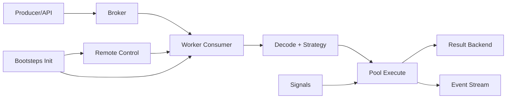
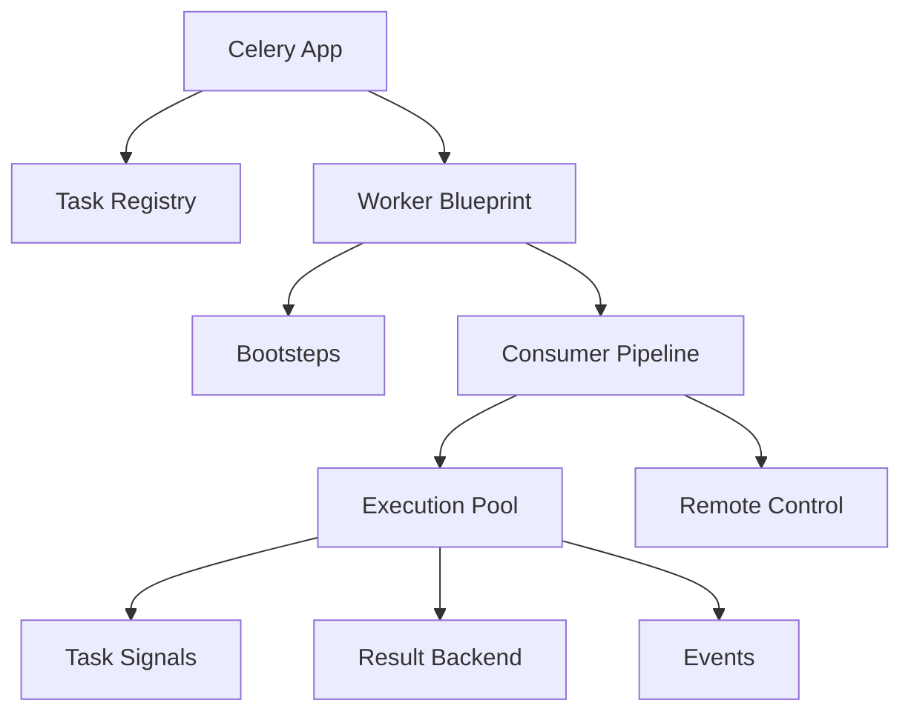

[← Назад к индексу части](index.md)
[↑ К глобальному плану](../../mastery_plan.md)

## Сквозная внутренняя схема Celery

**Простыми словами:** Celery worker — это не "одна функция, которая берет задачу". Это набор внутренних подсистем, где каждая отвечает за свой этап. Ошибка почти всегда локализуется в одном конкретном этапе.

### Где находятся точки расширения (extension points)

Эта схема помогает понять, где что расширять:
- если нужна инфраструктурная инициализация worker-а -> чаще `bootsteps`;
- если нужны lifecycle hooks задачи -> чаще `signals`;
- если нужна бизнес-логика -> код задачи/canvas, а не скрытые хуки.

---
