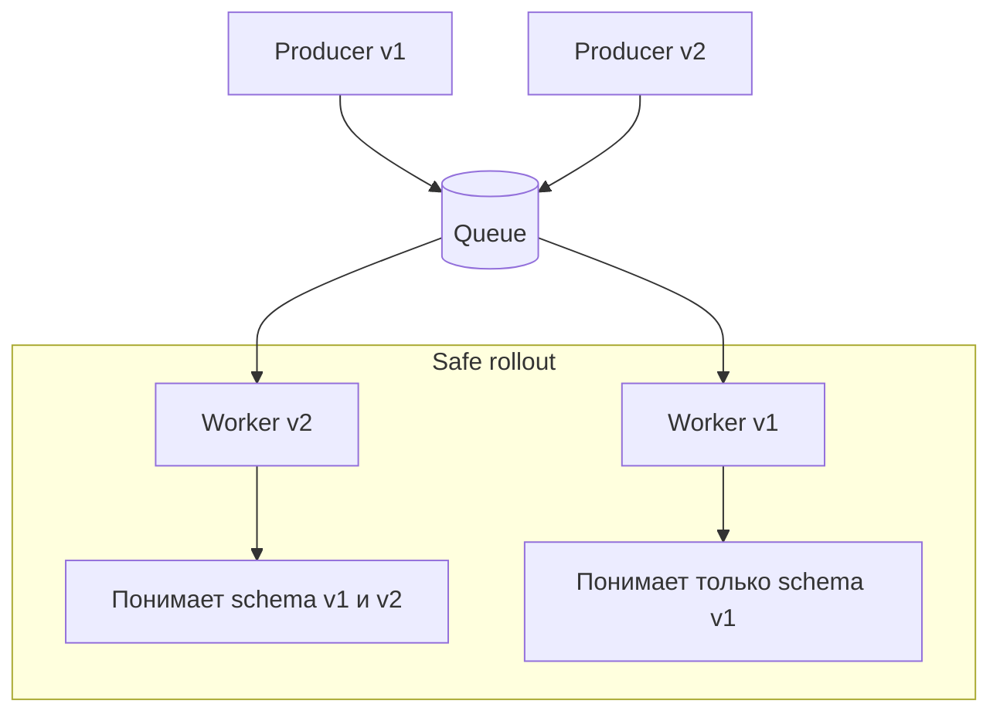

[← Назад к индексу части](index.md)
[↑ К глобальному плану](../mastery_plan.md)

## 22.2 Task message protocol

### Цель раздела

Научиться читать task-сообщение как контракт между producer и worker.

### В этом разделе главное

- protocol = это API между сервисами, только асинхронное;
- важны не только `args/kwargs`, но и метаданные контекста;
- эволюция payload без версии ломает backward compatibility.

### Термины

| Термин | Смысл |
|---|---|
| **Headers** | Метаданные: task name, id, retry info, chain context. |
| **Properties** | AMQP/transport свойства доставки (correlation_id и др.). |
| **Body** | Сериализованная полезная нагрузка задачи. |
| **Serializer** | JSON/msgpack/pickle и другие форматы кодирования. |

### Теория и правила

1. Сообщение должно быть **достаточным для выполнения** без внешних "догадок".
2. `task_id`, `root_id`, `parent_id` важны для tracing и debugging canvas.
3. Версионируй payload явно (`schema_version`) при изменениях структуры.
4. Избегай Python-специфичных сериализаций в межсервисных контурах.

### Что реально лежит в протоколе и зачем каждое поле

| Поле | Где обычно находится | Для чего нужно | Частая ошибка |
|---|---|---|---|
| `task` | headers | Имя задачи для registry lookup | Переименование задачи без переходного alias |
| `id` | headers/properties | Уникальный идентификатор task execution | Повторное использование ID вручную |
| `correlation_id` | properties | Корреляция запроса/ответа и трассировки | Не прокидывать в логирование |
| `eta` / `expires` | headers | Отложенный запуск и срок годности | Неверная timezone/clock drift |
| `retries` | headers | Контроль попыток и стратегия retry | Полагаться на retries без root cause |
| `args/kwargs` | body | Входные данные задачи | Передача несериализуемых объектов |
| `schema_version` | body | Явная версия payload-контракта | Отсутствие миграционного плана |

### Сравнение сериализаторов (практический взгляд)

| Сериализатор | Плюсы | Минусы | Когда применять |
|---|---|---|---|
| `json` | Безопаснее, кросс-языковая совместимость, удобный дебаг | Ограничение по типам, объемнее бинарных форматов | По умолчанию для большинства production-контуров |
| `msgpack` | Компактнее и быстрее JSON в ряде сценариев | Нужна аккуратная договоренность по типам | Высоконагруженные системы с контролируемым контрактом |
| `pickle` | Поддержка сложных Python-объектов | Высокий риск безопасности, слабая межязыковая совместимость | Только в полностью доверенном закрытом контуре, обычно избегать |

#### Проверь себя по блоку сериализации

1. Почему `pickle` может быть удобным, но опасным выбором в production?
2. В каком сценарии `msgpack` оправдан лучше, чем `json`?
3. Что важнее при выборе сериализатора: "скорость в микробенчмарке" или управляемость контракта?

<details><summary>Ответ</summary>

1) `pickle` умеет сложные Python-структуры, но создает существенные риски безопасности и плохо подходит для межязыковой среды.  
2) В высоконагруженном контуре с согласованным форматом и строгим контролем схем, где важны компактность и throughput.  
3) Для долгоживущего production-контура обычно важнее управляемость контракта, безопасность и предсказуемая эксплуатация.

</details>

### Пошагово

1. Определи минимально необходимый payload.
2. Добавь `schema_version`.
3. Зафиксируй правила backward/forward compatibility.
4. Протестируй старый producer против нового worker и наоборот.

### Простыми словами

Task message — это "посылка с бланком". Даже если содержимое понятно, без правильного бланка (метаданных) служба доставки не поймет, куда и как нести.

### Визуальная модель совместимости версий сообщения



Идея диаграммы: пока в очереди могут лежать сообщения двух версий, новый worker обязан читать обе версии. И только после дренирования старых сообщений можно удалить поддержку legacy-схемы.

### Пример структуры

```json
{
  "headers": {
    "task": "orders.recalculate",
    "id": "d86f...",
    "root_id": "d86f...",
    "retries": 1
  },
  "properties": {
    "correlation_id": "d86f..."
  },
  "body": {
    "schema_version": 2,
    "order_id": 774,
    "recalc_mode": "full"
  }
}
```

### Практика / реальные сценарии

- **Сценарий:** добавили обязательное поле в payload без phased rollout.  
  **Итог:** старые сообщения в очереди вызывают `KeyError` и массовые retries.

- **Сценарий:** producer и worker используют разные версии пакета с задачами.
  - Симптом: `Received unregistered task`.
  - Причина: имя задачи отсутствует в registry конкретного worker-а.
  - Решение: phased deployment, временный alias старого имени, явная совместимость в release notes.

### Граничные случаи

- **Clock drift между узлами**: `eta/expires` начинает работать "странно".  
- **Очень большие payload**: рост latency на broker и memory pressure на worker.
- **Смена serializer в бою**: старые сообщения могут стать нечитаемыми.

### Пошаговая стратегия безопасной эволюции payload

1. Вводи новую схему как **добавочную** (старые поля продолжают поддерживаться).
2. Выпусти worker-ы, умеющие читать и старую, и новую схему.
3. Переключи producer на новую схему.
4. Дождись дренирования старых сообщений.
5. Только после этого удаляй поддержку старой схемы.

#### Проверь себя по блоку миграции payload

1. Почему удалять поддержку старой схемы до дренирования очереди опасно?
2. Как phased rollout снижает риск массовых падений при смене payload?

<details><summary>Ответ</summary>

1) Потому что в очереди могут оставаться старые сообщения, которые новый worker уже не сможет обработать корректно.  
2) Он дает переходный период совместимости: сначала код умеет обе версии, потом переключается producer, и только затем убирается legacy-путь.

</details>

### Типичные ошибки

- "тихие" breaking changes в payload;
- отсутствие явной версии схемы;
- передача тяжелых бинарных данных в body.

### Что будет, если...

**...использовать неявный контракт?**  
Через 2-3 релиза команда потеряет понимание, какие поля обязательные, и любой rollout станет рискованным.

### Проверь себя

1. Почему `schema_version` лучше, чем "договоримся по памяти"?
2. В чем риск передачи больших payload напрямую в message body?

<details><summary>Ответ</summary>

1) Это явный контракт, который можно валидировать и мигрировать постепенно.  
2) Рост latency, memory pressure на broker/worker и более тяжелые redelivery/retry циклы.

</details>

### Запомните

Task protocol — это API-контракт. К нему нужно относиться так же строго, как к публичному HTTP API.

---
