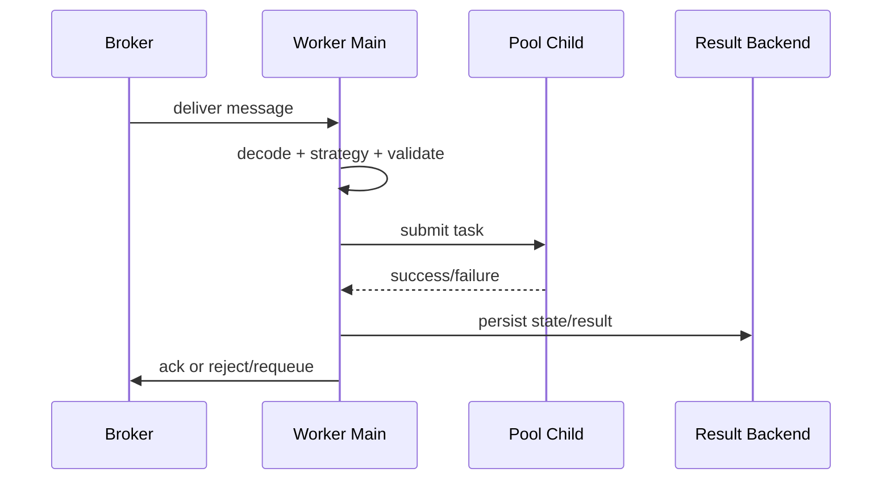

[← Назад к индексу части](index.md)
[↑ К глобальному плану](../../mastery_plan.md)

## 22.3 Consumer pipeline

### Цель раздела

Понять внутренний путь task-сообщения от очереди до исполнения и подтверждения.

### В этом разделе главное

- consumer pipeline определяет фактическую семантику доставки;
- prefetch и pool влияют на fairness и latency;
- место `ack` критично для устойчивости при сбоях.

### Термины

| Термин | Смысл |
|---|---|
| **Reserve** | Резерв сообщения consumer-ом у брокера. |
| **Dispatch/Strategy** | Выбор, как обработать конкретный task type. |
| **Acknowledge** | Подтверждение, что сообщение можно удалить из очереди. |
| **Reject/Requeue** | Отказ с возможным возвратом в очередь. |

### Теория и правила

1. `prefetch` повышает throughput, но может ухудшить fairness.
2. `acks_late=True` повышает надежность при падении worker-а, но требует идемпотентности.
3. Consumer и execution pool могут деградировать независимо.

### Две ключевые семантики подтверждения

| Режим | Когда ack | Что выигрываем | Чем платим |
|---|---|---|---|
| **Early ack** | До фактического выполнения | Меньше дублей при сбоях worker | Риск потери задачи при краше после ack |
| **Late ack** | После выполнения | Лучше устойчивость к падению worker | Дубликаты при redelivery, нужен идемпотентный код |

### Sequence-диаграмма: путь сообщения и точка ack



### Пошагово

1. Consumer получает сообщение.
2. Декодирует protocol и валидирует task name.
3. Передает задачу в execution pool.
4. Обновляет state/events.
5. Подтверждает или отклоняет сообщение.

### ASCII-схема pipeline

```text
Broker -> reserve -> decode -> strategy -> pool.execute
                                      -> on_success -> backend update -> ack
                                      -> on_failure -> retry/reject policy
```

### Простыми словами

Это конвейер аэропорта: багаж (message) сначала принимают, потом сканируют, отправляют на нужную ленту и только после корректной обработки закрывают цикл.

### Пример настройки

```python
app.conf.update(
    worker_prefetch_multiplier=1,
    task_acks_late=True,
    task_reject_on_worker_lost=True,
)
```

### Практика / реальные сценарии

- **Симптом:** очередь растет, но worker "alive".  
  **Частая причина:** pool starvation или блокирующий external I/O в task.

- **Симптом:** дубли business-эффектов после рестартов.  
  **Частая причина:** `acks_late` без идемпотентной операции.

- **Симптом:** часть задач "застревает" в `reserved`.
  - Частая причина: завышенный prefetch при длинных и коротких задачах в одной очереди.
  - Практическая мера: разделить workload по очередям и уменьшить prefetch для latency-sensitive задач.

### Мини-чеклист тюнинга pipeline

1. Начни с `worker_prefetch_multiplier=1` для mixed workload.
2. Проверь фактическую длительность задач (p50/p95/p99), а не "среднюю температуру".
3. Сравни throughput до/после изменения prefetch.
4. Для `acks_late=True` проверь idempotency на уровне БД/внешних API.
5. Отдельно валидируй поведение при kill -9 worker child.

### Failure matrix для pipeline

| Точка сбоя | Что происходит | Что проверить |
|---|---|---|
| Падение до ack (late ack) | Вероятен redelivery | Идемпотентность и duplicate-guard |
| Падение после раннего ack | Потенциальная потеря задачи | Нужность early ack и компенсации |
| Ошибка записи в backend | Задача могла выполниться, но статус не зафиксирован | Backend latency/errors, retries записи |
| Перегрузка пула | Reserve идет, исполнение тормозит | Concurrency limits, blocking I/O, разделение очередей |

#### Проверь себя по failure matrix

1. Чем принципиально отличаются риски "падение до ack" и "падение после раннего ack"?
2. Почему ошибка записи в backend может выглядеть как "задача не выполнилась", хотя бизнес-действие уже произошло?

<details><summary>Ответ</summary>

1) До ack при late-ack чаще будет redelivery и риск дубля, после раннего ack — риск потери задачи без повторной доставки.  
2) Потому что клиент и мониторинг ориентируются на состояние backend; если запись не произошла, внешне это похоже на незавершенную задачу.

</details>

### Типичные ошибки

- пытаться лечить CPU-bound нагрузку gevent-пулом без анализа;
- ставить высокий prefetch в mixed workload;
- не разделять очереди с разным SLA.

### Что будет, если...

**...поднять prefetch слишком высоко?**  
Часть worker-ов "захватит" много сообщений заранее, появится несправедливое распределение и ухудшится tail latency.

### Проверь себя

1. Почему `worker_prefetch_multiplier=1` часто безопасный baseline?
2. Как связаны `acks_late` и идемпотентность?
3. Почему "received" в логах не гарантирует успешное выполнение?

<details><summary>Ответ</summary>

1) Он снижает жадное резервирование и улучшает fairness.  
2) При падении task может выполниться повторно, значит side effects должны быть безопасны к повтору.  
3) Потому что это только ранняя стадия pipeline до факта выполнения и записи результата.

</details>

### Запомните

Consumer pipeline — место, где теория "доставки" превращается в реальное поведение системы.

---
