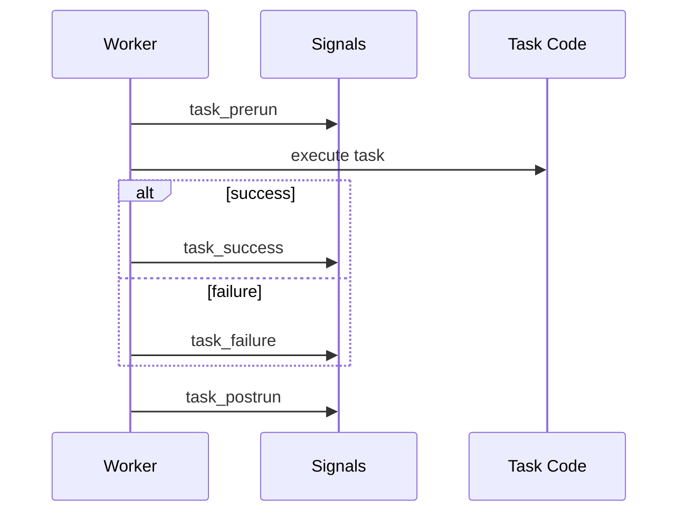

[← Назад к индексу части](index.md)
[↑ К глобальному плану](../celery_mastery_plan.md)

## 22.5 Signals

### Цель раздела

Использовать signals осознанно: для observability и инфраструктурных хуков, а не для скрытой бизнес-логики.

### В этом разделе главное

- сигналы помогают сделать cross-cutting функциональность;
- порядок и контекст сигналов важны;
- сигналы не заменяют доменную оркестрацию.

### Термины

| Термин | Смысл |
|---|---|
| **task_prerun/postrun** | Сигналы до и после выполнения задачи. |
| **task_failure/success** | Сигналы итогового статуса. |
| **worker_ready** | Worker инициализирован и готов принимать задачи. |

### Теория и правила

1. Signals должны быть быстрыми и устойчивыми к ошибкам.
2. Ошибки signal-handler не должны ломать task execution path.
3. Для бизнес-логики используй явный код задачи/оркестрацию, не implicit hooks.

### Какие сигналы обычно полезнее всего в production

| Сигнал | Что обычно делают | Ограничения |
|---|---|---|
| `worker_ready` | Отметить readiness в мониторинге | Не использовать для тяжелых bootstrap-операций |
| `task_prerun` | Старт span/таймера, обогащение лог-контекста | Нельзя делать блокирующий I/O |
| `task_postrun` | Метрики длительности, финальные теги статуса | Не перегружать хендлер вычислениями |
| `task_failure` | Инцидентные метрики и алерты | Не выполнять опасные компенсации "на лету" |

### Частая путаница: signal vs retry vs callback

| Понятие | Что это | Для чего использовать | Частая ошибка |
|---|---|---|---|
| **Signal** | Hook жизненного цикла | Наблюдаемость, легкие инфраструктурные действия | Пытаться управлять доменным процессом |
| **Retry** | Повтор выполнения задачи | Временные сбои и транзиентные ошибки | Ретраить бизнес-ошибки без смысла |
| **Canvas callback** | Явный шаг workflow | Оркестрация бизнес-этапов | Прятать callback-логику в signals |

#### Проверь себя по блоку "signal vs retry vs callback"

1. Какой механизм выбрать, если нужно продолжить бизнес-процесс только после успеха предыдущего шага?
2. Какой механизм выбрать, если внешний сервис временно недоступен?
3. Почему signal не подходит как основной orchestrator?

<details><summary>Ответ</summary>

1) Canvas callback/chain/chord, потому что это явная оркестрация этапов workflow.  
2) Retry-политику задачи с лимитом, backoff и классификацией ошибок.  
3) Signal — это hook наблюдаемости/lifecycle, а не надежный и явный механизм управления доменными переходами.

</details>

### Визуал: когда срабатывают task-сигналы



### Пример

```python
from celery.signals import task_prerun, task_postrun
import time

_start = {}

@task_prerun.connect
def on_start(task_id=None, **kwargs):
    _start[task_id] = time.time()

@task_postrun.connect
def on_end(task_id=None, task=None, **kwargs):
    started = _start.pop(task_id, None)
    if started is not None:
        duration = time.time() - started
        print(f"[metrics] task={task.name} duration={duration:.3f}s")
```

### Картинка в голове

Сигналы — это датчики на производственной линии. Они измеряют и сообщают, но не должны "тайно менять маршрут детали".

### Типичные ошибки

- делать сетевые блокирующие вызовы в signal-handler;
- запускать бизнес-компенсации из `task_failure` без идемпотентности;
- предполагать единый порядок сигналов для всех pool-моделей.

### Что будет, если...

**...в `task_failure` синхронно вызывать внешний API для алерта?**  
При массовом фейле ты получишь "шторм сигналов", увеличишь задержку worker-а и сам усугубишь инцидент.

**...перенести доменную логику в signals?**  
Потеряется явность процесса, тесты станут хрупкими, а последствия ретраев/дубликатов — неочевидными.

### Проверь себя

1. Где signals действительно полезны?
2. Почему signals считаются risky для core business flow?

<details><summary>Ответ</summary>

1) В телеметрии, трассировке, инфраструктурной инициализации и легких non-critical hook-ах.  
2) Они неявны, сложнее тестируются и могут срабатывать в условиях, которые тяжело предсказать при отказах/ретраях.

</details>

### Запомните

Signals — хороший инструмент наблюдаемости, но плохое место для скрытого доменного управления.

---
