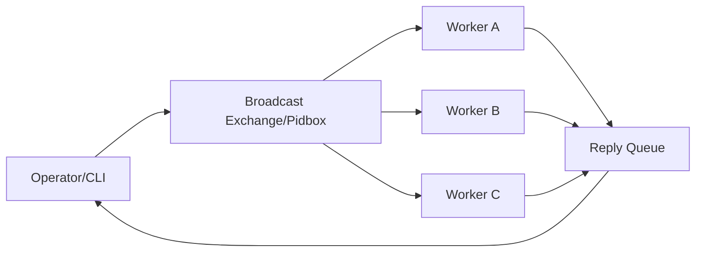

[← Назад к индексу части](index.md)
[↑ К глобальному плану](../../mastery_plan.md)

## 22.6 Remote control internals

### Цель раздела

Понять, как внутри работает `inspect/control`, почему ответы бывают неполными и как безопасно использовать remote commands.

### В этом разделе главное

- remote control основан на отдельном канале команд;
- это best-effort механизм, а не строгий консенсус;
- безопасность control channel критична.

### Термины

| Термин | Смысл |
|---|---|
| **Inspect** | Запрос информации у worker-ов (`active`, `stats`, `registered`). |
| **Control** | Команды управления (`pool_grow`, `rate_limit`, `shutdown`). |
| **Pidbox/Broadcast** | Механизм рассылки control-команд. |

### Теория и правила

1. Ответы inspect зависят от доступности и загрузки каждого worker-а.
2. Таймауты/потери ответов нормальны в больших кластерах.
3. Control-команды должны быть ограничены доступом по сети и аутентификацией.

### Как мыслить про remote control правильно

- Это **операционный канал best-effort**, а не "база истины".
- Ответы могут быть частичными (split brain по времени ответа), даже если кластер в целом здоров.
- Команды `control` имеют эффект "постепенного применения", а не атомарной транзакции по всем worker-ам.

### Transport dependence в remote control (ключевой нюанс)

| Вопрос | RabbitMQ/AMQP | Redis transport | Практический вывод |
|---|---|---|---|
| Broadcast-механика | Нативно хорошо ложится на exchange/queue модель | Работает, но чувствительнее к operational нюансам окружения | Для критичного control-plane чаще проще добиться предсказуемости на AMQP |
| Предсказуемость ответов inspect | Обычно стабильнее при зрелой топологии | Может сильнее зависеть от нагрузки и таймингов | Настраивай timeout/concurrency тестами под свой контур |
| Диагностика control-path | Богатая экосистема broker-инструментов | Чаще опирается на общие Redis-метрики/latency | Важно иметь отдельный дашборд control-канала |

Главная мысль: `inspect/control` нельзя проектировать "одинаково" для всех транспортов. Поведение зависит от broker-механики, нагрузки и сетевого профиля.

#### Проверь себя по transport-зависимости

1. Почему единые timeout-настройки inspect могут работать хорошо в одном контуре и плохо в другом?
2. Какой практический вывод для SRE-команды из transport-зависимости control-plane?

<details><summary>Ответ</summary>

1) Потому что поведение control-plane зависит от конкретного transport, задержек сети, нагрузки и топологии broker.  
2) Нужны environment-specific тесты и дашборды control-path, а не "универсальные" значения из чужих примеров.

</details>

### Mermaid-схема control-plane



### Пошагово

1. Запроси `inspect ping`.
2. Сравни ожидаемое число worker-ов с ответившими.
3. Проверь `stats/active`.
4. Применяй control-команды точечно и фиксируй audit trail.

### Примеры команд

```bash
celery -A proj inspect ping
celery -A proj inspect active
celery -A proj control rate_limit orders.recalculate 20/m
celery -A proj control pool_grow 2
```

### Простыми словами

Remote control похож на объявление по громкой связи в цеху: часть бригад услышит сразу, часть с задержкой, часть может не ответить. Это не транзакционный RPC.

### Security baseline для control-channel

1. Ограничь доступ к broker-vhost/control exchange только операторам и service accounts.
2. Раздели production и non-production control контуры (разные креды/сегменты).
3. Включи аудит control-команд (кто, когда, что отправил).
4. Установи policy запрета опасных команд вне change window.
5. Проверь, что control endpoint недоступен из публичных подсетей.

#### Проверь себя по безопасности control-channel

1. Почему аудит control-команд обязателен даже в "доверенном" внутреннем контуре?
2. Какой минимальный набор защит нужен перед использованием `control shutdown` в production?

<details><summary>Ответ</summary>

1) Потому что без аудита невозможно разбирать инциденты и отделять ошибку оператора от системной деградации.  
2) RBAC/ограничение ролей, сегментация сети, журналирование команд и процедурные ограничения по change window.

</details>

### Типичные ошибки

- воспринимать inspect как 100% источник истины в любую секунду;
- отправлять destructive control-команды без audit и RBAC;
- не защищать control channel в zero-trust окружении.
- не учитывать transport-зависимость latency/timeout в `inspect` и делать неверные операционные выводы.

### Практический runbook для "inspect отвечает не всем"

1. Увеличь timeout и повтори запрос.
2. Сверь список живых pod/process с реестром service discovery.
3. Проверь network policy/firewall между operator и broker.
4. Проверь load на неответивших worker-ах (CPU starvation может блокировать обработку control).
5. При необходимости проверь broker-level очереди control-plane.

### Что будет, если...

**...дать широкий доступ к control-командам?**  
Риск внутренних злоупотреблений и случайных массовых остановок резко вырастет.

### Проверь себя

1. Почему inspect/control нельзя трактовать как "строго согласованное состояние"?
2. Какие минимальные меры безопасности обязательны для control channel?

<details><summary>Ответ</summary>

1) Это распределенный best-effort канал, зависимый от сети, очередей и состояния worker-ов.  
2) Сегментация сети, ограничение прав, аутентификация, аудит команд и запрет широкого доступа.

</details>

### Запомните

Remote control — операционный инструмент, а не источник транзакционной истины.

---
