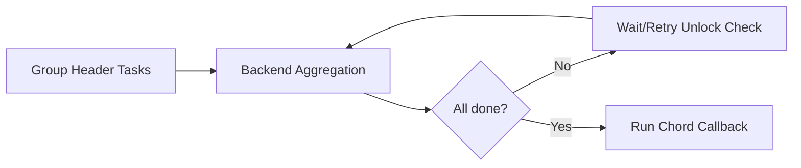

[← Назад к индексу части](index.md)
[↑ К глобальному плану](../mastery_plan.md)

## 22.7 Chord internals и backend dependence

### Цель раздела

Понять, как технически "срабатывает" chord и почему выбор backend напрямую влияет на надежность orchestration.

### В этом разделе главное

- chord = `group(header tasks)` + `callback(body)`, но синхронизация нетривиальна;
- backend участвует в учете завершений и unlock;
- ошибки в backend/TTL часто проявляются как "зависший chord".

### Термины

| Термин | Смысл |
|---|---|
| **Header tasks** | Набор задач группы, которые должны завершиться. |
| **Body callback** | Финальная задача, запускаемая после завершения группы. |
| **Unlock** | Момент, когда система признает group завершенной и пускает callback. |
| **GroupResult** | Объект агрегированного состояния группы задач. |

### Теория и правила

1. Для корректного chord нужен backend с надежной агрегацией результатов.
2. TTL result-данных не должен истекать раньше, чем завершится весь workflow.
3. Ошибки header-задач должны иметь явную политику (fail-fast/compensate/retry).

### Почему chord "дороже" обычной группы

| Аспект | Group без callback | Chord |
|---|---|---|
| Координация завершения | Необязательна централизованная | Обязателен глобальный барьер "все завершены" |
| Зависимость от backend | Средняя | Высокая |
| Риск зависания | Ниже | Выше, если backend/TTL/policy не настроены |
| Цена ошибки конфигурации | Локальная | Может блокировать целый бизнес-процесс |

### Mermaid-схема chord

### Пошагово

1. Header-задачи публикуются как группа.
2. Каждая завершенная задача обновляет backend.
3. Unlock-механизм проверяет полноту группы.
4. При полном наборе запускается callback.

### Расширенный edge-case разбор

- **Partial failure в header:** что делать с callback?
  - Вариант A: fail-fast и отдельная error-task.
  - Вариант B: собрать частичные результаты и выполнить деградированный callback.
  - Вариант C: retry failed tasks до лимита, затем compensation.
- **Длинный header + короткий TTL:** callback не стартует, потому что часть промежуточного state уже исчезла.
- **Смешение "тяжелых" и "легких" задач в одном chord:** tail latency определяется самыми тяжелыми задачами.

### Простыми словами

Chord — это "совещание после сдачи отчетов". Пока не сданы все отчеты, итоговое совещание не начинается. Backend играет роль секретаря, который фиксирует, кто уже сдал.

### Практика / реальные сценарии

- **Симптом:** callback не запускается, хотя часть задач success.  
  **Возможные причины:** потеря/истечение result state, backend-неконсистентность, ошибки header без корректной обработки.

### Типичные ошибки

- короткий TTL для backend при длинных batch workflow;
- смешение критичных и некритичных задач в одном chord без policy;
- отсутствие тестов на partial failure.

### Практический тестовый минимум для chord

1. Тест "все success".
2. Тест "одна header-задача падает без retry".
3. Тест "одна header-задача падает и успешно ретраится".
4. Тест "callback сам падает".
5. Тест "истечение TTL до завершения группы" (ожидаемое поведение должно быть явным).

### Anti-patterns chord internals

- использовать chord как "универсальный workflow-движок" для любой логики без оглядки на backend-нагрузку;
- хранить слишком тяжелые промежуточные результаты в backend, превращая его в bottleneck;
- не определять заранее политику "что считаем успехом группы" при частичных отказах;
- ставить одинаковые retry/time-limit для всех header-задач, игнорируя разную природу операций.

#### Проверь себя по anti-patterns chord

1. Почему одинаковые time-limit и retry для всех header-задач могут вредить надежности?
2. Какой симптом подсказывает, что backend стал bottleneck именно из-за chord?

Ответ

1) Потому что задачи часто имеют разную длительность и профиль отказов; единая политика приводит либо к лишним фейлам, либо к затяжным ретраям.  
2) Рост задержек/ошибок backend при массовом chord, задержка unlock/callback при живых worker-ах и нормальном publish-rate.

### Что будет, если...

**...использовать chord с неподходящим backend?**  
Можно получить недетерминированные unlock-сценарии: "иногда срабатывает, иногда зависает", что особенно опасно для финансовых и интеграционных процессов.

### Проверь себя

1. Почему chord сильнее зависит от backend, чем обычная одиночная задача?
2. Что чаще ломает надежность chord в проде?

Ответ

1) Потому что нужен агрегированный и согласованный учет завершения множества задач, а не только запись одного результата.  
2) Неверные TTL/policy хранения, отсутствие явной обработки ошибок header и непродуманный rollback/compensation.

### Запомните

Chord надежен ровно настолько, насколько надежны backend state и политика ошибок группы.

---
