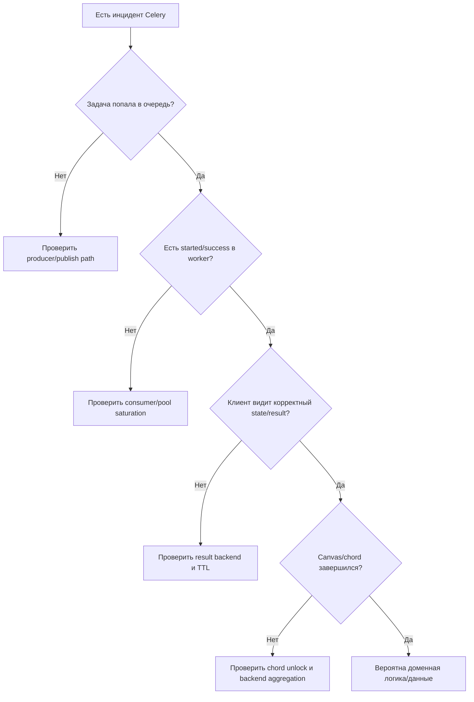

[← Назад к индексу части](index.md)
[↑ К глобальному плану](../mastery_plan.md)

## 22.8 Internal debugging

### Цель раздела

Дать практический алгоритм поиска причин "странного" поведения Celery на внутреннем уровне.

### В этом разделе главное

- начинай с симптома и карты слоя;
- проверяй hypothesis-driven, а не random action;
- фиксируй результат диагностики в runbook.

### Теория и правила

1. Любая проблема должна быть локализована в одном из слоев:
   - producer/publish,
   - broker/transport,
   - consumer pipeline,
   - execution pool,
   - result backend,
   - orchestration (canvas/chord).
2. Метрики, логи, inspect и бизнес-факты должны сходиться в одну картину.
3. После инцидента нужен "закрывающий" action: test, alert, config change, runbook update.

### Пошаговый диагностический алгоритм

1. **Определи симптом:** не приходит, не стартует, не завершает, не публикует result, зависает chord.
2. **Привяжи к слою:** используй карту internals.
3. **Собери evidence:** broker depth, worker logs, inspect stats, backend записи.
4. **Проверь настройки:** prefetch, ack mode, retries, time limits, backend TTL.
5. **Сузь гипотезу:** воспроизведи на staging/канареечном worker.
6. **Внеси фикс и валидацию:** измерь до/после.
7. **Обнови runbook:** чтобы следующий инцидент решался быстрее.

### Команды и сигналы, которые чаще всего полезны при internal-debugging

```bash
celery -A proj inspect ping
celery -A proj inspect active
celery -A proj inspect reserved
celery -A proj inspect stats
celery -A proj report
```

```text
Минимальный набор evidence:
- queue depth и publish rate
- worker concurrency/load average
- task failure/retry rate
- backend latency/error rate
- доля chord timeout/failure (если используете canvas)
```

### Диагностическая матрица

| Симптом | Наиболее вероятный слой | Что проверять первым |
|---|---|---|
| Очередь растет, worker жив | consumer/pool | prefetch, concurrency, блокировки I/O |
| `received` есть, `started` нет | execution pool | saturation, process crashes, resource limits |
| `success` в логах, но клиент не видит | backend | result backend доступность, TTL, serialization |
| Chord callback не стартует | orchestration/backend | group state, unlock policy, backend consistency |
| Inspect показывает не всех worker-ов | control channel | network, timeout, broker route для pidbox |

### Диаграмма принятия решения при инциденте



#### Проверь себя по decision flow

1. Почему в диаграмме проверка backend идет раньше глубокого анализа бизнес-кода?
2. Что означает ветка "задача не попала в очередь" и какой первый шаг диагностики?

<details><summary>Ответ</summary>

1) Потому что проблемы фиксации состояния и инфраструктурного контура встречаются часто и быстро проверяются объективными метриками/логами.  
2) Это признак проблемы publish-path producer; первым делом проверяются API/producer-логи, ошибки publish и доступность broker.

</details>

### Карта инструментов по слоям (что использовать первым)

| Слой | Инструменты первого шага | Что ищем |
|---|---|---|
| Producer/publish | app-логи API, счетчик publish ошибок, tracing спаны | Публикуется ли задача вообще |
| Broker/transport | queue depth, broker latency, connection/channels errors | Доходит ли сообщение до очереди |
| Consumer/pool | `inspect active/reserved/stats`, worker logs, CPU/RAM | Берет ли worker задачу и может ли исполнить |
| Result backend | backend RTT/errors, TTL cleanup logs | Почему нет финального состояния |
| Canvas/chord | group/chord state, unlock retries, callback failures | Где ломается оркестрация |

### Мини-практика internal-debugging

Смоделируй инцидент "success в логах, но клиент видит `PENDING`":

1. Сними evidence по backend (ошибки, latency, TTL).
2. Сверь `task_id`/`correlation_id` по цепочке producer -> worker -> backend.
3. Проверь, не очищается ли результат раньше клиентского SLA.
4. Зафиксируй итог в runbook в формате "симптом -> причина -> проверка -> фикс".

### Шаблон пост-инцидентного разбора (internal focus)

```text
Incident ID:
Дата/время:
Симптом (что увидели пользователи/система):
Затронутый слой internals (producer/broker/consumer/pool/backend/chord):
Доказательства (метрики, логи, inspect, трассировка):
Первопричина:
Временное решение (mitigation):
Постоянный фикс:
Какие алерты/тесты/guardrails добавлены:
Как предотвращаем повтор:
```

Этот шаблон превращает разовый опыт дежурного в повторяемое командное знание.

#### Проверь себя по post-incident шаблону

1. Почему поле "затронутый слой internals" критично для качества разбора?
2. Зачем фиксировать отдельно временное решение и постоянный фикс?

<details><summary>Ответ</summary>

1) Оно заставляет локализовать причину системно и не смешивать симптомы разных слоев в одну "размытую" версию инцидента.  
2) Чтобы не оставить workaround как финальное решение: mitigation снижает ущерб сейчас, permanent fix предотвращает повтор.

</details>

### Простыми словами

Internal debugging — это не "магия DevOps". Это дисциплина: симптом -> слой -> доказательства -> гипотеза -> проверка -> фиксация знаний.

### Типичные ошибки

- сразу менять много параметров одновременно;
- опираться только на один источник правды (например, только Flower);
- не проверять backward compatibility при rollback.

### Что будет, если...

**...пропускать пост-инцидентный разбор?**  
Проблемы будут повторяться, и команда каждый раз начнет расследование "с нуля".

### Проверь себя

1. Почему опасно менять сразу и `prefetch`, и `acks`, и concurrency в одном релизе?
2. Что важнее при дебаге: "быстро перезапустить" или "собрать evidence"?  
3. Почему runbook — это часть технического решения, а не документация "для галочки"?

<details><summary>Ответ</summary>

1) Невозможно атрибутировать, какой параметр реально дал эффект или регрессию.  
2) На длинной дистанции evidence важнее: без него fixes нестабильны и инциденты повторяются.  
3) Потому что он снижает MTTR и превращает индивидуальный опыт в командную операционную память.

</details>

### Запомните

Сильный инженерный подход к Celery начинается с диагностики по внутренним слоям, а не с случайных рестартов.

---
