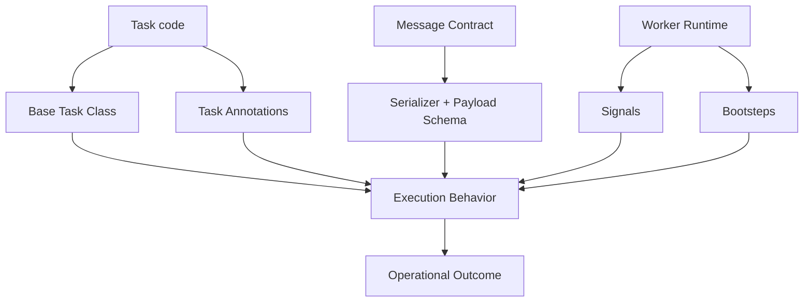
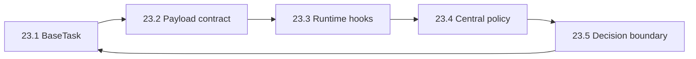

[← Назад к индексу части](index.md)
[↑ К глобальному плану](../mastery_plan.md)

## Модель расширений Celery

**Простыми словами:** у тебя есть пять крупных рычагов расширения. Если тянуть за все сразу, будет хаос. Нужен принцип: один риск — один рычаг.

### Карта связей между подпунктами 23.1-23.5

Эта петля важна: каждое новое расширение должно проходить проверку из `23.5`, и только после этого попадать обратно в инженерный baseline (`23.1`–`23.4`).

### "Картинка в голове": не тюнинговать мотор гаечным ключом от велосипеда

Celery похож на автомобиль:
- `Base Task` — это коробка передач: влияет на стиль езды всех задач;
- сериализация — тип топлива: если ошибиться, машина вообще не поедет;
- `signals/bootsteps` — это датчики и электроника;
- `annotations` — правила дорожного движения для конкретных задач;
- `23.5` — инженерный здравый смысл: не делать лишних модификаций.

---
