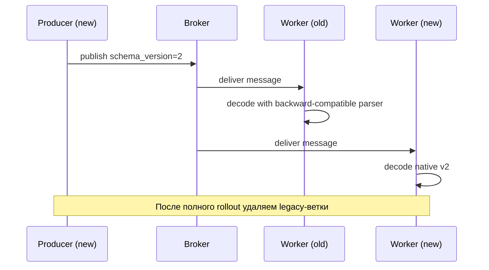

[← Назад к индексу части](index.md)
[↑ К глобальному плану](../celery_mastery_plan.md)

## 23.2 Кастомные сериализаторы и схемы payload

### Цель раздела

Понять, когда и как применять кастомную сериализацию, как безопасно эволюционировать схему payload, и как избегать несовместимостей между producer/worker разных версий.

### В этом разделе главное

- кастомный serializer нужен редко, но иногда критически важен;
- payload schema — это контракт между producer и consumer;
- эволюция схемы должна быть "вперед и назад совместимой";
- большие payload — это чаще архитектурная проблема, а не проблема serializer-а.

### Термины

| Термин | Формальное значение | Простыми словами |
|---|---|---|
| **Serializer registry** | Реестр сериализаторов Kombu/Celery | Список поддерживаемых форматов |
| **Content-type** | MIME-тип полезной нагрузки | Подсказка, как декодировать сообщение |
| **Schema version** | Версия формата payload | "Редакция" контракта данных |
| **Backward compatibility** | Новая версия читает старые сообщения | Не ломаем старых отправителей |
| **Forward compatibility** | Старая версия терпит новые поля | Не падаем от дополнительных полей |

### Теория и правила

#### Когда действительно нужен кастомный сериализатор

- Требуется компактный бинарный формат для очень высокого throughput.
- Есть строгие требования к валидации/типизации payload на wire-уровне.
- Нужно межъязыковое взаимодействие с фиксированным schema-contract.

#### Когда **не** нужен

- Если хватает JSON и объем payload умеренный.
- Если проблема в слишком больших объектах (лучше передавать `object_id`, а не весь объект).
- Если команда не готова поддерживать schema evolution и миграции.

#### Правило "контракт важнее формата"

Даже лучший serializer не спасет, если нет явной схемы:
- какие поля обязательны;
- какие опциональны;
- что делать с неизвестными полями;
- как вести себя при несовместимой версии.

### Пошагово: внедрение schema evolution

1. Добавь поле `schema_version` в payload.
2. Зафиксируй контракт в документации (или в schema-файле).
3. Поддержи чтение старых версий в worker-е.
4. Вводи новые поля как опциональные.
5. Делай staged rollout producer/worker.
6. Удаляй старые ветки декодирования только после подтверждения отсутствия старых сообщений.

### Простыми словами

Serializer — это "конверт", schema — "правила заполнения". Можно иметь идеальный конверт, но если внутри документы без структуры, процесс все равно ломается.

### Картинка в голове

Почтовое отделение:
- serializer = формат упаковки посылки;
- schema = список обязательных полей в бланке;
- compatibility = новые бланки должны читаться в старых отделениях.

### Как запомнить

**Сначала договор (schema), потом упаковка (serializer).**

### Пример: версия payload и мягкая эволюция

```python
from dataclasses import dataclass
from typing import Any


@dataclass
class EmailTaskV2:
    schema_version: int
    user_id: str
    template: str
    locale: str | None = None


def decode_email_payload(raw: dict[str, Any]) -> EmailTaskV2:
    version = raw.get("schema_version", 1)
    if version == 1:
        return EmailTaskV2(
            schema_version=2,
            user_id=raw["user_id"],
            template=raw["template"],
            locale=None,
        )
    if version == 2:
        return EmailTaskV2(
            schema_version=2,
            user_id=raw["user_id"],
            template=raw["template"],
            locale=raw.get("locale"),
        )
    raise ValueError(f"Unsupported schema_version={version}")
```

### Пример: регистрация кастомного сериализатора (концептуально)

```python
from kombu.serialization import register
import json


def dumps(obj):
    # Здесь может быть custom encoding
    return json.dumps(obj).encode("utf-8")


def loads(data):
    # Здесь может быть custom decoding/validation
    return json.loads(data.decode("utf-8"))


register(
    "app-json-v2",
    dumps,
    loads,
    content_type="application/x-app-json-v2",
    content_encoding="utf-8",
)
```

### Сравнение стратегий payload-контракта

| Подход | Когда уместен | Плюсы | Минусы / риски |
|---|---|---|---|
| **JSON + явная версия схемы** | Большинство бизнес-систем | Простота, прозрачность, легко дебажить | Больше размер payload по сравнению с бинарными форматами |
| **JSON + object reference (`id`)** | Большие данные и batch-процессы | Разгружает broker, упрощает ретраи | Нужна надежная внешняя система хранения и контроль TTL |
| **Кастомный бинарный serializer** | Очень высокий throughput, строгие контракты | Компактность, скорость | Сложная поддержка, выше риск несовместимости и lock-in |

### Диаграмма: безопасная эволюция схемы payload



### Диагностика проблем сериализации (runbook)

1. Проверить `task_serializer`, `result_serializer`, `accept_content` у producer и worker.
2. Сверить `content_type` сообщения и зарегистрированные сериализаторы Kombu.
3. Проверить наличие `schema_version` и фактическую структуру payload в "падающих" сообщениях.
4. Разделить проблемы транспорта и проблемы декодирования:
   - транспорт: message not delivered / timeout;
   - декодирование: `DecodeError`, `ValueError`, schema mismatch.
5. Оценить blast radius: какие очереди и какие версии worker затронуты.
6. Применить mitigation:
   - временно ограничить producer до совместимой схемы;
   - включить tolerant parser;
   - при необходимости отправить "ядовитые" сообщения в quarantine queue.

### Граничный случай: "старые сообщения после релиза"

Проблема: после успешного деплоя в очереди могут оставаться сообщения старой схемы, особенно при длинных retry/ETA.

Что делать:
1. перед релизом оценить максимальное "время жизни" старого сообщения (ETA + retry horizon);
2. держать backward-compatible parser как минимум на этот горизонт;
3. мониторить долю сообщений старой версии;
4. удалять legacy decoding только после нулевого хвоста в проде.

### Практика / реальные сценарии

1. **Миграция payload при rolling deploy**
   - Producer стал отправлять новое поле `locale`.
   - Старые worker-ы игнорируют неизвестное поле.
   - Новые worker-ы поддерживают и старый, и новый формат.
   - После стабилизации старая ветка чтения удаляется.

2. **Большой payload из отчетного сервиса**
   - До: в задачу передавали огромный список строк.
   - После: передают `report_id`, а данные читаются из object storage.
   - Выигрыш: меньше нагрузка на broker, меньше время сериализации, меньше ошибок доставки.

### Типичные ошибки

- менять схему "в лоб" без версионирования;
- считать, что `pickle` удобнее и "значит лучше" (риски безопасности и совместимости);
- пытаться лечить архитектурные проблемы payload-магией;
- не проверять `accept_content` и `task_serializer` в конфиге.

### Что будет, если...

- **если** забыть версию схемы,  
  **то** при первом же несовместимом изменении начнутся падения decoding;
- **если** включить редкий кастомный serializer без observability,  
  **то** диагностика wire-проблем станет болезненной;
- **если** передавать мегабайты payload в broker,  
  **то** вырастут задержки, memory pressure и риск таймаутов.

### Проверь себя

1. Почему payload schema важнее выбора `json` vs `msgpack` в большинстве проектов?

<details><summary>Ответ</summary>

Потому что основные инциденты связаны не с самим форматом, а с несовместимостью структуры данных между producer и worker.

</details>

2. Что должно происходить при встрече неизвестной версии payload?

<details><summary>Ответ</summary>

Должно быть явное и наблюдаемое поведение: controlled fail с понятной ошибкой и метрикой, а не тихая порча данных.

</details>

3. Какой безопасный способ уменьшить размер payload?

<details><summary>Ответ</summary>

Передавать ссылку/идентификатор, а сами тяжелые данные держать в БД или объектном хранилище.

</details>

### Запомните

- Кастомный serializer — это advanced-инструмент, а не default.
- Версионирование схемы обязательно для долгоживущих систем.
- Совместимость и наблюдаемость важнее микрооптимизации формата.

### Вопросы по подблокам 23.2

1. Почему блоки "сравнение стратегий", "runbook диагностики" и "граничный случай старых сообщений" нужно рассматривать вместе?

<details><summary>Ответ</summary>

Потому что выбор стратегии контракта данных определяет тип инцидентов и способ диагностики. Даже хороший формат ломается без учета хвоста старых сообщений и без операционного runbook-а для mixed-version среды.

</details>

2. Чем practically отличается ошибка "несовместимая схема" от ошибки "неподдерживаемый serializer"?

<details><summary>Ответ</summary>

Несовместимая схема — данные декодируются, но не соответствуют ожиданиям полей/версий. Неподдерживаемый serializer — сообщение не удается корректно преобразовать на уровне wire-format. Первый случай лечится schema-evolution, второй — настройками serializer/accept-content и регистрацией формата.

</details>

3. Почему подход "передавать ссылку вместо большого payload" иногда лучше даже без проблем с производительностью?

<details><summary>Ответ</summary>

Он упрощает эволюцию контракта, сокращает blast radius при ошибках сериализации, уменьшает нагрузку на broker и делает retry более предсказуемыми, особенно при длинных очередях и частичных отказах.

</details>

---
