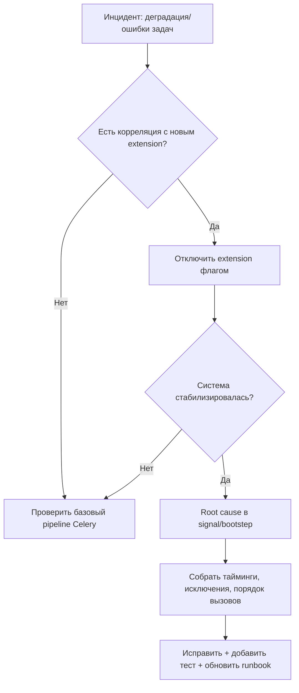
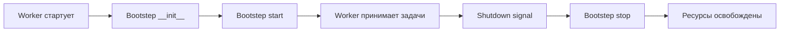
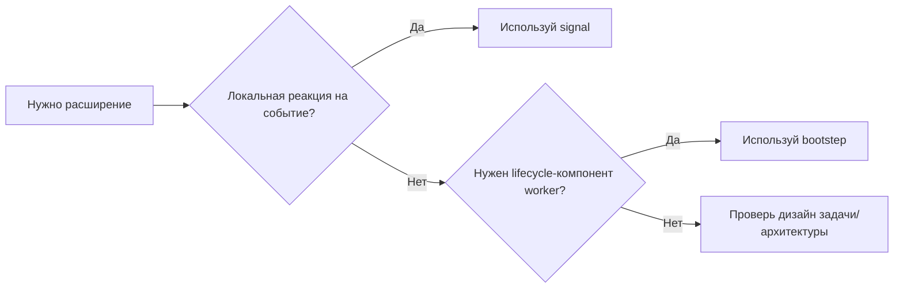

[← Назад к индексу части](index.md)
[↑ К глобальному плану](../../mastery_plan.md)

## 23.3 Расширения через signals и bootsteps

### Цель раздела

Понять, как использовать `signals` и `bootsteps` для системных задач (телеметрия, инициализация клиентов, health probes, диагностика), не смешивая это с бизнес-логикой.

### В этом разделе главное

- `signals` подходят для реакций на lifecycle-события;
- `bootsteps` подходят для структурной инициализации worker-подсистем;
- оба механизма опасны при неконтролируемом росте сложности;
- extensions этого уровня должны иметь строгую операционную дисциплину.

### Термины

| Термин | Формальное значение | Простыми словами |
|---|---|---|
| **Worker signal** | Событие жизненного цикла worker/task | Крючок, куда можно подключить обработчик |
| **Bootstep graph** | Граф зависимостей шагов старта worker-а | Порядок запуска подсистем |
| **Telemetry hook** | Точка сбора метрик/трейсов | Встраивание наблюдаемости |
| **Health probe** | Проверка готовности/здоровья | "Можно ли доверять worker-у сейчас?" |
| **Lifecycle isolation** | Изоляция инфраструктурных расширений | Не давать хаосу проникнуть в бизнес-логику |

### Теория и правила

#### Signals: сила и риск

Сигналы удобны, потому что:
- не требуют переписывать задачу;
- дают доступ к context выполнения;
- быстро подключаются.

Но риски:
- порядок выполнения handlers не всегда очевиден;
- exception в handler может влиять на поведение задач;
- сложно отслеживать "кто на что подписан" без реестра.

#### Bootsteps: структурный подход

`bootsteps` нужны, когда требуется:
- инициализировать shared-клиенты до старта потребления задач;
- поднять сервисные фоновые компоненты;
- обеспечить корректный shutdown.

#### Правило разделения ответственности

- `signals` — "локальные реакции";
- `bootsteps` — "архитектурная сборка worker-а".

### Пошагово: безопасное внедрение signal/bootstep

1. Сформулируй, зачем расширение нужно операционно.
2. Определи, подходит ли `signal` или `bootstep`.
3. Ограничь область ответственности (один extension — одна задача).
4. Добавь защиту от сбоев (timeouts, try/except, fallback behavior).
5. Обязательно добавь метрики и логи для extension itself.
6. Проверь graceful shutdown и startup race conditions.

### Простыми словами

Signals и bootsteps — это не "место, куда можно дописать все подряд", а хирургические инструменты. Если использовать их как молоток, система быстро станет нестабильной.

### Картинка в голове

В театре:
- `signals` — это звонки перед началом акта (локальные события);
- `bootsteps` — это работа сцены до открытия занавеса (базовая подготовка инфраструктуры).

### Как запомнить

**Signal реагирует. Bootstep строит.**

### Пример: signal для tracing и метрик

```python
from celery.signals import task_prerun, task_postrun, task_failure
import time

_starts = {}


@task_prerun.connect
def on_task_prerun(task_id=None, task=None, **kwargs):
    _starts[task_id] = time.monotonic()
    # emit_metric("task_started_total", tags={"task": task.name})


@task_postrun.connect
def on_task_postrun(task_id=None, task=None, state=None, **kwargs):
    started = _starts.pop(task_id, None)
    if started is not None:
        duration = time.monotonic() - started
        # emit_histogram("task_duration_seconds", duration, tags={"task": task.name, "state": state})


@task_failure.connect
def on_task_failure(task_id=None, exception=None, sender=None, **kwargs):
    # emit_metric("task_failed_total", tags={"task": sender.name, "exception": type(exception).__name__})
    pass
```

### Пример: bootstep для инициализации shared-клиента

```python
from celery import bootsteps


class MetricsClientStep(bootsteps.StartStopStep):
    requires = {"celery.worker.components:Pool"}

    def __init__(self, worker, **kwargs):
        self.client = None

    def start(self, worker):
        # Инициализация внешнего клиента до массового выполнения задач
        self.client = object()
        worker.app.metrics_client = self.client

    def stop(self, worker):
        # Корректное освобождение ресурса
        worker.app.metrics_client = None


def install_bootsteps(app):
    app.steps["worker"].add(MetricsClientStep)
```

### Диагностика для signals и bootsteps: где искать проблему

| Симптом | Вероятная причина | Где проверять первым делом |
|---|---|---|
| Резкий рост latency задач | Тяжелый/блокирующий signal-handler | `task_prerun/task_postrun` handlers, таймауты внешних вызовов |
| Worker "жив", но не обрабатывает задачи | Неуспешный bootstep-start или deadlock инициализации | Логи startup, порядок `requires`, readiness probes |
| Плавающие ошибки после restart | Некорректный `stop` в bootstep | Освобождение ресурсов, повторная инициализация клиентов |
| Необъяснимые побочные эффекты | Скрытые подписки на signals в разных модулях | Реестр handlers, импортный порядок, дублирующиеся connect |

### Мини-чеклист production-готовности для runtime-расширений

- у каждого signal/bootstep есть owner и описание ответственности;
- есть метрики самого расширения (ошибки хука, длительность хука, count вызовов);
- есть таймауты и безопасные fallback-сценарии;
- startup/shutdown поведение протестировано на staging;
- extension можно временно отключить feature-flag-ом или конфигом.

### Отладочный маршрут при инциденте в runtime-расширении



### Anti-pattern vs Best practice (signals/bootsteps)

| Anti-pattern | Почему опасно | Best practice |
|---|---|---|
| Тяжелый HTTP-вызов в `task_prerun` | Блокирует выполнение задач | Неблокирующий буфер/асинхронная отправка метрик |
| Один огромный bootstep "на все случаи" | Невозможно сопровождать и тестировать | Набор маленьких bootsteps с явными `requires` |
| Signal без fallback | Ломает критичный pipeline при сбое телеметрии | Fail-open для не критичных extension-хуков |

### Диаграмма: жизненный цикл bootstep



### Диаграмма: где лучше signals, а где bootsteps



### Таблица выбора: signal vs bootstep vs task code

| Что нужно сделать | Лучшее место | Почему |
|---|---|---|
| Замерить latency каждой задачи | `signal` | Это реакция на lifecycle-событие |
| Поднять shared-клиент до старта обработки | `bootstep` | Нужен управляемый startup/shutdown |
| Обработать бизнес-ошибку конкретной задачи | код задачи | Это доменная логика, не инфраструктурный хук |
| Временная аварийная телеметрия | `signal` (с TTL) | Быстро добавить и легко снять |
| Health probe уровня worker | `bootstep` + readiness | Нужен устойчивый runtime-компонент |

### Практика / реальные сценарии

1. **Телеметрия SLA задач**
   - Подключили `task_prerun`/`task_postrun` для измерения latency.
   - Отдельно считают `success/failure/retry` по task-name.
   - На дашборде видны деградации до жалоб пользователей.

2. **Инициализация secure client-а для KMS**
   - Через bootstep создают общий клиент и проверяют readiness.
   - Если инициализация неуспешна — worker не начинает consumption.
   - Это лучше, чем получать массовые падения задач уже в runtime.

3. **Кастомные health probes**
   - bootstep периодически проверяет broker/backend connectivity.
   - Проба учитывает не только "процесс жив", но и "сервис функционален".

### Типичные ошибки

- делать тяжелые сетевые операции прямо в signal без таймаутов;
- складывать всю инициализацию в один giant bootstep;
- не очищать ресурсы в `stop`;
- не иметь owner-а расширения (кто отвечает при инциденте).

### Что будет, если...

- **если** signal handler зависнет,  
  **то** можно получить деградацию throughput или блокировку процесса;
- **если** bootstep не корректно завершает ресурсы,  
  **то** после reload/restart возможны утечки и непредсказуемое состояние;
- **если** использовать signals как бизнес-оркестратор,  
  **то** поток выполнения станет неявным и трудно тестируемым.

### Проверь себя

1. Когда выбрать `bootstep`, а не `signal`?

<details><summary>Ответ</summary>

Когда нужен управляемый lifecycle компонента worker-а: инициализация, зависимости, запуск/остановка и контроль готовности.

</details>

2. Почему extension через signals без observability опасно?

<details><summary>Ответ</summary>

Потому что поведение становится "скрытым": сложно понять, какой handler повлиял на задачу и где произошел сбой.

</details>

3. Какое простое правило ограничивает хаос в расширениях runtime?

<details><summary>Ответ</summary>

Один extension — одна ответственность, плюс метрики, логи, тесты и владелец.

</details>

### Запомните

- Signals хороши для реакций, bootsteps — для жизненного цикла.
- Любое runtime-расширение должно быть наблюдаемым.
- Инфраструктурная логика должна быть отделена от бизнес-алгоритмов.

### Вопросы по подблокам 23.3

1. Как связаны блоки "signal vs bootstep", "жизненный цикл bootstep" и "отладочный маршрут инцидента"?

<details><summary>Ответ</summary>

Они описывают один и тот же объект с разных сторон: где размещать расширение (выбор механизма), как оно живет во времени (init/start/stop), и как безопасно расследовать сбой в проде (disable -> stabilize -> root cause).

</details>

2. Почему правило "один extension — одна ответственность" особенно важно для signals?

<details><summary>Ответ</summary>

Signals легко превратить в неявный orchestration-слой: несколько скрытых обработчиков начинают влиять на одну задачу, а порядок и последствия вызовов становятся неочевидны. Узкая ответственность сохраняет прозрачность и тестируемость.

</details>

3. Что показывает таблица `signal vs bootstep vs task code` в причинно-следственном смысле?

<details><summary>Ответ</summary>

Она фиксирует, что неправильный выбор уровня реализации почти всегда порождает типовой сбой: бизнес-код в signals дает хрупкость, lifecycle-задачи без bootsteps — проблемы запуска/остановки, а инфраструктурная телеметрия в task code — дубли и рассинхрон.

</details>

---
