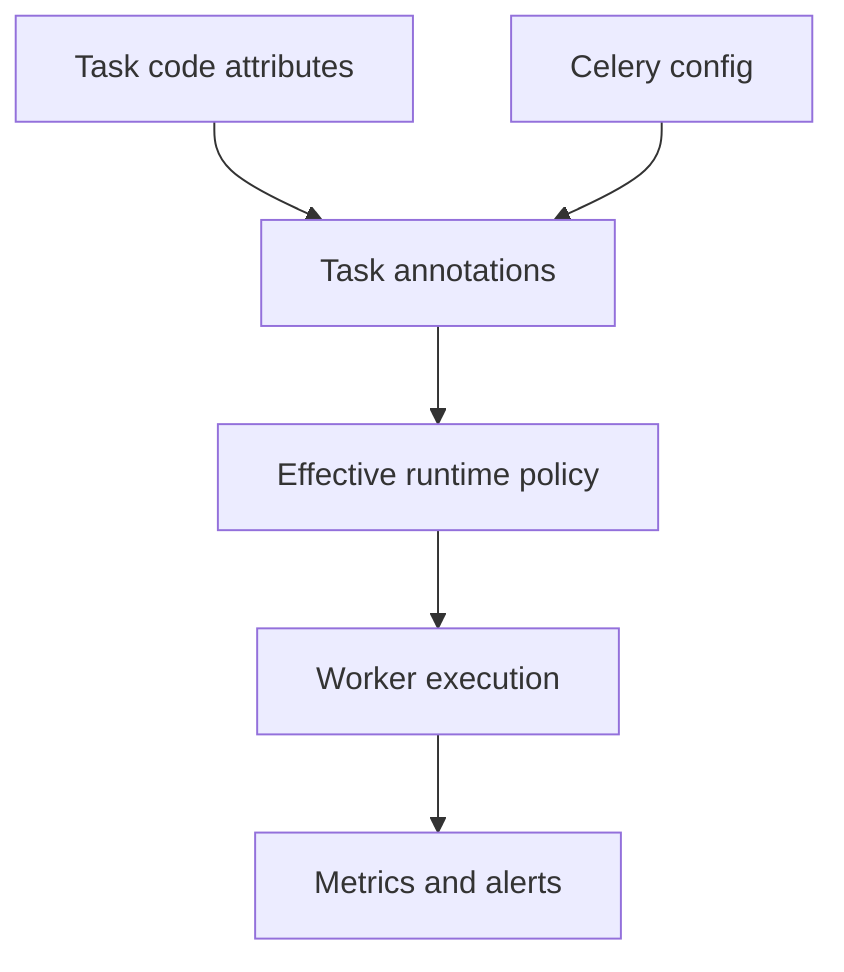

[← Назад к индексу части](index.md)
[↑ К глобальному плану](../celery_mastery_plan.md)

## 23.4 Task annotations и centralized policy

### Цель раздела

Освоить `task_annotations` как механизм централизованного управления политиками исполнения задач и понять, как использовать его для безопасных миграций конфигурации.

### В этом разделе главное

- `task_annotations` позволяют менять часть поведения задач без правки кода каждой задачи;
- это мощно для rate limits, retry overrides и единых операционных политик;
- центральная policy-система требует дисциплины версионирования и документирования;
- annotations не должны подменять собой архитектуру.

### Термины

| Термин | Формальное значение | Простыми словами |
|---|---|---|
| **Task annotation** | Правило переопределения атрибутов задачи на уровне конфигурации | Централизованный "патч" параметров задач |
| **Policy override** | Принудительное изменение поведения | Системное правило поверх локальных настроек |
| **Rate limit** | Ограничение скорости выполнения задач | "Не больше N задач за период" |
| **Central config drift** | Расхождение реального и задуманного конфига | Правила есть, но применяются не так |

### Теория и правила

#### Зачем нужен centralized policy layer

Когда задач много, ручное редактирование параметров в каждой задаче:
- медленное;
- ошибкоопасное;
- плохо масштабируется.

Annotations дают единое место управления.

#### Типовые случаи применения

- экстренное ограничение `rate_limit` для внешнего API;
- временный override retry-политики во время нестабильности зависимости;
- постепенная миграция конфигурации между версиями.

#### Граница ответственности

Annotations должны менять только операционные параметры. Если требуется менять бизнес-решения, нужно идти в код и архитектуру.

#### Важный нюанс: приоритет и прозрачность overrides

Частая путаница: разработчик смотрит на декоратор задачи и думает, что видит финальное поведение. Но annotations могут его переопределять.

Практическое правило:
- всё, что переопределяется через annotations, должно быть явно перечислено в policy-документе;
- при запуске диагностики смотри не только код задачи, но и "effective runtime config";
- wildcard-правила (`*`) должны быть минимальными и очень хорошо объясненными.

### Пошагово: внедряем policy через annotations

1. Определи список задач и параметров, которые могут быть централизованы.
2. Зафиксируй policy-таблицу (кто владелец, цель, срок, риск).
3. Реализуй annotations в конфигурации.
4. Включи observability: метрики по retries/rate-limit effect.
5. Протестируй на staging с нагрузочным сценарием.
6. Введи change management: кто и как может менять policy.

### Простыми словами

Task annotations — это "центральный пульт". Но если на пульте много неподписанных кнопок, в аварии никто не поймет, почему система ведет себя именно так.

### Картинка в голове

Диспетчерская вышка в аэропорту:
- задачи = рейсы;
- annotations = команды диспетчера по приоритету и скорости;
- цель = безопасность и управляемость потока.

### Как запомнить

**Annotations — для операционной политики, не для бизнес-логики.**

### Пример: централизованные overrides

```python
# celeryconfig.py

task_annotations = {
    "billing.charge_invoice": {
        "rate_limit": "20/m",
        "max_retries": 7,
        "default_retry_delay": 30,
    },
    "notifications.send_email": {
        "rate_limit": "100/s",
    },
    "*": {
        # осторожно: wildcard-правила должны быть предсказуемы и задокументированы
        "acks_late": True,
    },
}
```

### Пример: policy migration rollout (шаги)

```text
Шаг 1: собираем базовые метрики (до изменений)
Шаг 2: вводим annotation для 10% worker-группы
Шаг 3: проверяем error rate / retry volume / latency
Шаг 4: расширяем rollout до 100%
Шаг 5: фиксируем новую policy как baseline
```

### Пример: динамические annotations через класс

```python
class PolicyAnnotation:
    def annotate(self, task):
        if task.name.startswith("payments."):
            return {"rate_limit": "30/m", "max_retries": 8}
        if task.name.startswith("emails."):
            return {"rate_limit": "200/s"}
        return None


task_annotations = (PolicyAnnotation(),)
```

### Практика миграций через annotations без регрессий

| Шаг | Что делаем | Что измеряем |
|---|---|---|
| **Baseline** | Фиксируем текущие SLI/SLO по задачам | latency, error-rate, retry-rate |
| **Canary** | Включаем новую policy на ограниченной worker-группе | drift относительно baseline |
| **Expand** | Увеличиваем охват по очередям/воркерам | стабильность и пропускная способность |
| **Finalize** | Закрепляем policy и обновляем документацию | отсутствие скрытых overrides |
| **Cleanup** | Удаляем временные исключения | снижение config complexity |

### Мини-runbook: "почему задача ведет себя не так, как в коде"

1. Проверить task-декоратор и локальные параметры в коде.
2. Проверить `task_annotations` (включая wildcard и динамические аннотаторы).
3. Сравнить effective policy между окружениями (dev/stage/prod).
4. Проверить, не остались ли "временные" overrides после аварий.
5. Зафиксировать расхождение в policy-инвентаре и устранить config drift.

### Anti-pattern vs Best practice (annotations)

| Anti-pattern | Последствие | Best practice |
|---|---|---|
| Глобальный wildcard override без ревью | Неожиданные изменения у всех задач | Явные списки задач + RFC/approval |
| "Временная" policy без дедлайна | Нарастание config drift | TTL на overrides + план cleanup |
| Отсутствие сравнения окружений | Dev и prod ведут себя по-разному | Регулярный diff effective policy |

### Диаграмма: где работает annotation-policy



### Практика / реальные сценарии

1. **Внешний провайдер начал отдавать 429**
   - Операционно вводят `rate_limit` через annotations.
   - Параллельно усиливают backoff и jitter.
   - После стабилизации часть ограничений снимают.

2. **Миграция retry policy без массовой правки кода**
   - У сотен задач унифицируют `max_retries` и `default_retry_delay`.
   - Переход выполняют через одну конфигурационную точку.
   - Риск рассинхронизации сильно ниже, чем при ручной правке всех задач.

### Типичные ошибки

- wildcard-правила без четкой документации;
- "вечные временные" overrides;
- отсутствие ownership и approval процесса для policy-изменений;
- отсутствие обратной связи через метрики.

### Что будет, если...

- **если** централизованные overrides не наблюдаются,  
  **то** команда не поймет, почему конкретная задача ведет себя иначе, чем описано в коде;
- **если** policy меняют стихийно,  
  **то** поведение системы становится нестабильным от релиза к релизу;
- **если** annotations используют для бизнес-ветвления,  
  **то** модель системы станет непрозрачной и трудно тестируемой.

### Проверь себя

1. Чем удобны `task_annotations` в аварийной ситуации?

<details><summary>Ответ</summary>

Они дают централизованный и быстрый механизм изменить операционные параметры множества задач без срочного массового редактирования кода.

</details>

2. Почему wildcard-аннотации требуют особой осторожности?

<details><summary>Ответ</summary>

Потому что влияют сразу на широкую группу задач и могут неожиданно изменить поведение там, где это не планировалось.

</details>

3. Как понять, что centralized policy внедрена правильно?

<details><summary>Ответ</summary>

Есть owner, документация, процесс изменений, метрики эффекта и понятный rollback.

</details>

### Запомните

- Task annotations — мощный инструмент операционного управления.
- Без дисциплины governance они создают скрытую сложность.
- Каждое policy-изменение должно быть измеримым и обратимым.

### Вопросы по подблокам 23.4

1. Почему блок "приоритет и прозрачность overrides" критичен для анализа инцидентов?

<details><summary>Ответ</summary>

Потому что код задачи не всегда отражает фактическое runtime-поведение: annotations могут переопределять параметры исполнения. Без понимания effective policy команда диагностирует не ту причину.

</details>

2. Чем полезно сочетание "динамические annotations" + "таблица миграций без регрессий"?

<details><summary>Ответ</summary>

Динамика дает гибкость, а миграционный каркас дает контроль. Вместе они позволяют менять политику быстро, но проверяемо: через baseline, canary, наблюдение и cleanup.

</details>

3. Почему anti-pattern "вечные временные overrides" особенно опасен в мультикомандной среде?

<details><summary>Ответ</summary>

Потому что локальное аварийное правило становится системным поведением без явного владения. Новые команды ориентируются на код, а реально работает скрытая policy-настройка, что ведет к drift и регрессиям.

</details>

---
