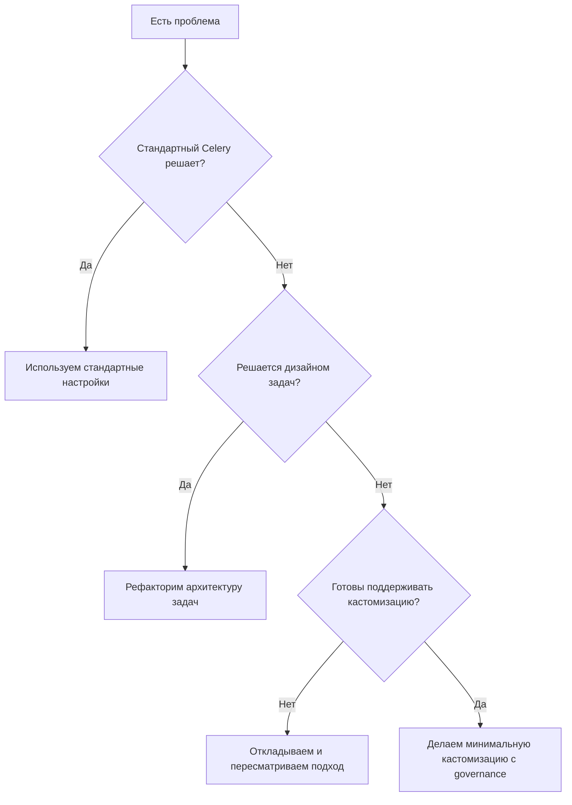

[← Назад к индексу части](index.md)
[↑ К глобальному плану](../mastery_plan.md)

## 23.5 Когда не кастомизировать

### Цель раздела

Научиться принимать инженерное решение "не кастомизировать", если проблему лучше решить архитектурой задач, конфигурацией стандартных механизмов или организационными практиками.

### В этом разделе главное

- не каждая боль требует extension point;
- кастомизация имеет стоимость владения (support, тесты, апгрейды);
- риск lock-in к версии Celery/Kombu реален;
- без тестов и owner-а кастомизация почти всегда превращается в техдолг.

### Термины

| Термин | Формальное значение | Простыми словами |
|---|---|---|
| **Over-customization** | Избыточные расширения без достаточной пользы | "Слишком много тюнинга" |
| **Operational burden** | Стоимость поддержки в эксплуатации | Сколько сил нужно, чтобы это не ломалось |
| **Version lock-in** | Привязка к внутренностям версии | Трудно обновляться без боли |
| **Ownerless subsystem** | Подсистема без ответственного владельца | "Ничья" критическая логика |

### Теория и правила

#### Три вопроса перед любой кастомизацией

1. Можно ли решить задачу стандартным конфигом Celery?
2. Можно ли решить это дизайном задач/архитектуры (идемпотентность, декомпозиция, routing)?
3. Готова ли команда сопровождать это решение 12-24 месяца?

Если хотя бы на третий вопрос ответ "нет" — не кастомизируй.

#### Матрица принятия решения

| Критерий | Низкий риск | Высокий риск |
|---|---|---|
| Связь с internals Celery | Используются публичные API | Используются внутренние приватные детали |
| Тестируемость | Есть unit/integration/e2e | Тесты отсутствуют |
| Владение | Есть owner и runbook | Owner не назначен |
| Апгрейд-готовность | Проверено на нескольких версиях | Ломается при minor update |

#### Признаки, что надо остановиться

- "Сделаем быстро хук, потом разберемся";
- "Это знает только один человек";
- "Тестов нет, но вроде работает";
- "В changelog Celery это место unstable, но нам нормально".

### Пошагово: решение "делаем / не делаем"

1. Опиши проблему без привязки к инструменту.
2. Сравни 2-3 альтернативы (стандартный Celery, архитектурный рефакторинг, кастомизация).
3. Оцени стоимость владения (поддержка, обучение, апгрейды).
4. Определи rollback и критерии успеха.
5. Если кастомизация все же выбрана — ограничь scope и назначь owner-а.

### Практический scorecard решения о кастомизации

Оцени каждый пункт от 0 до 2:
- **Бизнес-ценность** (0 = неясно, 2 = четко измерима).
- **Альтернативы** (0 = не анализировали, 2 = сравнили с 2-3 вариантами).
- **Поддерживаемость** (0 = нет owner/tests, 2 = есть owner, тесты, runbook).
- **Совместимость с апгрейдами** (0 = завязка на private internals, 2 = публичные API).
- **Rollback readiness** (0 = rollback не продуман, 2 = rollback быстрый и проверенный).

Интерпретация:
- `0-4`: не внедрять, пересмотреть подход;
- `5-7`: только как временная мера с жесткими сроками удаления;
- `8-10`: можно внедрять в controlled rollout.

### ASCII-схема "цена кастомизации во времени"

```text
Краткосрочно:       [Быстрый выигрыш]++++
Среднесрочно:       [Поддержка и тесты]++++++++
Долгосрочно:        [Апгрейды и совместимость]++++++++++++

Вывод: чем глубже в internals, тем дороже владение на горизонте 1-2 лет.
```

### Граничные случаи, где решение особенно сложное

1. **Критичный SLA + нестабильный внешний провайдер**
   - Хочется быстро "докрутить" internals.
   - Часто лучше: rate-limit + backoff + circuit breaker + временный degrade path.

2. **Многокомандная платформа**
   - Одна команда делает extension, остальные становятся зависимыми.
   - Нужны RFC-процесс, контрактная документация и roadmap поддержки.

3. **Смешанные версии Celery при долгом rollout**
   - Любой private-хак сильно повышает риск несовместимости.
   - Приоритет: публичные API и минимальная кастомизация.

### Быстрый "стоп-лист": когда кастомизацию лучше запретить сразу

- нет владельца подсистемы и дежурной команды;
- нет времени на тесты и staged rollout;
- изменение затрагивает private internals без крайней необходимости;
- нет плана аварийного отключения;
- цель сформулирована как "хочется красиво", а не "есть измеримый операционный эффект".

### Простыми словами

Иногда лучший инженерный ход — ничего не кастомизировать, а улучшить базовый дизайн задач, конфигурацию и наблюдаемость.

### Картинка в голове

Дом:
- можно каждый раз чинить протечки декоративной накладкой (кастомизация),
- а можно заменить проблемный участок трубы (архитектурное решение).

### Как запомнить

**Если решение сложно объяснить новому инженеру за 10 минут — оно, вероятно, слишком кастомное.**

### Пример: анти-паттерн vs правильный подход

```text
Анти-паттерн:
- Проблема: периодические дубликаты выполнения.
- Решение: кастомный хук в internals acknowledge-пайплайна.
- Итог: ломается после обновления Celery.

Правильный подход:
- Идемпотентность на уровне бизнес-операции + dedup key.
- Настройка retry/acks в рамках публичных параметров.
- Наблюдаемость duplicate-rate.
```

### Диаграмма решения



### Практика / реальные сценарии

1. **Команда хотела "кастомно улучшить ack internals"**
   - После анализа оказалось, что проблемы из-за неидемпотентной задачи.
   - Исправили бизнес-логику и ключи дедупликации.
   - Кастомизация internals не понадобилась.

2. **Критичный extension без owner-а**
   - При увольнении автора никто не понимал подсистему.
   - Любой апгрейд откладывался на месяцы.
   - После инцидента ввели правило: no owner -> no extension.

### Типичные ошибки

- принимать "технически интересное" за "бизнесово полезное";
- недооценивать стоимость апгрейдов;
- не вести инвентаризацию расширений;
- не иметь плана удаления временных кастомизаций.

### Что будет, если...

- **если** кастомизация завязана на private internals,  
  **то** обновления Celery станут дорогими и рискованными;
- **если** нет владельца,  
  **то** инциденты будут решаться медленно и несистемно;
- **если** игнорировать архитектурные причины,  
  **то** кастомизации будут множиться, а базовая проблема останется.

### Проверь себя

1. Назови три причины отказаться от кастомизации.

<details><summary>Ответ</summary>

Проблему решают стандартные механизмы, нет готовности сопровождать решение, высокий риск lock-in к версии internals.

</details>

2. Что важнее: "мы можем это сделать" или "мы можем это поддерживать"?

<details><summary>Ответ</summary>

"Мы можем поддерживать". Инженерная ценность определяется жизненным циклом решения, а не только фактом реализации.

</details>

3. Какой минимальный governance должен быть у кастомного расширения?

<details><summary>Ответ</summary>

Owner, документация контракта, тесты, метрики, runbook и критерии rollback.

</details>

### Запомните

- Не кастомизировать — это тоже зрелое инженерное решение.
- Любой extension должен иметь понятную бизнес-ценность.
- Стоимость поддержки часто важнее краткосрочной "красоты" решения.

### Вопросы по подблокам 23.5

1. Как связаны "три вопроса перед кастомизацией", scorecard и стоп-лист?

<details><summary>Ответ</summary>

Это три уровня фильтрации: быстрый смысловой фильтр (3 вопроса), количественная оценка готовности (scorecard), и жесткий запрет при критичных рисках (стоп-лист). Вместе они снижают вероятность импульсивных и дорогих решений.

</details>

2. Почему даже высокий технический потенциал решения не гарантирует, что его стоит внедрять?

<details><summary>Ответ</summary>

Потому что ценность определяется не только реализуемостью, но и стоимостью владения: тесты, апгрейды, on-call поддержка, rollback. Если поддерживаемость слабая, решение становится источником долгов и инцидентов.

</details>

3. Какой практический вывод дает ASCII-схема стоимости кастомизации во времени?

<details><summary>Ответ</summary>

Краткосрочный выигрыш часто маскирует долгосрочную цену. Чем глубже вмешательство в internals, тем важнее заранее оценить операционные затраты на горизонте 1-2 лет.

</details>

---
