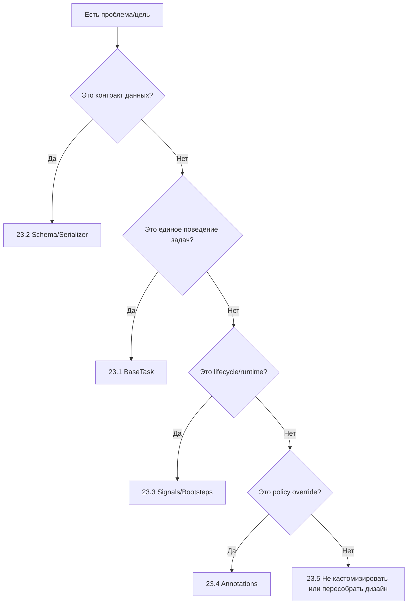

[← Назад к индексу части](index.md)
[↑ К глобальному плану](../../mastery_plan.md)

## Справочник по части

| Тема | Ключевые пункты |
|---|---|
| **BaseTask** | Стандартизирует инфраструктурное поведение задач; не хранит бизнес-правила |
| **Serializer + schema** | Контракт данных важнее формата; нужна версия payload и стратегия совместимости |
| **Signals** | Локальные lifecycle-реакции; обязательны ограничения и observability |
| **Bootsteps** | Архитектурная инициализация worker runtime; важны зависимости и shutdown |
| **Task annotations** | Централизованные операционные overrides; нужны governance и прозрачность |
| **Когда не кастомизировать** | При возможности решения стандартными средствами или при высокой цене сопровождения |

### Финальный production-checklist для любой кастомизации Celery

- **Цель измерима:** есть конкретный SLI/SLO, который улучшаем.
- **Риск понятен:** описан blast radius и условия rollback.
- **Контракт зафиксирован:** для BaseTask/payload/policy есть документация.
- **Совместимость проверена:** учтены mixed-version rollout и старые сообщения в очередях.
- **Наблюдаемость включена:** логи, метрики, трейсы покрывают само расширение.
- **Владелец назначен:** есть команда/человек, runbook и on-call ответственность.
- **Путь отключения есть:** feature flag или безопасное конфигурационное выключение.
- **План удаления есть:** для временных решений указан срок и критерий cleanup.

### Сводная таблица выбора extension point

| Если твоя цель... | Начинай с... | Не начинай с... | Почему |
|---|---|---|---|
| Унифицировать логи/ретраи/валидацию | `BaseTask` (`23.1`) | `signals` и deep internals | Нужна единая оболочка поведения задач |
| Обеспечить совместимость формата сообщений | schema + serializer (`23.2`) | "магии" в BaseTask | Это контракт producer/worker, не логика выполнения |
| Подключить lifecycle-телеметрию | `signals` (`23.3`) | переписывания бизнес-задач | Это реакция на события жизненного цикла |
| Инициализировать shared runtime-компонент | `bootsteps` (`23.3`) | случайный код в импорте модулей | Нужен управляемый startup/shutdown |
| Быстро ограничить rate/retry по группе задач | `task_annotations` (`23.4`) | массовой правки кода задач | Нужен централизованный policy-override |
| Снизить риск техдолга от кастомизаций | decision-framework (`23.5`) | внедрения "сразу в прод" | Нужен фильтр ценности и стоимости владения |

### Компактная диаграмма принятия решения

### Вопросы по справочнику и чеклистам

1. Как использовать справочник по части и финальный production-checklist вместе в реальном проекте?

Ответ

Справочник помогает выбрать концептуальный слой проблемы, а checklist — проверить готовность решения к продакшену. Первый отвечает на "что это за класс решения", второй — "можно ли это безопасно внедрять сейчас".

2. Почему таблица выбора extension point снижает количество архитектурных ошибок у команды?

Ответ

Она предотвращает типичный anti-pattern "решаем все одним инструментом". Команда быстрее сопоставляет цель с правильным уровнем вмешательства и избегает избыточной кастомизации.

3. В чем ценность компактной диаграммы принятия решения при инциденте?

Ответ

Она сокращает время на первичную классификацию проблемы: куда смотреть первым делом (`23.2`, `23.3`, `23.4` или `23.5`) и какой тип действий вероятнее всего безопасен.

---
