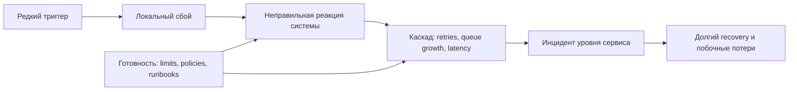
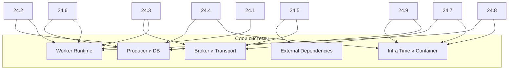

[← Назад к индексу части](index.md)
[↑ К глобальному плану](../../mastery_plan.md)

## Сквозная модель edge-case риска

**Простыми словами:** почти любой «редкий» инцидент проходит один и тот же путь: сначала мелкая аномалия, потом неверная автоматическая реакция, затем лавина. Наша задача — заранее встроить «предохранители», чтобы лавина не возникала.

### Картинка в голове

Представь снежный склон: сам по себе маленький ком снега не страшен, но если склон крутой и нет защитных барьеров, начинается лавина. Edge-case инженерия — это барьеры, маршруты схода и датчики риска.

### Сводная карта: какой edge case чаще всего бьет по какому слою

Эта схема нужна как карта расследования: по симптому быстро видно, в какой слой идти первым.

#### Проверь себя: сквозная модель и слои

1. В чем польза разделения на слои (`Producer/DB`, `Broker`, `Worker`, `External`, `Infra`) при расследовании?

Ответ

Слои уменьшают хаос диагностики: вместо «проверяем всё» команда начинает с наиболее вероятного слоя и быстрее находит корень проблемы.

2. Почему один edge case может задевать сразу несколько слоев?

Ответ

В распределенной системе ошибка распространяется по цепочке: например, неверный retry-паттерн в worker создает перегрузку broker и усугубляет сбой внешней зависимости.

---
