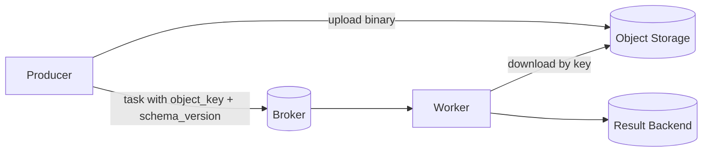

[← Назад к индексу части](index.md)
[↑ К глобальному плану](../../mastery_plan.md)

## 24.2 Очень большие payload

### Цель раздела

Научиться безопасно передавать большие данные в задачах Celery без перегруза broker, без лишней сериализации и без роста latency.

### В этом разделе главное

- broker не предназначен быть «файловым хранилищем»;
- большие payload множат memory pressure и сетевой overhead;
- чаще правильно передавать ссылку/идентификатор, а не сами данные;
- объектное хранилище + metadata в задаче обычно безопаснее.

### Термины

| Термин | Формально | Простыми словами |
|---|---|---|
| **Payload** | Тело сообщения задачи | То, что мы отправляем в аргументах задачи |
| **Serialization overhead** | Затраты CPU/памяти на кодирование/декодирование | Плата за «упаковку-распаковку» данных |
| **Broker memory pressure** | Рост памяти брокера из-за тяжелых сообщений | Очередь начинает «раздуваться» и тормозить |
| **Pointer payload** | Передача ссылки на данные вместо самих данных | Отправляем `s3://...`, а не 50 МБ JSON |

### Теория и правила

1. **Большой payload бьет сразу по трем местам:** producer, broker, consumer.
2. **Каждый retry дублирует тяжелый трафик и сериализацию.**
3. **Большой JSON может быть удобен в дебаге, но дорог в проде.**
4. **Правильный паттерн:** payload содержит метаданные + ссылку на объект в внешнем хранилище.
5. **Контракт на данные обязателен:** версия схемы, TTL объекта, правила очистки.

### Диаграмма потока: «данные отдельно, команда отдельно»



### Пошагово: безопасная стратегия для больших данных

1. Сохрани тяжелый объект во внешнем хранилище (`S3`, `MinIO`, `GCS`).
2. Передай в Celery только `object_key`, размер, checksum, version.
3. На worker валидационно проверь размер/checksum/version.
4. Обрабатывай данные потоково (stream/chunk), не загружай целиком в память.
5. После успеха включи lifecycle cleanup (TTL, retention policy).

### Граничные случаи

- слишком короткий TTL удалит объект до того, как воркер успеет его обработать;
- отсутствие schema version приведет к скрытым ошибкам парсинга;
- отсутствие checksum может дать «тихую» порчу данных.

### Простыми словами

Celery-сообщение — это «квитанция на работу», а не «грузовик с грузом». Груз должен ехать отдельным каналом.

### Картинка в голове

Представь аэропорт:

- брокер — это диспетчерская с расписанием рейсов;
- payload — это «карточка рейса»;
- тяжелый файл — это багаж в грузовом терминале.

Если тащить весь багаж в диспетчерскую, она перестанет управлять рейсами. Ее задача — маршрутизировать, а не хранить чемоданы.

### Как запомнить

**PTRC:** `Pointer -> TTL -> Read stream -> Cleanup`.  
Это базовая формула безопасной работы с большими данными через Celery.

### Пример payload-контракта

```json
{
  "schema_version": 3,
  "object_url": "s3://reports-bucket/2026/04/21/job-9284/input.parquet",
  "object_sha256": "9be3...f1",
  "bytes": 387421993,
  "content_type": "application/x-parquet",
  "tenant_id": "acme-eu"
}
```

### Практика / реальные сценарии

- батч-отчеты: в задачу передается только `report_id` и `data_ref`;
- генерация PDF/медиа: результат кладется во внешнее хранилище, в backend — только status + URL;
- ML preprocessing: chunk-обработка с ленивым чтением.

### Типичные ошибки

- отправлять «сырые» мегабайты прямо в task args;
- забывать версионировать payload schema;
- не контролировать cleanup старых объектов;
- использовать pickle-подобные форматы без осознания риска совместимости/безопасности.

### Что будет, если…

**Если продолжать гонять большие payload через broker:**  
очереди растут, latency скачет, retry становится дорогим, а worker чаще упирается в память.

### Проверь себя

1. Почему «просто увеличить ресурсы broker» не лучший ответ на большие payload?

<details><summary>Ответ</summary>

Это лечит симптом, но не архитектурную причину. Стоимость и сложность растут, а паттерн остается неустойчивым и продолжает масштабировать проблему.

</details>

2. Когда передача ссылки лучше передачи данных?

<details><summary>Ответ</summary>

Почти всегда при больших объемах данных, особенно если возможны retry, fan-out и долгие очереди ожидания.

</details>

3. Зачем checksum в payload-контракте?

<details><summary>Ответ</summary>

Чтобы проверить целостность объекта и не обрабатывать поврежденные или подмененные данные.

</details>

### Запомните

Большой payload в broker — это дорогой технический компромисс, который обычно можно заменить на pointer-based подход.

---
