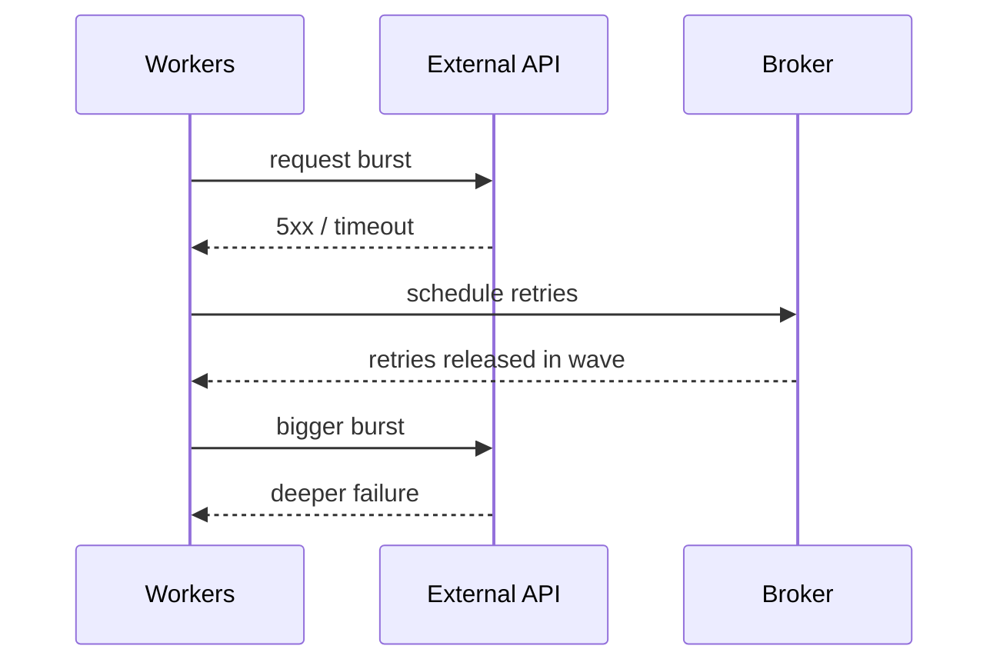

[← Назад к индексу части](index.md)
[↑ К глобальному плану](../../mastery_plan.md)

## 24.5 Падение внешней зависимости во время массового retry

### Цель раздела

Научиться предотвращать retry-storm, когда внешний сервис падает, а Celery начинает повторять задачи лавинообразно.

### В этом разделе главное

- без backoff+jitter retry превращается в DDoS собственной зависимости;
- circuit breaker должен включаться раньше, чем очередь «вскипит»;
- нужна деградационная стратегия (degrade/disable path);
- retry policy должен быть согласован с SLO внешнего сервиса.

### Термины

| Термин | Формально | Простыми словами |
|---|---|---|
| **Retry storm** | Лавинообразный рост повторов задач | Все одновременно снова бьют в падающий сервис |
| **Exponential backoff** | Увеличение интервала повторов экспоненциально | Каждый следующий retry дальше по времени |
| **Jitter** | Рандомизация задержки повторов | Чтобы повторы не совпали по секунде |
| **Circuit breaker** | Паттерн временного «разрыва цепи» при ошибках | Временно прекращаем вызовы в больной сервис |
| **Degrade path** | Упрощенный режим работы | Лучше частичный сервис, чем полный коллапс |

### Теория и правила

1. **Retry — это нагрузка, а не бесплатное восстановление.**
2. **Exponential backoff без jitter — половинчатое решение.**
3. **Circuit breaker защищает и зависимость, и вашу очередь.**
4. **Нужны лимиты «верхнего давления»: rate limits, concurrency caps, dead-letter policy.**
5. **Для каждой критичной зависимости нужен отдельный runbook.**

### Диаграмма каскада retry-storm



### Пошагово: анти-шторм стратегия

1. Введи `retry_backoff=True` + jitter для всех задач, зависимых от внешнего API.
2. Ограничь максимальный retry count и max retry delay.
3. Подключи circuit breaker на клиенте внешнего сервиса.
4. Добавь режим degrade: временный fallback или отложенная постановка в отдельную очередь.
5. Введи emergency switch: возможность быстро «приглушить» тип задач через annotations/config.

### Disable path: что можно временно отключать первым

- вторичные уведомления;
- не критичные синхронизации;
- тяжелые задачи, усиливающие OOM/latency в пик инцидента.

Это нужно заранее фиксировать в runbook, а не решать «на лету».

### Пример конфигурационной политики

```python
task_annotations = {
    "billing.sync_invoice": {
        "rate_limit": "20/m",
        "max_retries": 8,
        "autoretry_for": (TimeoutError, ConnectionError),
        "retry_backoff": True,
        "retry_jitter": True,
    }
}
```

### Практика / реальные сценарии

- платежный шлюз временно недоступен: отключаем агрессивные retries, включаем отложенную очередь;
- CRM API дает 429: увеличиваем backoff и включаем адаптивный rate-limit;
- внутренний сервис деградирует: переводим часть задач в «ленивый» режим с приоритетом критичных потоков.

### Мини-таблица решений для retry-политики

| Симптом | Риск | Решение |
|---|---|---|
| массовые `429` | перегрузка зависимости | увеличить backoff, усилить jitter, понизить rate limit |
| стабильные `5xx` > N минут | частичная недоступность | включить circuit breaker и degrade path |
| timeouts на пике | сетевой/latency стресс | снизить concurrency и fan-out, разнести очереди |

### Типичные ошибки

- использовать фиксированный retry countdown для всех задач;
- не разделять retry-политику по типам внешних ошибок;
- пытаться «догнать backlog» мгновенным увеличением concurrency;
- не иметь ручного переключателя degrade mode.

### Что будет, если…

Коллапс внешнего API усилится, очередь разрастется, latency вырастет по всем доменам, включая те, что изначально были здоровы.

### Проверь себя

1. Почему jitter критичен даже при экспоненциальном backoff?

<details><summary>Ответ</summary>

Потому что без jitter множество задач, упавших одновременно, повторятся синхронно и создадут новую ударную волну.

</details>

2. Почему retry policy должна быть разной для `429` и `500`?

<details><summary>Ответ</summary>

`429` обычно сигнализирует ограничение нагрузки (нужны более длинные и аккуратные паузы), `500` может требовать иной стратегии и более короткого окна диагностики.

</details>

3. Что дает circuit breaker в контексте Celery?

<details><summary>Ответ</summary>

Снижает бессмысленные вызовы в падающий сервис и защищает очередь от каскадного накопления повторов.

</details>

### Запомните

Retry без ограничителей — это ускоритель инцидента, а не механизм надежности.

---
