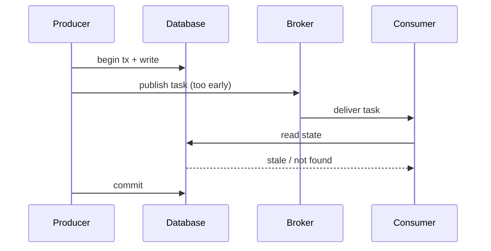
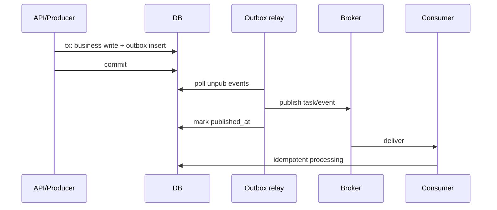

[← Назад к индексу части](index.md)
[↑ К глобальному плану](../../mastery_plan.md)

## 24.6 Гонка producer vs consumer state

### Цель раздела

Разобраться, как возникают гонки между публикацией задачи и фиксацией состояния в БД, и как проектировать публикацию так, чтобы consumer видел корректные данные.

### В этом разделе главное

- классическая ловушка: `publish` происходит до `commit`;
- consumer может стартовать раньше, чем данные станут видимыми;
- eventual consistency нужно проектировать явно;
- transactional outbox — стандартный способ снизить риск.

### Термины

| Термин | Формально | Простыми словами |
|---|---|---|
| **Publish-before-commit** | Сообщение отправлено до фиксации транзакции | Задача стартует, но данных еще «нет» |
| **Transactional outbox** | Публикация событий через таблицу outbox в той же транзакции | Сначала надежно фиксируем факт, потом доставляем |
| **Stale read** | Чтение устаревшего состояния | Consumer смотрит «старую картину мира» |
| **Eventual consistency** | Согласованность со временем, не мгновенно | Нужно уметь жить с задержкой видимости |

### Теория и правила

1. **Producer и DB commit должны быть связаны единым контрактом надежности.**
2. **Consumer должен быть готов к временной недоступности ожидаемого состояния.**
3. **Ретрай consumer-а не должен маскировать архитектурную гонку.**
4. **Идемпотентность и дедупликация критичны на обеих сторонах.**

### Диаграмма гонки



### Пошагово: безопасный паттерн

1. В основной транзакции записи данных запиши событие в `outbox` таблицу.
2. Коммить транзакцию.
3. Отдельный reliable publisher читает outbox и публикует в broker.
4. После успешной публикации помечай outbox запись как доставленную.
5. На consumer реализуй идемпотентную обработку.

### Граничные случаи outbox

- publish случился, а `published_at` не проставился: возможна повторная публикация;
- relay отстает: растет outbox lag и бизнес видит задержку событий;
- нет cleanup outbox: таблица разрастается и замедляет relay.

### Простыми словами

Нельзя отправлять «курьера» за заказом до того, как заказ внесен в систему. Иначе курьер приедет — а заказа еще нет.

### Диаграмма: правильный поток через outbox



### Как запомнить

**WCPI:** `Write -> Commit -> Publish -> Idempotent consume`.

### Пример структуры outbox

```sql
CREATE TABLE outbox_events (
  id BIGSERIAL PRIMARY KEY,
  event_type TEXT NOT NULL,
  payload JSONB NOT NULL,
  created_at TIMESTAMPTZ NOT NULL DEFAULT now(),
  published_at TIMESTAMPTZ NULL
);
```

### Типичные ошибки

- «временно» публиковать изнутри транзакции;
- не логировать correlation id между DB записью и задачей;
- полагаться только на retry вместо устранения гонки;
- считать eventual consistency «редкой проблемой».

### Что будет, если…

Появятся задачи, которые «иногда не находят данные», случайные дубли и сложные для расследования флапающие инциденты.

### Проверь себя

1. Почему retry consumer-а не решает полностью проблему publish-before-commit?

<details><summary>Ответ</summary>

Retry лишь снижает симптом, но не устраняет первопричину гонки. В периоды нагрузки это приводит к нестабильности и лишним повторам.

</details>

2. В чем ключевая идея transactional outbox?

<details><summary>Ответ</summary>

Сделать факт «данные записаны + событие создано» атомарным в одной БД транзакции, а публикацию вынести в надежный последующий шаг.

</details>

3. Зачем correlation id между producer state и task?

<details><summary>Ответ</summary>

Для трассировки и доказуемой диагностики: видно, какое состояние породило конкретную задачу и как она отработала.

</details>

### Запомните

Если publish не синхронизирован с commit, вы получаете лотерею корректности.

---
