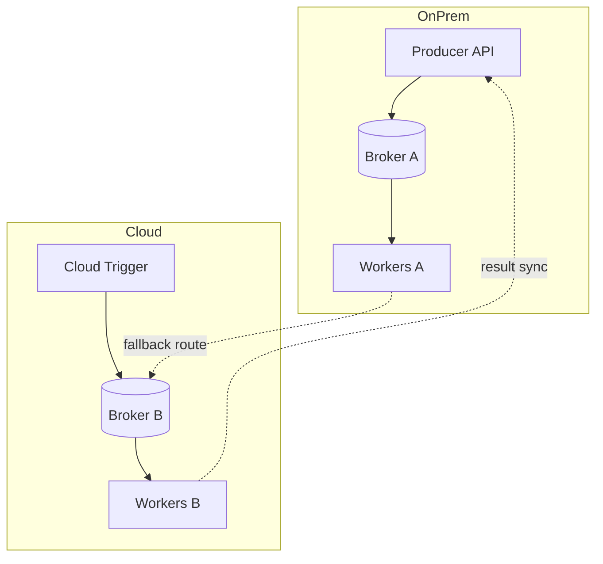
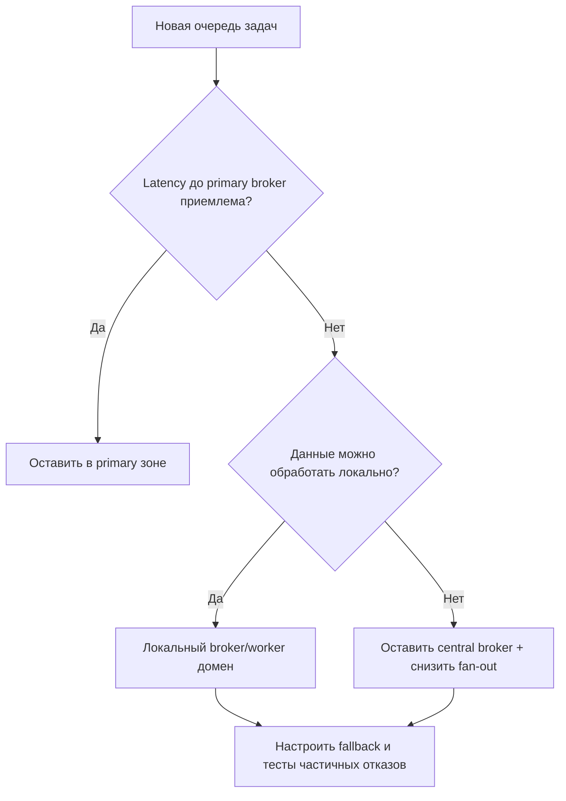

[← Назад к индексу части](index.md)
[↑ К глобальному плану](../mastery_plan.md)

## 24.7 Celery в гибридных environments

### Цель раздела

Научиться строить Celery-топологию для смешанных контуров (on-prem + cloud, несколько broker, geo-удаленные worker) без потери управляемости и предсказуемости.

### В этом разделе главное

- гибридная среда требует topology-aware routing;
- latency между worker и broker влияет на поведение очередей и timeouts;
- multi-broker добавляет сложность consistency и наблюдаемости;
- архитектура должна явно выделять зоны ответственности и сбойные домены.

### Термины

| Термин | Формально | Простыми словами |
|---|---|---|
| **Hybrid environment** | Комбинация нескольких инфраструктурных доменов | Часть системы в облаке, часть on-prem |
| **Geo-distributed workers** | Worker-ы в разных регионах/датацентрах | Далеко друг от друга и от broker |
| **Topology-aware routing** | Маршрутизация с учетом сетевой топологии | Задача идет туда, где дешевле и надежнее выполнить |
| **Failure domain** | Область, в которой отказ взаимосвязан | Сбой в одном сегменте не должен валить все |

### Теория и правила

1. **Данные и вычисления должны быть по возможности рядом.**
2. **Не смешивай критичные и «лучше-успеть» потоки в одних очередях через WAN.**
3. **Multi-broker оправдан только при явной бизнес-необходимости.**
4. **Наблюдаемость должна быть глобально сквозной (единые trace/correlation IDs).**

### Диаграмма гибридной топологии

### Пошагово

1. Классифицируй задачи: latency-critical, data-local, best-effort.
2. Определи primary execution zone для каждого класса.
3. Введи явные routing keys и очереди по зонам.
4. Настрой fallback только для тех потоков, где это безопасно по данным.
5. Протестируй сценарии partial outage: падение одного broker/канала.

### Практический latency budget для hybrid

Минимально отслеживай:

- `publish_to_consume_ms`;
- `queue_wait_p95_ms`;
- `retry_rate_per_route`;
- `worker_start_skew_ms` между регионами.

Если маршрут системно вне бюджета, переноси поток в локальный execution-домен или понижай его долю.

### Multiple brokers: когда это оправдано, а когда это ловушка

**Оправдано:**
- есть жесткое разделение доменов/тенантов;
- разные compliance-требования по маршрутам данных;
- нужен явный isolation для критичных и второстепенных потоков.

**Ловушка:**
- «просто чтобы было надежнее», без четких границ;
- нет единой observability-модели;
- нет формализованного failover-плана и командной дисциплины переключения.

### Выбор маршрутизации по latency между worker и broker

### Что будет, если переусложнить multi-broker без дисциплины

- routing становится неочевидным даже для команды;
- инциденты диагностируются дольше из-за «размазанной» телеметрии;
- failover приводит к неожиданной смене порядка и latency-профиля задач.

### Простыми словами

Гибридная среда — это как логистика между городами: если не продумать маршруты, один перекрытый мост парализует всю доставку.

### Картинка в голове

Каждый broker-домен — это отдельный транспортный хаб. Хорошая схема похожа на сеть дорог с объездом, плохая — на один мост для всех грузов.

### Как запомнить

**ZRAF:** `Zone routing -> Risk isolation -> Alert visibility -> Failover drills`.

### Типичные ошибки

- пытаться «прозрачно» скрыть geo-latency;
- отправлять data-heavy задачи в удаленный регион без нужды;
- смешивать роли broker и не иметь ясной схемы failover;
- не иметь runbook «что отключаем первым» при межзонных проблемах.

### Что будет, если…

Система станет нестабильной в пиковые часы: часть задач резко замедляется, часть отваливается по таймаутам, диагностика расползается по разным контурам.

### Проверь себя

1. Почему «все worker-ы на один глобальный broker» может быть плохой идеей в hybrid?

Ответ

Из-за сетевой задержки, разной надежности каналов и роста blast radius: сбой или деградация централизованной точки бьет по всем регионам сразу.

2. Что дает topology-aware routing?

Ответ

Снижает latency, уменьшает сетевые риски и делает поведение очередей более предсказуемым.

3. Когда fallback между зонами опасен?

Ответ

Когда данные нельзя безопасно обрабатывать вне зоны (регуляторика, доступность источников, консистентность состояния).

### Запомните

Hybrid Celery — это не «добавили еще worker», а отдельная архитектура с явными сетевыми границами.

---
