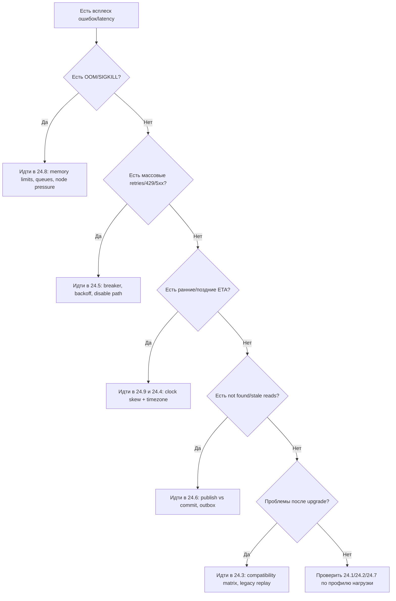

[← Назад к индексу части](index.md)
[↑ К глобальному плану](../../mastery_plan.md)

## Практический runbook: как диагностировать edge-case инцидент

1. **Зафиксируй симптом в измеряемом виде**  
   Пример: «рост redelivery x4 за 15 минут» вместо «очередь странно себя ведет».
2. **Отнеси симптом к классу риска**  
   `время`, `память`, `совместимость`, `гонка состояния`, `внешняя зависимость`, `топология`.
3. **Сверься с соответствующим разделом части 24**  
   Используй блоки «что проверить» и «типичные ошибки».
4. **Ограничи blast radius**  
   Снижение concurrency, временное ограничение типов задач, переключение degrade mode.
5. **Собери доказательства первопричины**  
   Логи с timestamp в UTC, метрики retries, OOM events, clock skew, traces публикации/коммита.
6. **Зафиксируй постоянное изменение**  
   Policy, лимиты, тесты совместимости, дополнительные алерты или архитектурный рефактор.

### Как запомнить runbook

**S-C-M-C-E-F:** `Symptom -> Classify -> Mitigate -> Collect evidence -> Eliminate cause -> Formalize policy`.

#### Проверь себя: runbook

1. Почему шаг «Collect evidence» нельзя пропускать даже при очевидном симптоме?

Ответ

Без доказательств легко перепутать причину и следствие, принять неверное исправление и получить повтор инцидента в следующий пик.

2. Что делает шаг «Formalize policy» обязательным, а не «nice to have»?

Ответ

Он превращает разовое тушение пожара в постоянное улучшение системы: фиксируются правила, владельцы, тесты и алерты.

### Decision tree: с чего начинать triage за первые 5 минут

Эта схема помогает не тратить первые минуты инцидента на хаотичный поиск.

---
