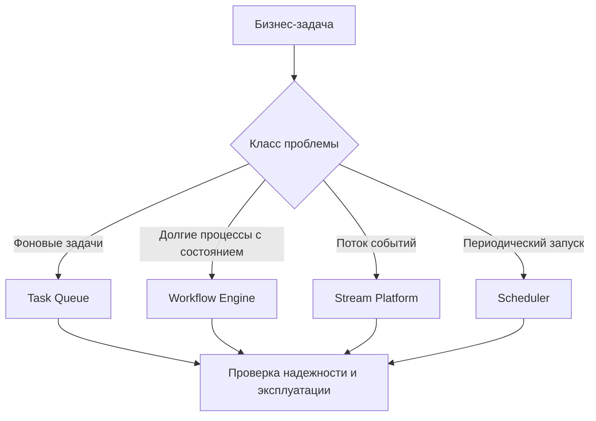
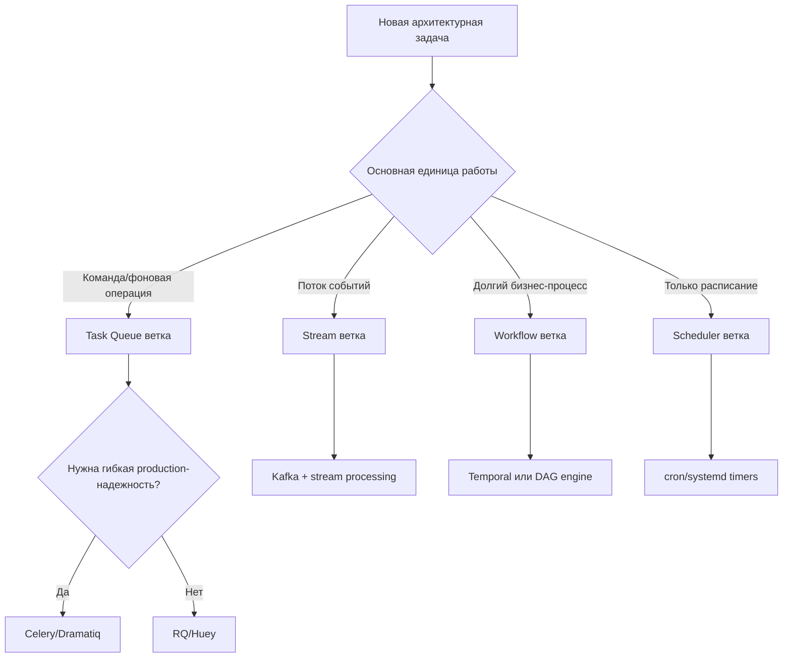

[← Назад к индексу части](index.md)
[↑ К глобальному плану](../../mastery_plan.md)

## Сквозная модель выбора инструмента

### Цель раздела

Понять, как сравнивать инструменты системно: сначала класс проблемы, потом требования, потом эксплуатация.

### В этом разделе главное

Самая дорогая ошибка — выбрать инструмент "не того класса".  
Пример: пытаться строить durable workflow на голом task queue или пытаться заменить event-stream платформу Celery-очередями.

### Теория и правила

Правило трех уровней выбора:

1. **Класс задачи**: background tasks, workflow orchestration, data pipelines, event streams.
2. **Гарантии и масштаб**: delivery semantics, replay, ordering, latency, throughput.
3. **Операционный контур**: сложность эксплуатации, on-call, стоимость команды и платформы.

### Пошагово

1. Опиши задачу на языке бизнеса: что должно происходить и как часто.
2. Переведи в инженерные требования: надежность, время отклика, SLA, объем.
3. Сопоставь с классом инструмента.
4. Проверь эксплуатацию: кто и как это будет сопровождать.
5. Проведи "тест отказа": что ломается при сбое и как быстро восстанавливается.

### Простыми словами

Сначала реши, нужен тебе велосипед, грузовик или поезд, и только потом выбирай марку.

### Картинка в голове

### Мини-матрица выбора (быстрый фильтр)

| Вопрос | Если ответ "да" | Куда смотреть первым |
|---|---|---|
| Нужна очередь фоновых задач для Python-сервисов? | Task queue профиль | Celery / Dramatiq / RQ |
| Нужен граф процессов с богатой оркестрацией и историей? | Workflow/DAG профиль | Airflow/Prefect/Temporal |
| Нужна обработка потока событий с replay и retention? | Stream профиль | Kafka + stream processing |
| Нужен только локальный запуск по расписанию? | Scheduler профиль | cron/systemd timers |
| Нужно минимум self-hosted эксплуатации в cloud? | Managed профиль | Cloud Run Jobs/Batch/Step Functions |

### Decision flow (дерево первого выбора)

### Проверь себя: дерево выбора

1. Какой главный риск, если пропустить узел "класс задачи" и сразу выбирать конкретный инструмент?

Ответ

Можно выбрать инструмент не того класса: например, task queue вместо stream/workflow решения, что приведет к архитектурным костылям и инцидентам.

2. Почему в ветке task queue есть отдельная развилка про production-надежность?

Ответ

Потому что даже внутри одного класса задач есть разная глубина требований: для простых кейсов хватает легких решений, для сложных нужен более зрелый и управляемый контур.

### Типичные ошибки

- начинать с любимого инструмента, а не с требований;
- игнорировать стоимость эксплуатации;
- путать "мы можем это сделать" с "это правильный инструмент".

### Проверь себя

1. Почему нельзя начинать сравнение с таблицы фич?

Ответ

Потому что фичи без контекста требований не показывают пригодность. Можно выбрать инструмент с большим числом фич, но не того класса.

2. Что обычно недооценивают команды при выборе?

Ответ

Операционную стоимость: on-call, инциденты, обновления, поддержка инфраструктуры и когнитивная нагрузка команды.

---
