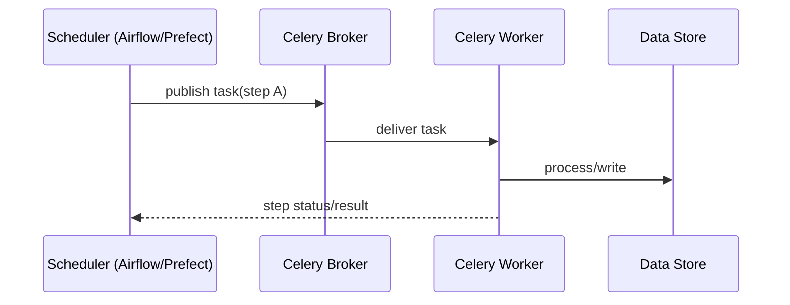

[← Назад к индексу части](index.md)
[↑ К глобальному плану](../../mastery_plan.md)

## 25.3 Celery vs Airflow/Prefect

### Цель раздела

Не путать "фоновые задачи приложения" и "оркестрацию пайплайнов/процессов".

### Термины

| Термин | Коротко |
|---|---|
| **DAG orchestration** | Управление графом зависимых шагов. |
| **Pipeline observability** | Видимость выполнения на уровне всего процесса. |
| **Statefulness** | Хранение состояния workflow и шагов. |

### Теория и правила

Celery силен как execution layer фоновых задач в приложениях.  
Airflow/Prefect сильны как orchestration layer для расписаний, data pipelines и управляемых графов.

Если нужна:

- богатая модель DAG, зависимостей и мониторинга pipeline;
- replay отдельных шагов и контроль истории выполнения;
- data-oriented orchestration,

то часто Airflow/Prefect уместнее.

Ключевое различие в **единице управления**:

- в Celery единица управления чаще "задача";
- в Airflow/Prefect — "workflow/DAG целиком" как наблюдаемая бизнес-сущность.

### Пошагово

1. Это задача приложения или data-pipeline?
2. Нужен ли явный DAG и визуальная оркестрация?
3. Требуется ли lineage и переигровка шагов?
4. Если "да" — смотри в сторону Airflow/Prefect.

### Простыми словами

Celery — "сервис доставки задач".  
Airflow/Prefect — "дирижер оркестра процессов".

### Пример гибрида

- Airflow планирует и оркестрирует ETL DAG.
- Отдельные тяжелые Python-шаги отправляются в Celery как execution workers.

### Что будет если...

Если строить большой data pipeline только на Celery canvas, можно столкнуться с:

- слабой прозрачностью lineage;
- сложным управлением зависимостями;
- ростом самописной orchestration-логики.

Production-практика: даже если выбираешь Celery-first, заранее зафиксируй "порог перехода" в DAG-оркестратор (например, количество межкомандных pipeline, требования к lineage, SLA на восстановление шагов).

### Проверь себя

1. Почему наличие `chain/group/chord` не делает Celery полным заменителем Airflow?

Ответ

Потому что canvas решает композицию задач, но не покрывает полностью orchestration-функции уровня DAG-платформ: lineage, управление зависимостями, rich UI и data-centric контроль.

2. Когда Celery и Airflow могут работать вместе?

Ответ

Когда Airflow отвечает за orchestration и расписание, а Celery — за выполнение отдельных шагов/функций в Python-стеке.

---
