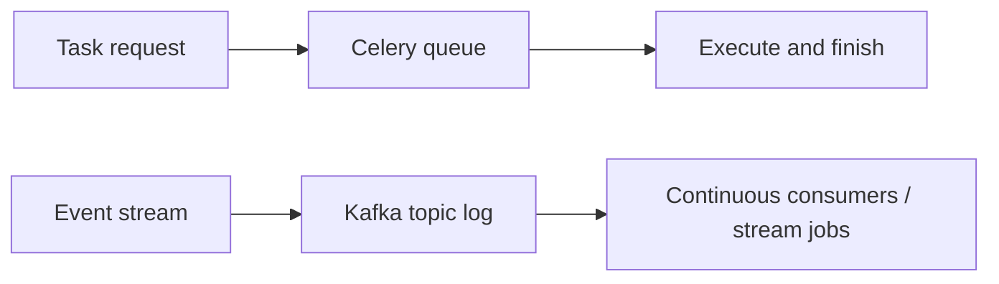

[← Назад к индексу части](index.md)
[↑ К глобальному плану](../../mastery_plan.md)

## 25.5 Celery vs Kafka consumers / stream processing

### Цель раздела

Отделить обработку задач от обработки непрерывного потока событий.

### Термины

| Термин | Коротко |
|---|---|
| **Ordering guarantees** | Гарантии порядка обработки сообщений. |
| **Retention** | Время хранения событий в логе. |
| **Replay** | Возможность перечитать поток и переобработать данные. |

### Теория и правила

Celery:

- оптимален для task-oriented задач;
- обычно с приоритетом "выполнить работу" и управлять retries.

Kafka/stream processing:

- оптимальны для event-oriented контуров;
- дают мощные возможности порядка, ретенции и replay потока.

Ключевой смысл:

- task queue оптимизирует "выполнение поручений";
- stream platform оптимизирует "движение и переиспользование истории событий".

### Картинка в голове

### Практический кейс

- Отправка email, генерация PDF, очистка кэша -> чаще Celery.
- Аналитика кликов в реальном времени, агрегации событий, event-driven projections -> чаще Kafka + stream processing.

Граничный кейс:

- "Order created" событие идет в Kafka как источник истины;
- Celery берет производные операционные задачи (email, антифрод-проверка, enrichment), не подменяя потоковую платформу.

### Что будет если...

Если использовать Celery как замену stream platform:

- потеряешь богатый replay и retention сценарий;
- упрешься в ограниченную модель event-истории;
- усложнишь downstream аналитику.

### Production-рекомендации

- четко разделяй event bus и task bus в документации архитектуры;
- избегай смешения контрактов: событие домена != команда на фоновую операцию;
- при гибриде Kafka + Celery фиксируй idempotency ключи на границе.

### Проверь себя

1. Почему replay критичен для stream-задач?

Ответ

Потому что позволяет переобработать исторические события при изменении логики, восстановлении проекций и расследовании инцидентов.

2. Когда Celery и Kafka стоит сочетать?

Ответ

Когда Kafka является шиной событий, а Celery используется для фоновых операционных задач и тяжелых side-effect операций на основе этих событий.

---
