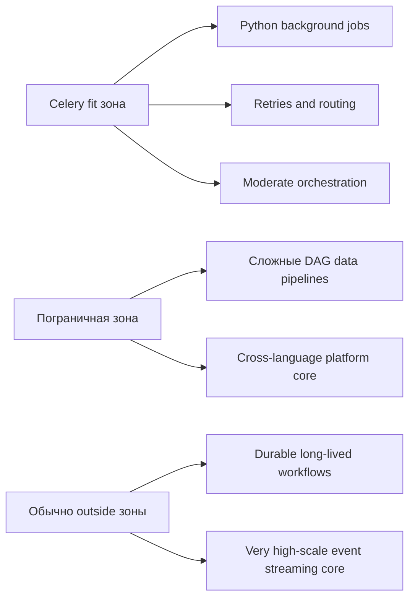

[← Назад к индексу части](index.md)
[↑ К глобальному плану](../mastery_plan.md)

## 25.9 Когда Celery - спорный выбор

### Цель раздела

Распознавать красные флаги, когда лучше рассмотреть альтернативу.

### Теория и правила

Celery может быть спорным, если доминируют требования:

- строгой durable workflow оркестрации с долгим жизненным циклом;
- very high scale event streaming и богатого replay;
- platform-first, cross-language архитектуры как центра;
- hard exactly-once ожиданий без готовности к сложным компромиссам.

### Таблица "симптом -> куда смотреть"

| Симптом | Почему Celery может быть спорным | Что рассмотреть |
|---|---|---|
| Долгие процессные workflow с паузами/сигналами | Нужна durable история workflow | Temporal / аналогичные engines |
| Поток событий как ядро платформы | Нужны retention/replay/ordering на уровне stream | Kafka + stream processing |
| Data lineage как ключевое требование | Нужна data-centric оркестрация | Airflow/Prefect/Dagster |
| Крайне жесткие требования exactly-once | Высокий риск ложных ожиданий от queue системы | Пересмотр модели, transactional patterns |

### Диаграмма "границы применимости Celery"

### Проверь себя: границы применимости

1. Что означает "пограничная зона" в диаграмме и как с ней работать?

Ответ

Это зона, где Celery может работать, но риск архитектурных компромиссов растет. Нужно заранее определить критерии эскалации к специализированному инструменту.

2. Почему mature-архитектура может включать Celery и другие инструменты одновременно?

Ответ

Потому что разные workload-классы требуют разных сильных сторон. Один инструмент редко оптимален для всех задач платформы.

### Что делать, если Celery уже внедрен, но признаки "спорного выбора" проявились

Пошаговая стратегия без резких разрушений:

1. Зафиксировать проблемные workload-классы (не весь Celery-контур сразу).
2. Выделить пилотный поток для альтернативного инструмента.
3. Сравнить SLA/операции/стоимость на реальных сценариях.
4. Мигрировать постепенно, оставляя Celery там, где он по-прежнему силен.

### Антипаттерны миграции (чтобы не ухудшить ситуацию)

- мигрировать "всё и сразу", не разделив workload-классы;
- сравнивать альтернативы только на синтетических тестах;
- менять движок без пересмотра контрактов задач/событий;
- не обучать команду новому операционному контуру до запуска в production.

### Простыми словами

Если Celery приходится "дотягивать" десятками архитектурных костылей до чужого класса задач — это сигнал пересмотреть выбор.

### Проверь себя (25.9)

1. Почему Celery не является прямой заменой Temporal?

Ответ

Потому что Temporal ориентирован на durable workflow с replay-моделью и историей состояния, а Celery — на доставку и исполнение задач через очередь.

2. Почему cron и Celery решают разные классы задач?

Ответ

cron решает расписание локального запуска, а Celery — распределенную обработку фоновых задач с queue semantics и runtime-контролем.

3. В каком проекте вы бы осознанно не выбрали Celery, даже если команда знает Python?

Ответ

Например, в платформе с доминирующим event-stream ядром и обязательным replay многомесячной истории событий, где Kafka/stream stack является естественным центром архитектуры.

---
