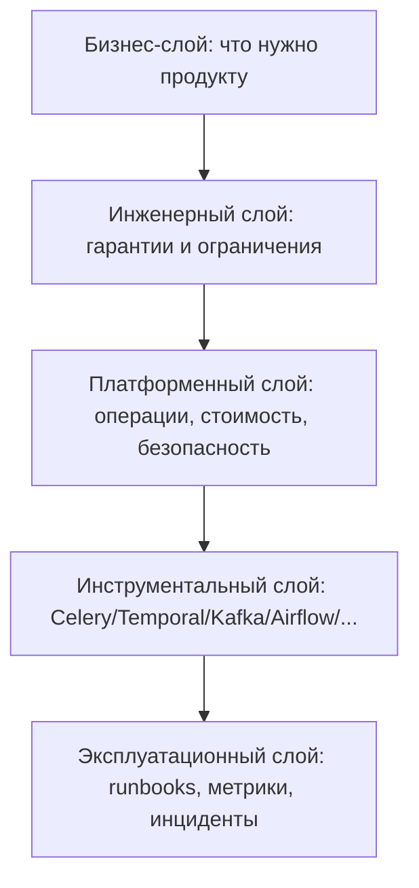
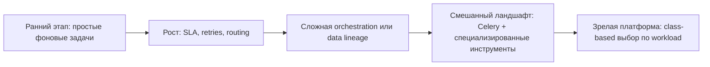

[← Назад к индексу части](index.md)
[↑ К глобальному плану](../celery_mastery_plan.md)

## Единая сравнительная карта (все альтернативы в одном месте)

Ниже таблица для быстрого "второго взгляда", когда ты уже прочитал разделы и хочешь сопоставить варианты на одной плоскости.

| Класс решения | Инструменты | Что решают лучше всего | Где обычно начинаются проблемы |
|---|---|---|---|
| **Локальный scheduler** | `cron`, `systemd timers` | Простые периодические задачи на одном узле | Масштабирование, дубли, слабая наблюдаемость распределенного контура |
| **Task queue (Python)** | `Celery`, `RQ`, `Huey`, `Dramatiq`, `Arq` | Фоновые операции, retries, изоляция нагрузки | Перегиб с инструментом: или недофункциональность, или лишняя сложность |
| **Workflow/DAG orchestration** | `Airflow`, `Prefect`, `Temporal` | Управление сложными процессами и их состоянием | Повышенный порог эксплуатации и проектной дисциплины |
| **Data/ETL orchestration** | `Luigi`, `Dagster` | Графы данных, lineage, data quality | Избыточность для простых operational background задач |
| **Stream processing** | `Kafka consumers`, stream frameworks | Потоки событий, retention, replay, order | Неудобно использовать как прямую замену task queue |
| **Managed execution** | `Cloud Run Jobs`, `Batch`, `Step Functions` | Снижение self-hosted рутины, быстрый cloud-старт | Cold start, lock-in, сетевые/комплаенс ограничения |

### Слойная диаграмма архитектурного выбора

Смысл: инструмент выбирается не напрямую из "предпочтений команды", а как итог проверки по слоям.

### Проверь себя: слойная модель

1. Что произойдет, если исключить платформенный слой (стоимость/безопасность/операции) из выбора?

Ответ

Можно принять технически красивое, но операционно нежизнеспособное решение: дорогое, некомплаентное или неподдерживаемое в дежурном контуре.

2. Почему эксплуатационный слой идет после выбора инструмента, но должен обсуждаться заранее?

Ответ

Потому что именно эксплуатация выявляет реальную цену решения. Если не учесть ее заранее, выбор может оказаться формально верным, но practically несостоятельным.

### Как запомнить

Опорная формула:

- **Task** -> task queue;
- **Process** -> workflow engine;
- **Data graph** -> ETL orchestrator;
- **Event flow** -> stream platform;
- **Simple local schedule** -> cron/systemd.

Если приходится "ломать" инструмент под чужую формулу, почти всегда выбран не тот класс решения.

### Чеклист граничных условий перед финальным выбором

- есть ли жесткое требование replay-истории на месяцы/годы;
- нужна ли сквозная data lineage как обязательная функция;
- критичен ли строгий порядок событий в больших потоках;
- есть ли ограничения по комплаенсу/сетям, которые ломают managed-сценарий;
- соответствует ли зрелость команды выбранному инструменту;
- есть ли план безопасной миграции, если прогноз по росту окажется неверным.

### Проверь себя: граничные условия

1. Какой пункт чеклиста чаще всего игнорируют и к чему это приводит?

Ответ

Часто игнорируют план миграции при ошибке прогноза роста. В итоге система застревает в контуре, который не масштабируется по требованиям, и миграция становится аварийной.

2. Почему зрелость команды — полноценный архитектурный критерий, а не "организационная мелочь"?

Ответ

Потому что инструмент живет в руках команды. Без нужной зрелости даже хороший инструмент будет эксплуатироваться с ошибками и высоким инцидентным риском.

### Антикейсы выбора (как выглядит ошибка в реальности)

| Симптом в проекте | Частая ошибочная реакция | Что делать правильно |
|---|---|---|
| Появились первые 2-3 сложных pipeline | "Срочно переписываем весь фон на workflow engine" | Выделить только проблемный контур и провести пилот |
| Возросла нагрузка событий | "Давайте просто добавим больше Celery worker" | Проверить, не стал ли кейс stream-first по природе |
| Команда устала от операций | "Managed решит всё автоматически" | Проверить cold start, сеть, комплаенс и реальную стоимость |
| Есть один громкий инцидент в Celery | "Celery не подходит вообще" | Разобрать root cause: инструмент, дизайн задач или операционная дисциплина |

### Проверь себя: антикейсы

1. Почему "один большой инцидент" не доказывает автоматически, что инструмент выбран неверно?

Ответ

Потому что причина может быть в реализации, процессах или эксплуатации. Нужно отделить проблему класса инструмента от ошибки использования.

2. Что общего у всех ошибочных реакций в антикейсах?

Ответ

Они реактивны и крайние: либо паническая миграция, либо отрицание проблемы. Правильный путь — поэтапная проверка фактов и пилот.

### Диаграмма эволюции выбора по мере роста зрелости

Диаграмма показывает нормальную эволюцию: зрелые системы часто приходят к сочетанию инструментов, а не к "одному универсальному".

### Проверь себя: эволюция выбора

1. Почему зрелая архитектура часто мультиинструментальная?

Ответ

Потому что разные workload-классы имеют разные оптимальные механики: task processing, stream processing, workflow orchestration и локальное расписание.

2. Что опасно в попытке удержать "один инструмент на все стадии зрелости"?

Ответ

Это ведет к компромиссам в надежности и стоимости, накоплению костылей и замедлению развития платформы.

### Диагностические сигналы, что выбор пора пересматривать

| Наблюдаемый сигнал | Что это обычно значит | Действие |
|---|---|---|
| Большая доля инцидентов связана не с бизнес-логикой, а с самим orchestration-слоем | Инструмент не совпадает с классом задач или перегружен нецелевыми функциями | Перепроверить class-fit через scorecard |
| Рост числа "временных" обходов и ручных компенсаций | Архитектурный долг маскирует несоответствие инструмента | Выделить проблемный workload и запустить пилот альтернативы |
| Метрики queue lag/retry/backlog стабильно ухудшаются при росте нагрузки | Контур упирается в предел модели или текущего дизайна | Пересмотреть декомпозицию: task vs stream vs workflow |
| Обсуждения в команде сводятся к "как бы заставить текущий инструмент делать X" | Команда решает чужой класс проблемы в неподходящем инструменте | Вернуться к формуле Task/Process/Data/Event/Schedule |

### Проверь себя: диагностические сигналы

1. Почему "рост обходов и ручных компенсаций" — системный, а не локальный симптом?

Ответ

Потому что это признак несоответствия базовой модели решения: команда постоянно закрывает пробелы вручную вместо того, чтобы опираться на естественные возможности подходящего инструмента.

2. Как не спутать временную операционную проблему с признаком неверного class-fit?

Ответ

Смотреть на тренд и повторяемость: если проблемы устойчиво воспроизводятся при росте нагрузки/сложности и требуют архитектурных обходов, это не разовый сбой, а structural mismatch.

### Мини-runbook пересмотра архитектурного выбора (30-60-90)

- **Первые 30 дней:** зафиксировать факты (инциденты, SLO, стоимость, скорость изменений).
- **До 60 дней:** провести ограниченный пилот альтернативы на одном workload-классе.
- **До 90 дней:** принять решение: оставить текущий подход, перейти частично или мигрировать контурно.

Главный принцип runbook: пересматривается не "любимый инструмент", а соответствие между классом задач и выбранной технологией.

### Проверь себя: runbook 30-60-90

1. Почему runbook разбит именно на этапы, а не делается одним большим решением?

Ответ

Этапность снижает риск: сначала факты, потом пилот, потом решение. Так команда избегает как паники, так и затягивания проблемы.

2. Что считается успешным результатом этапа 60 дней?

Ответ

Пилот с измеримыми результатами по SLA/стоимости/операциям, достаточный для обоснованного решения о частичной или полной смене подхода.

### Предпродовый контрольный лист выбора (go/no-go)

Перед финальным утверждением проверь:

- есть документированный class-fit (почему это task/workflow/stream/scheduler);
- зафиксированы SLO/SLA и как выбранный инструмент их поддерживает;
- есть измерения пилота на реалистичной нагрузке, а не только "локально работает";
- определены риски отказа и сценарий rollback/partial rollback;
- есть ответственность команды за эксплуатацию (кто дежурит, кто владелец контура);
- есть дата повторного архитектурного пересмотра.

Если хотя бы два пункта не выполнены, решение лучше считать предварительным, а не финальным.

### Проверь себя: go/no-go

1. Почему решение без владельца эксплуатации не должно считаться go?

Ответ

Потому что без ownership не будет системной ответственности за инциденты, метрики, улучшения и пересмотр. Такой контур быстро деградирует.

2. Зачем фиксировать дату повторного пересмотра сразу при принятии решения?

Ответ

Чтобы решение не "застыло" навсегда и команда заранее имела механизм адаптации к росту нагрузки, требованиям и изменениям платформы.

### Связь с соседними частями курса

Чтобы эта часть работала как "узел маршрута", полезно связывать выводы с соседними блоками:

- `часть 20` — архитектурные паттерны и границы сервисов;
- `часть 21` — production-эксплуатация выбранного контура;
- `часть 24` — edge cases, которые проверяют зрелость выбора;
- `часть 26` — современные практики и эволюция после первичного решения.

### Проверь себя: связи с курсом

1. Почему часть 25 нельзя изучать в отрыве от части 21 (production-эксплуатация)?

Ответ

Потому что выбор инструмента проверяется именно в эксплуатации: через SLO, инциденты, наблюдаемость и стоимость сопровождения.

2. Как часть 24 (edge cases) помогает валидировать выводы части 25?

Ответ

Edge cases показывают реальную устойчивость решения в сложных режимах. Если выбор не выдерживает крайние сценарии, архитектурное решение требует пересмотра.

### Запомните

- Сначала определяется класс проблемы, потом конкретный продукт.
- Celery силен в Python background processing, но не обязан покрывать все классы distributed workload.
- Самый практичный выбор — не самый модный, а самый адекватный по риску, стоимости и сопровождению.

### Проверь себя: ключевые выводы

1. Какая одна ошибка чаще всего ломает качество выбора инструмента?

Ответ

Смешение класса проблемы и конкретного продукта: когда выбирают "любимую технологию", не определив сначала, какой тип работы вообще нужно решать.

2. Что означает "адекватный по риску и сопровождению" в контексте выбора?

Ответ

Это решение, которое не только работает функционально, но и реалистично поддерживается командой по стоимости, надежности, операционным практикам и эволюции.

---
