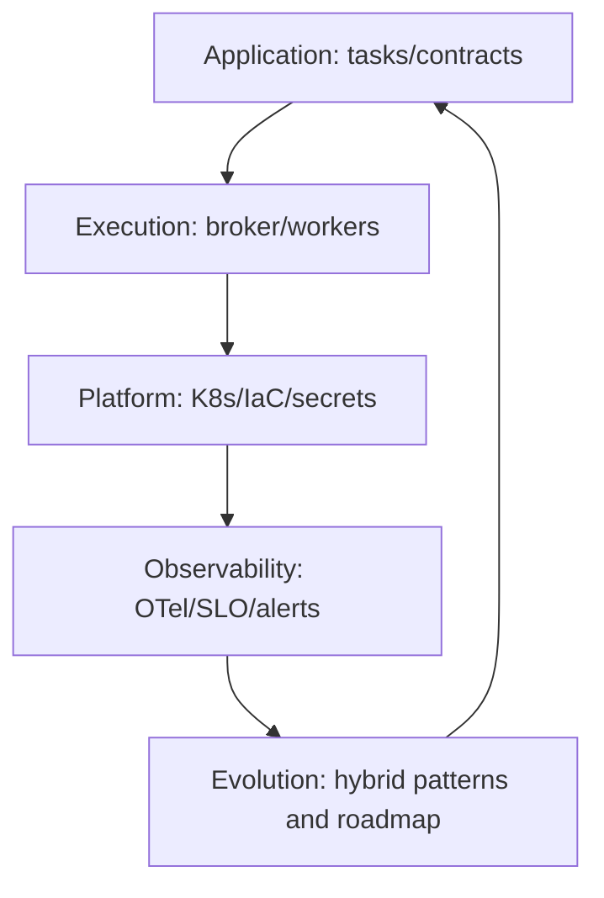

[← Назад к индексу части](index.md)
[↑ К глобальному плану](../../mastery_plan.md)

## Сквозная современная модель Celery-платформы

### Цель раздела

Сформировать "картинку целиком": Celery сегодня — это не только задачи и воркеры, а целый платформенный контур.

### Теория и правила

Современная зрелость Celery опирается на 5 слоев:

1. **Application layer** — код задач, контракты payload, идемпотентность.
2. **Execution layer** — очереди, воркеры, pools, routing.
3. **Platform layer** — Kubernetes, autoscaling, secrets, IaC.
4. **Observability layer** — OTel, SLO, алерты, trace correlation.
5. **Evolution layer** — миграции, гибридные схемы, roadmap развития.

### Mermaid-диаграмма

### Сквозной путь "идея -> эксплуатация"

Эта схема важна как ментальная рамка: современная практика — это цикл улучшений, а не одноразовая настройка.

### Простыми словами

Если раньше Celery был "двигателем задач", то сейчас это часть "автомобиля целиком" — с приборной панелью, системами безопасности и планом обслуживания.

### Проверь себя

1. Почему нельзя остановиться на уровне `task code + broker`, если система бизнес-критична?

Ответ

Потому что без platform и observability слоев система неуправляема в масштабировании и инцидентах. Локально задачи могут работать, но производственная надежность останется низкой.

2. Какой слой чаще всего упускают команды, которые "быстро стартовали" с Celery?

Ответ

Обычно недооценивают слой наблюдаемости и SLO: метрики есть, но нет формальной модели качества и раннего обнаружения деградаций.

3. Какую типичную ошибку делает команда, если воспринимает этап `E -> F -> B` как "необязательный"?

Ответ

Команда перестает учиться на инцидентах и деградациях. В итоге архитектура и настройки остаются "замороженными", хотя нагрузка и требования меняются.

---
