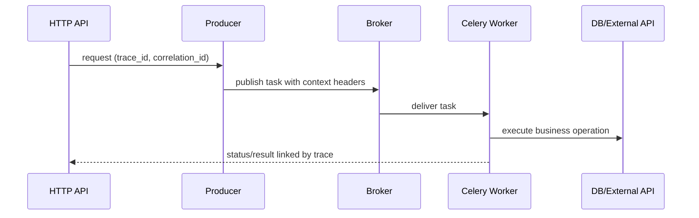

[← Назад к индексу части](index.md)
[↑ К глобальному плану](../../mastery_plan.md)

## 26.2 Наблюдаемость по современным стандартам

### Цель раздела

Научиться строить наблюдаемость Celery уровня "сквозного бизнес-потока", а не разрозненных метрик.

### В этом разделе главное

- OpenTelemetry нужен не ради моды, а ради сквозной причинности;
- связь `HTTP -> task -> DB/API` критична для диагностики;
- SLO фоновых систем должны быть формальными и измеримыми;
- alerting должен опираться на burn-rate, а не на одиночные всплески.

### Термины

| Термин | Формально | Простыми словами |
|---|---|---|
| **Distributed trace** | Цепочка спанов через несколько сервисов | История "куда пошел запрос" |
| **Trace context propagation** | Передача контекста трассировки между компонентами | Сквозной `trace_id` везде |
| **Lag SLO** | Цель по задержке ожидания задач в очереди | Насколько быстро задача начинает исполняться |
| **Failure budget burn rate** | Скорость потери допустимого уровня ошибок | Как быстро мы "проедаем" надежность |

### Теория и правила

1. **Three pillars вместе:** метрики, логи, трейсы должны быть связаны единым контекстом.
2. **Correlation by contract:** `correlation_id` и `trace_id` обязаны проходить через payload/headers.
3. **SLO for background:** минимум нужны SLO по lag, success-rate, processing latency.
4. **Burn-rate alerts:** алертим не только на "ошибка есть", а на скорость деградации.

### Sequence-диаграмма сквозной корреляции



### Пошагово: внедрение OTel и SLO

1. Инструментировать API и producer для генерации/продолжения trace context.
2. Передавать контекст в headers задач.
3. Инструментировать worker execution span (start, queue wait, run time, outcome).
4. Связать traces с log fields (`trace_id`, `task_id`, `queue`).
5. Определить SLO:  
   - `queue_wait_p95 < X`,  
   - `task_success_ratio > Y`,  
   - `end_to_end_latency_p95 < Z`.
6. Настроить burn-rate алерты на быстрый и медленный горизонты (например, 5m/1h).

### Пример передачи correlation/tracing контекста

```python
from celery import shared_task


def publish_invoice_task(celery_app, invoice_id: str, trace_id: str, correlation_id: str) -> None:
    celery_app.send_task(
        "billing.process_invoice",
        kwargs={"invoice_id": invoice_id},
        headers={
            "trace_id": trace_id,
            "correlation_id": correlation_id,
            "source": "billing-api",
        },
    )


@shared_task(bind=True, name="billing.process_invoice")
def process_invoice(self, invoice_id: str):
    trace_id = self.request.headers.get("trace_id")
    correlation_id = self.request.headers.get("correlation_id")
    # Здесь trace_id/correlation_id должны попасть в structured logs и spans.
    return {"invoice_id": invoice_id, "trace_id": trace_id, "correlation_id": correlation_id}
```

### Таблица SLO/SLI для background-систем

| SLI | Что измеряем | Почему важно | Типичный риск при деградации |
|---|---|---|---|
| **Queue wait p95** | время от публикации до старта | пользовательская задержка и бизнес-SLA | "задачи есть, результата нет" |
| **Success ratio** | доля успешных задач | надежность пайплайна | тихая потеря бизнес-операций |
| **Retry amplification** | сколько попыток на 1 успешную операцию | устойчивость к внешним сбоям | retry storm и перегрузка зависимостей |
| **End-to-end p95** | полный путь HTTP -> task -> side effect | качество конечного потока | жалобы пользователя при "здоровых" сервисах |

### Матрица алертов по burn-rate

| Горизонт | Когда срабатывает | Зачем нужен |
|---|---|---|
| **Быстрый (5-10 минут)** | резкий burn-rate сильно выше нормы | быстро поймать лавинообразную деградацию |
| **Средний (30-60 минут)** | устойчивый burn-rate выше целевого | отделить краткий шум от реальной проблемы |
| **Длинный (3-6 часов)** | накопительная потеря error budget | увидеть системный drift и техдолг |

Принцип: один алерт редко дает полную картину, поэтому burn-rate лучше анализировать на нескольких горизонтах одновременно.

### Картинка в голове

Наблюдаемость — это не просто "камеры в здании", а система, которая показывает весь путь посетителя: вход, лифт, кабинет, выход. Без этого инцидент выглядит как "что-то где-то пошло не так".

### Практика / реальные сценарии

- **Сценарий "высокий lag, но worker CPU нормальный":** trace показывает bottleneck в внешнем API.
- **Сценарий "жалобы на задержки от клиентов":** end-to-end trace связывает медленный HTTP с backlog в `high_priority` queue.
- **Сценарий "алертов много, пользы мало":** переход на burn-rate снижает шум и ускоряет triage.

### Что будет, если...

Если ограничиться "графиками без связей":
- команда видит симптомы, но не видит корневую причину;
- triage инцидентов затягивается, растет MTTR;
- улучшения делаются "по ощущениям", а не по фактам.

### Мини-runbook диагностики "SLO нарушен, но CPU нормальный"

1. Проверить `queue_wait_p95` и `retry amplification`.
2. Открыть trace цепочки и найти самый длинный span.
3. Проверить не деградировала ли внешняя зависимость (API/DB), а не сами воркеры.
4. Временно ограничить fan-out и включить degrade policy для некритичных задач.
5. Зафиксировать postmortem: какой SLI сработал первым и почему.

### Типичные ошибки

- собирать только инфраструктурные метрики без бизнес-SLO;
- не передавать trace context в задачи;
- алертить на каждую ошибку вместо budget burn;
- считать успехом "воркер жив", игнорируя queue wait.

### Проверь себя

1. Почему correlation между HTTP и task критичнее, чем просто график "tasks/sec"?

<details><summary>Ответ</summary>

Потому что `tasks/sec` показывает объем, но не причинность. Корреляция позволяет увидеть, какой пользовательский поток и какой бизнес-операции соответствует конкретная деградация.

</details>

2. Что дает SLO для фоновой системы, если и так есть dashboards?

<details><summary>Ответ</summary>

SLO превращает наблюдение в управляемую цель качества: появляется объективный критерий "нормально/ненормально" и основа для приоритизации работ.

</details>

3. Почему burn-rate лучше простого алерта "error_rate > threshold"?

<details><summary>Ответ</summary>

Потому что учитывает скорость сгорания error budget и отделяет краткий шум от опасной системной деградации.

</details>

### Запомните

Современная наблюдаемость Celery — это сквозная история выполнения и измеримый контракт качества, а не набор отдельных графиков.

---
