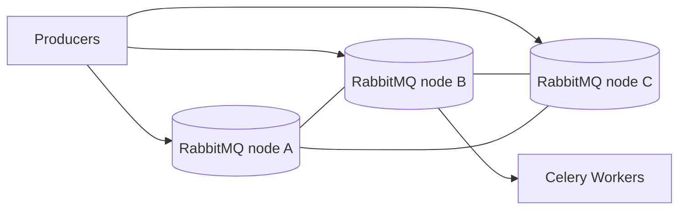

[← Назад к индексу части](index.md)
[↑ К глобальному плану](../celery_mastery_plan.md)

## 26.3 Эволюция RabbitMQ/Redis практик

### Цель раздела

Понять, какие broker-практики считаются современными и устойчивыми для Celery в production.

### В этом разделе главное

- "исторически рабочие" настройки могут быть неактуальны при текущих нагрузках;
- quorum queues и HA-топологии снижают риски потери доступности;
- managed broker-сервисы дают выгоду, но требуют оценки ограничений;
- restart-устойчивость должна тестироваться, а не предполагаться.

### Термины

| Термин | Формально | Простыми словами |
|---|---|---|
| **Quorum queues** | Реплицируемые очереди RabbitMQ на базе Raft-подхода | Очередь "живет" даже при падении части узлов |
| **HA topology** | Архитектура высокой доступности брокера | Нет единой точки отказа |
| **Managed broker service** | Облачный брокер, управляемый провайдером | Меньше рутины, но есть ограничения |
| **Broker restart resilience** | Устойчивость системы к перезапускам брокера | Очереди и воркеры корректно восстанавливаются |

### Теория и правила

1. **RabbitMQ:** для критичных очередей рассматривать quorum queues как default-кандидат.
2. **Redis как broker:** оценивать ограничения и режимы persistence/HA особенно строго.
3. **Managed choice:** считать не только стоимость, но и latency, network policy, limits.
4. **Restart drills:** регулярно тестировать сценарии restart/failover и поведение redelivery.

### RabbitMQ vs Redis: прикладная матрица для Celery

| Критерий | RabbitMQ (часто) | Redis (часто) | Практический вывод |
|---|---|---|---|
| Модель очередей | богаче по policy/routing | проще старт и эксплуатация | сложные контуры чаще тяготеют к RabbitMQ |
| Устойчивость/HA | зрелые кластеры и quorum-подходы | зависит от режима persistence/replication | для критичных потоков нужна явная HA-проверка |
| Операционная сложность | выше | ниже на старте | простота Redis может быть выгодна для некритичных задач |
| Граница масштабирования | гибкая, но сложнее | проще, но с ограничениями на высоких режимах | заранее определять "порог переезда" |

### Redis-практики: когда особенно осторожно

- если ожидаются длинные очереди с критичным SLA;
- если нужны сложные policy-механики маршрутизации;
- если команда не проработала HA-режимы Redis и восстановление после failover.

Это не означает "Redis плохой". Это означает "Redis должен использоваться в подходящем профиле задач и рисков".

### ASCII-схема сравнения отказов

```text
RabbitMQ quorum:
node A down -> quorum persists -> queue available (degraded but alive)

Redis single primary without robust failover:
primary down -> queue unavailable until failover/recovery
```

### Пример checklist restart resilience

```text
1) Остановить один broker-node в staging
2) Проверить reconnect клиентов Celery
3) Проверить рост redelivery/retry_rate
4) Проверить queue lag и recovery time
5) Зафиксировать, какие SLO были нарушены
6) Обновить runbook и reconnect policy
```

### Mermaid-диаграмма HA-подхода



### Пошагово: обновление broker-практик

1. Классифицировать очереди по критичности (`critical`, `bulk`, `best-effort`).
2. Для critical оценить quorum/replication-стратегию.
3. Проверить managed/self-hosted ограничения и SLO провайдера.
4. Настроить retry/reconnect политику клиентов Celery.
5. Провести controlled restart test и зафиксировать метрики восстановления.
6. Документировать runbook для broker incident/failover.

### Простыми словами

Брокер — это "сердце логистики" задач. Современная практика не надеется, что сердце "никогда не остановится", а проектирует систему так, чтобы она переживала этот стресс контролируемо.

### Практика / реальные сценарии

- **Сценарий "planned maintenance брокера":** worker-ы переживают restart без лавинообразного дублирования.
- **Сценарий "миграция на managed RabbitMQ":** часть operational риска уходит в облако, но добавляются требования к сетевой политике и лимитам.
- **Сценарий "пик redelivery после failover":** заранее подготовленные idempotency и rate-limits предотвращают каскад.

### Что будет, если...

Если broker-слой считать "прозрачной инфраструктурой":
- неожиданно всплывут проблемы при failover/maintenance;
- повторная доставка начнет выглядеть как "рандомные баги" приложения;
- стоимость инцидентов вырастет из-за отсутствия recovery-репетиций.

### Проверь себя: граничные решения по брокеру

1. Почему вопрос "какой брокер быстрее" обычно вторичен для критичных очередей?

<details><summary>Ответ</summary>

Потому что в критичных потоках важнее предсказуемая устойчивость, восстановление после сбоев и операционная управляемость, чем сырая скорость на синтетическом тесте.

</details>

2. Когда managed broker объективно выигрывает у self-hosted?

<details><summary>Ответ</summary>

Когда команда хочет снизить инфраструктурную рутину и может принять ограничения платформы по сети, лимитам и стоимости, при этом SLO подтверждены пилотом.

</details>

### Типичные ошибки

- выбирать тип очереди "по привычке", не по критичности;
- не тестировать перезапуск брокера на staging;
- не учитывать лимиты managed-сервиса в пиковых режимах;
- смешивать критичные и best-effort потоки в одной политике доставки.

### Проверь себя

1. Почему `restart resilience` нужно тестировать явно, даже если документация брокера обещает HA?

<details><summary>Ответ</summary>

Документация описывает возможности продукта, но конкретное поведение зависит от вашей топологии, конфигурации клиентов, retry-политики и профиля нагрузки.

</details>

2. В чем риск "managed broker решит все"?

<details><summary>Ответ</summary>

Можно недооценить сетевые ограничения, latency, сервисные лимиты и специфику failover-механики, что приведет к неожиданным деградациям в реальном трафике.

</details>

3. Когда quorum queue особенно оправдана?

<details><summary>Ответ</summary>

Когда очередь критична для бизнес-процесса и потеря/долгая недоступность сообщений недопустимы.

</details>

### Запомните

Современная broker-практика — это архитектура устойчивости и регулярные failover-упражнения, а не "однажды настроили и забыли".

---
