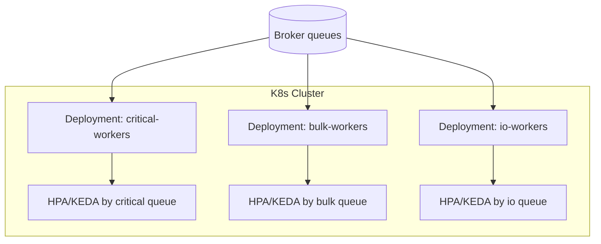
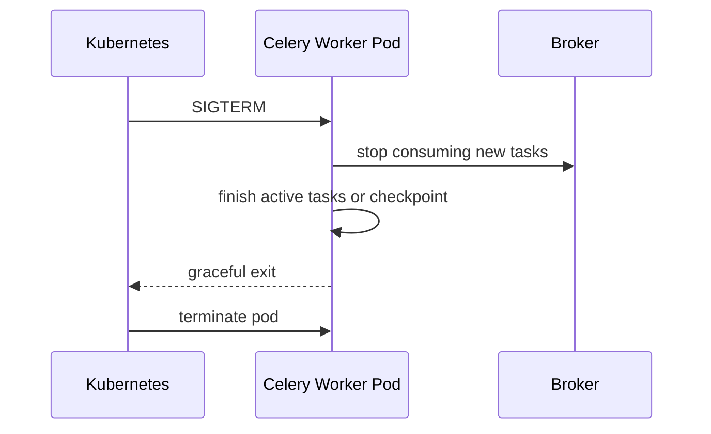

[← Назад к индексу части](index.md)
[↑ К глобальному плану](../celery_mastery_plan.md)

## 26.4 Celery в Kubernetes-окружениях

### Цель раздела

Освоить k8s-паттерны Celery, которые защищают от частых production-проблем: внезапный stop, неверные probes, неконтролируемое масштабирование и смешение workload.

### В этом разделе главное

- pod-ы короткоживущие по природе, и это нужно учитывать в дизайне задач;
- graceful shutdown и сигналы остановки — обязательный, а не "дополнительный" слой;
- probes должны проверять функциональную готовность, а не просто живой процесс;
- scaling per queue + worker specialization дают управляемость и изоляцию рисков.

### Термины

| Термин | Формально | Простыми словами |
|---|---|---|
| **SIGTERM handling** | Обработка сигнала остановки контейнера | Как worker корректно завершает работу |
| **Readiness probe** | Проверка готовности принимать нагрузку | Под готов принимать новые задачи |
| **Liveness probe** | Проверка "не завис ли" процесс | Нужно ли перезапускать pod |
| **Worker specialization** | Разделение deployment-ов по типам очередей/задач | Отдельные worker-группы для разных задач |
| **Scaling per queue** | Независимое масштабирование по очередям | Масштабируется именно нужный поток |

### Теория и правила

1. **Pod ephemeral mindset:** pod может исчезнуть в любой момент (eviction, upgrade, autoscaling).
2. **Graceful stop contract:** worker должен корректно завершать текущие задачи и не брать новые.
3. **Probe truthfulness:** readiness должна проверять зависимые сервисы (broker connectivity, essential dependencies).
4. **Queue isolation:** разные SLA и resource-profile -> разные deployment-ы.
5. **Service mesh нюанс:** mTLS и sidecar полезны, но могут добавить latency overhead.

### Service mesh в Celery-контуре: когда помогает, а когда мешает

| Ситуация | Service mesh обычно полезен | Где риск |
|---|---|---|
| Требуется mTLS и единая policy безопасности | да | возможен рост latency |
| Нужна богатая телеметрия сетевых вызовов | да | сложнее диагностика из-за extra-hop |
| Очередь с очень чувствительным SLA по latency | осторожно | sidecar overhead может съедать budget |

Практическое правило: mesh включают осознанно, после замера p95/p99 задержек "до/после", а не "по умолчанию".

### Диаграмма Kubernetes-подхода



### Пошагово: production-ready k8s план

1. Разделить worker deployment-ы по очередям и SLA.
2. Добавить `terminationGracePeriodSeconds` согласно реальному runtime задач.
3. Реализовать корректную stop-стратегию в entrypoint/worker config.
4. Настроить readiness/liveness probes по функциональным сигналам.
5. Подключить autoscaling отдельно для каждого deployment-а.
6. Провести тесты rolling update, pod eviction, node drain.

### Пример probe-design для Celery worker

```yaml
livenessProbe:
  exec:
    command: ["sh", "-c", "celery -A app inspect ping -d celery@$(hostname)"]
  initialDelaySeconds: 30
  periodSeconds: 20
  timeoutSeconds: 5

readinessProbe:
  exec:
    command: ["sh", "-c", "python /app/scripts/check_worker_readiness.py"]
  initialDelaySeconds: 15
  periodSeconds: 10
  timeoutSeconds: 5
```

Идея:
- `liveness` проверяет, что worker-процесс не завис;
- `readiness` проверяет, что worker реально готов брать задачи (есть связь с broker и доступ к критичным зависимостям).

### Пример worker specialization как отдельных deployment-ов

```yaml
apiVersion: apps/v1
kind: Deployment
metadata:
  name: celery-critical-workers
spec:
  replicas: 3
  template:
    spec:
      containers:
        - name: worker
          image: app/celery:latest
          args: ["celery", "-A", "app", "worker", "-Q", "critical", "--concurrency=4"]
---
apiVersion: apps/v1
kind: Deployment
metadata:
  name: celery-bulk-workers
spec:
  replicas: 2
  template:
    spec:
      containers:
        - name: worker
          image: app/celery:latest
          args: ["celery", "-A", "app", "worker", "-Q", "bulk", "--concurrency=2"]
```

Почему это важно:
- разные очереди получают независимые ресурсы и scaling;
- проблемы bulk-очереди не "съедают" критичный поток;
- проще управлять policy и SLO по каждому классу workload.

### Sequence: graceful stop при rolling update



### Простыми словами

Kubernetes постоянно "переставляет мебель в комнате". Если Celery не умеет красиво останавливаться и возобновляться, каждый такой переезд превращается в инцидент.

### Что будет если...

Если probes и stop-логика сделаны формально:
- pod может считаться "готовым", но фактически не способен выполнять задачи;
- rolling update вызовет дубли или брошенные задачи;
- autoscaling увеличит количество "некачественных" исполнителей.

### Практика / реальные сценарии

- **Сценарий "очередь платежей и очередь отчетов":** разные deployment-ы и autoscaling policy.
- **Сценарий "service mesh включили для безопасности":** проверили рост latency и скорректировали таймауты.
- **Сценарий "частые node drain":** tuning graceful stop уменьшил redelivery spikes.

### Граничные случаи

- **preStop hook слишком долгий:** Kubernetes считает pod "висящим", начинается принудительное завершение.
- **readiness всегда true:** под получает задачи даже при потере broker-connectivity.
- **масштабирование только по CPU:** queue lag нарушает SLO, хотя CPU выглядит "здоровым".

### Anti-pattern vs Best practice для k8s Celery

| Anti-pattern | Последствие | Best practice |
|---|---|---|
| Один deployment на все очереди | пересечение SLA и конфликт ресурсов | specialization per queue |
| Readiness только "процесс жив" | pod принимает задачи в деградации | readiness проверяет функциональную готовность |
| Нет тестов node drain | неожиданные дубли в проде | регулярные lifecycle-drills |

### Типичные ошибки

- один универсальный worker deployment "на все задачи";
- readiness, которая проверяет только `process is up`;
- слишком короткий grace period для длинных задач;
- отсутствие тестов на termination под реальной нагрузкой.

### Проверь себя

1. Почему scaling per queue лучше, чем масштабирование "всех воркеров сразу"?

<details><summary>Ответ</summary>

Потому что нагрузка и SLA у очередей разные. Масштабирование всех сразу ведет к неэффективному расходу ресурсов и может ухудшить критичные потоки.

</details>

2. Что означает "правдивая readiness probe" для Celery worker?

<details><summary>Ответ</summary>

Она подтверждает, что worker реально готов выполнять задачи: есть связь с брокером и доступны критичные зависимости, а не просто жив процесс.

</details>

3. В каком случае service mesh может ухудшить Celery-контур?

<details><summary>Ответ</summary>

Если не учтен дополнительный latency overhead sidecar/proxy и это бьет по SLA очередей с чувствительным временем ожидания/обработки.

</details>

### Запомните

Kubernetes-устойчивость Celery строится на правильных lifecycle-контрактах, queue-изоляции и функциональных probes.

---
