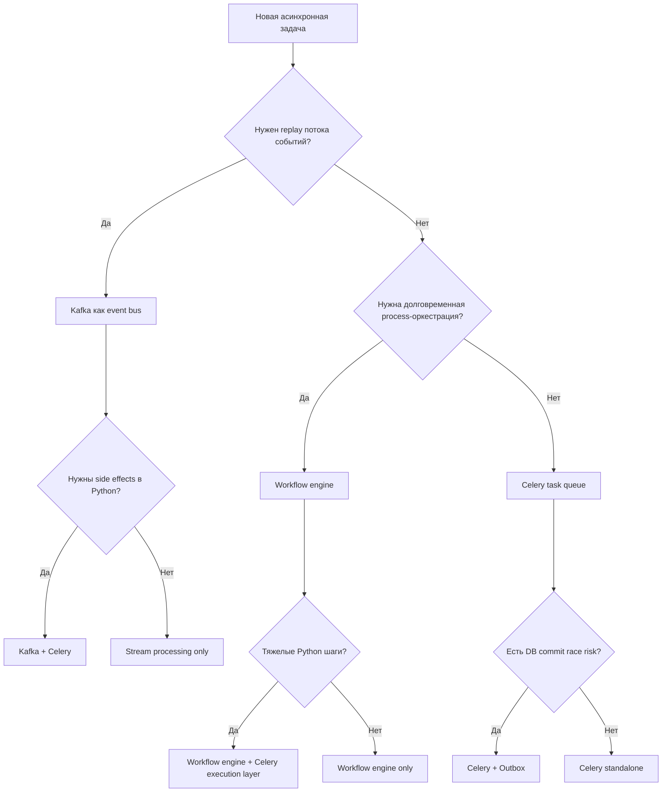
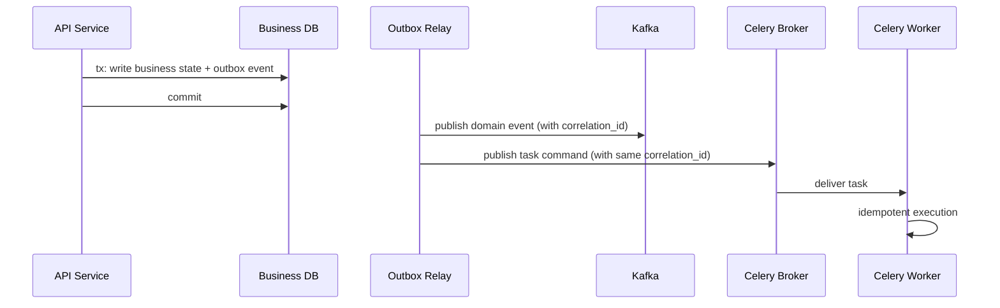
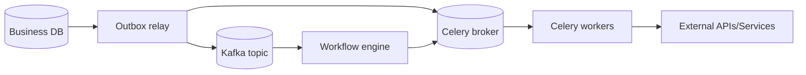

[← Назад к индексу части](index.md)
[↑ К глобальному плану](../celery_mastery_plan.md)

## 26.5 Смешанные подходы

### Цель раздела

Научиться сочетать Celery с соседними подходами без архитектурной путаницы и "перетягивания" чужого класса задач в Celery.

### В этом разделе главное

- гибридные схемы — это признак зрелости, а не слабости;
- Celery хорошо работает как execution layer в смешанной архитектуре;
- у каждой комбинации должен быть четкий контракт границ;
- если границ нет, появятся дубли, расхождение состояния и деградация диагностики.

### Термины

| Термин | Формально | Простыми словами |
|---|---|---|
| **Celery + Kafka** | Celery для task execution, Kafka для event stream | События и команды разделены по ролям |
| **Celery + Outbox** | Надежная публикация задач после commit | Убираем гонку publish-before-commit |
| **Celery + Workflow engine** | Workflow сверху, Celery как исполняющий слой | Оркестратор командует, Celery выполняет |
| **Execution layer** | Нижний слой выполнения шагов процесса | "Рабочие руки" системы |

### Теория и правила

1. **Не путать событие и команду.**  
   Event bus (Kafka) и task queue (Celery) решают разные задачи.

2. **Outbox как дисциплина согласованности.**  
   Если есть БД-транзакции и асинхронная публикация, outbox часто должен быть стандартом.

3. **Workflow boundary ясна.**  
   Если orchestration делает внешний engine, Celery не должен дублировать его процессную логику.

4. **Единая наблюдаемость across tools.**  
   Trace/correlation должны проходить через все контуры гибрида.

### Decision-матрица смешанных подходов

| Симптом/потребность | Что часто подходит | Почему |
|---|---|---|
| Нужен replay событий и event history | `Kafka + Celery` | Kafka хранит поток событий, Celery исполняет side effects |
| Нужна строгая связь DB commit и публикации | `Outbox + Celery` | outbox снижает race publish-before-commit |
| Нужны долгоживущие workflow с сигналами/таймерами | `Workflow engine + Celery` | движок оркестрирует, Celery исполняет шаги |
| Нужна только фоновая обработка в Python | `Celery standalone` | минимальная сложность при хорошем class-fit |

### Decision tree: выбор смешанной архитектуры



### Таблица контрактов на границах гибрида

| Граница | Что фиксировать обязательно | Типичный сбой при отсутствии контракта |
|---|---|---|
| API -> Celery | `correlation_id`, schema version, idempotency key | не воспроизводимые дубли и "плавающие" ошибки |
| DB -> Outbox relay | атомарность записи, retry relay, dedup policy | publish-before-commit race |
| Kafka -> Celery | event schema и mapping event->task | несоответствие типов сообщений |
| Workflow engine -> Celery | ownership шага, timeout, compensation strategy | "зависшие" процессы без владельца |

### Sequence: outbox + Kafka + Celery без потери причинности



### Mermaid-диаграмма гибридной схемы



### Пошагово: как проектировать смешанный подход

1. Явно разделить классы workload: stream, workflow, task execution.
2. Определить source of truth для каждого класса.
3. Зафиксировать контракты интеграции (schema, idempotency key, correlation id).
4. Внедрить outbox там, где нужен publish-after-commit.
5. Настроить сквозную observability и runbook для межсистемных инцидентов.

### Простыми словами

Смешанная архитектура похожа на команду специалистов: хирург, анестезиолог и диагност не заменяют друг друга, но вместе дают лучший результат.

### Практика / реальные сценарии

- **Celery + Kafka:** Kafka хранит поток доменных событий, Celery выполняет side-effect задачи (email, enrichment, интеграции).
- **Celery + Outbox:** после commit заказа outbox гарантирует публикацию задачи "create_invoice".
- **Celery + Workflow engine:** Temporal/Prefect управляет долгим процессом, Celery исполняет отдельные Python-heavy шаги.

### Anti-pattern: как ломают смешанные схемы

```text
1) Одни и те же сообщения одновременно считаются event и command
2) Нет единого idempotency-key между контурами
3) Нет owner-а у границы Kafka <-> Celery
4) Нет сквозного trace_id

Итог: дубли, расхождение состояний, сложные и долгие расследования.
```

### Что будет, если...

Если не зафиксировать контракты на границах гибрида:
- одна и та же операция начнет трактоваться по-разному в разных контурах;
- observability перестанет быть сквозной;
- миграции будут ломать совместимость между сервисами.

### Типичные ошибки

- использовать Celery как замещение stream platform;
- строить long-lived workflow полностью на task retries;
- забывать единый correlation-id через гибридные контуры;
- не документировать ownership на границе инструментов.

### Проверь себя

1. Почему outbox особенно важен в смешанных схемах?

<details><summary>Ответ</summary>

Потому что смешанные схемы увеличивают число границ консистентности. Outbox снижает риск гонки между commit в БД и публикацией в Celery/Kafka.

</details>

2. Когда Celery лучше использовать как execution layer, а не как orchestration engine?

<details><summary>Ответ</summary>

Когда orchestration уже выполняет специализированный workflow-движок, а Celery нужен для надежного исполнения конкретных технических шагов.

</details>

3. Какой главный архитектурный риск гибрида?

<details><summary>Ответ</summary>

Размытые границы ответственности: инструменты начинают дублировать роли, из-за чего растут сложность, дубли обработки и трудность диагностики.

</details>

### Запомните

Гибридный подход работает только при четких контрактах границ: кто оркестрирует, кто хранит событие, кто исполняет и кто отвечает за консистентность.

---
