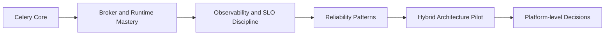

[← Назад к индексу части](index.md)
[↑ К глобальному плану](../../mastery_plan.md)

## Практикум по части 26 (лабораторные задания)

### Лабораторная 1. Autoscaling и guardrails (`26.1`)

**Цель:** настроить scaling per queue так, чтобы backlog снижался без перегруза внешних API.

**Шаги:**
1. Поднять тестовую очередь `critical_tasks`.
2. Настроить KEDA scaling по длине очереди.
3. Искусственно создать всплеск задач.
4. Измерить: lag, retries, success rate, внешний API error rate.
5. Ввести ограничители (`max replicas`, cooldown, rate limit) и повторить тест.

**Критерий успеха:** lag уменьшается, а error budget не сгорает лавинообразно.

### Лабораторная 2. OTel и SLO (`26.2`)

**Цель:** получить сквозной trace `HTTP -> task -> external API`.

**Шаги:**
1. Прокинуть `trace_id/correlation_id` в headers задач.
2. Включить tracing в producer и worker.
3. Настроить SLI: queue wait, success ratio, end-to-end latency.
4. Симулировать деградацию внешнего API.
5. Проверить, что burn-rate алерт срабатывает раньше пользовательских жалоб.

**Критерий успеха:** по одному trace видно корневой bottleneck.

### Лабораторная 3. Broker restart resilience (`26.3`)

**Цель:** проверить, что broker restart не приводит к хаосу.

**Шаги:**
1. Запустить controlled load.
2. Перезапустить один broker node.
3. Измерить recovery time и всплеск redelivery.
4. Проверить идемпотентность и отсутствие неконтролируемых дублей.
5. Обновить runbook по итогам.

**Критерий успеха:** система восстанавливается в пределах целевого SLO.

### Лабораторная 4. Kubernetes lifecycle (`26.4`)

**Цель:** убедиться, что rolling update не ломает корректность задач.

**Шаги:**
1. Настроить readiness/liveness probes.
2. Проверить graceful stop при `SIGTERM`.
3. Запустить long-running задачи.
4. Выполнить rolling update и node drain.
5. Измерить redelivery spikes и фактические дубли.

**Критерий успеха:** нет массовых "брошенных" задач и неконтролируемых повторов.

### Лабораторная 5. Hybrid contracts (`26.5`)

**Цель:** формализовать границы `Celery + Kafka + Outbox`.

**Шаги:**
1. Описать контракты сообщений (schema version, correlation id, idempotency key).
2. Реализовать outbox relay для publish-after-commit.
3. Настроить сквозную трассировку между контурами.
4. Симулировать повторную публикацию и проверить dedup.
5. Зафиксировать ownership и runbook границ.

**Критерий успеха:** при повторных публикациях бизнес-состояние остается консистентным.

### Лабораторная 6. План развития команды (`26.6`)

**Цель:** превратить roadmap в управляемый процесс.

**Шаги:**
1. Заполнить карту компетенций 0-3.
2. Выбрать 2 слабых зоны команды.
3. Назначить артефакты на 30/60/90 дней.
4. Встроить ревью артефактов в регулярный техпроцесс.
5. Повторно оценить компетенции через квартал.

**Критерий успеха:** рост компетенций подтверждается артефактами и улучшением SLO.

#### Проверь себя: практикум

1. Почему у каждой лабораторной обязателен “критерий успеха”, а не только список шагов?

<details><summary>Ответ</summary>

Без критерия невозможно понять, внедрение получилось или нет. Шаги можно выполнить формально, но не достичь нужного качества.

</details>

2. Как понять, что лабораторные по части 26 выполнены “системно”, а не точечно?

<details><summary>Ответ</summary>

Результаты лабораторных связаны между собой через артефакты: SLO-дашборд, runbook, drill-отчет, контракты гибрида и roadmap-ревью.

</details>

### 90-дневный план с измеримыми артефактами

| Период | Фокус | Артефакт результата |
|---|---|---|
| **Дни 1-30** | Broker + observability база | дашборд SLI/SLO и broker failover checklist |
| **Дни 31-60** | Reliability patterns | командный стандарт idempotency/outbox/dedup |
| **Дни 61-90** | Hybrid pilot | mini-RFC и пилот Celery + Kafka/Workflow в одном bounded контуре |

### Диаграмма траектории развития



### Что будет, если...

Если после ядра не строить roadmap:
- развитие станет хаотичным и реактивным;
- команда будет учиться "через боль" каждого инцидента;
- архитектура начнет расползаться без единого принципа.

### Проверь себя: roadmap после ядра

1. Почему в roadmap нужен явный артефакт на каждом этапе, а не просто "изучили тему"?

<details><summary>Ответ</summary>

Артефакт проверяет практическую применимость знаний: дашборд, runbook, стандарт или RFC можно использовать в реальной работе и улучшать итеративно.

</details>

2. Какой признак, что команда реально выросла после части 26?

<details><summary>Ответ</summary>

Решения стали приниматься через измеримые SLO/SLI, архитектурные контракты и postmortem-петлю улучшений, а не через "интуитивные" одноразовые правки.

</details>

### Простыми словами

Освоить Celery — это как научиться хорошо водить. Следующий шаг — научиться понимать дорожную инфраструктуру, правила безопасности, поведение потока и управление риском в плохую погоду.

### Картинка в голове

```text
Celery Core
   -> Broker Mastery
   -> Reliability Engineering
   -> SRE Discipline
   -> Hybrid Architecture (Workflow + Events)
   -> Platform Architect mindset
```

### Практика / реальные сценарии

- **Инженер уровня mid:** улучшает retry/idempotency и мониторинг очередей.
- **Инженер уровня senior:** проектирует HA-топологию брокера и SLO-фреймворк.
- **Архитектор:** разделяет workload-классы и выбирает правильные гибридные инструменты.

### Типичные ошибки

- пытаться изучать все одновременно без порядка;
- углубляться в tooling без понимания distributed reliability;
- считать, что "если Celery работает, дальше учиться нечему";
- не переводить теорию в runbooks и практические drills.

### Проверь себя

1. Почему после Celery-core логично идти в RabbitMQ и reliability, а не сразу в сложные workflow engines?

<details><summary>Ответ</summary>

Потому что сначала нужно укрепить фундамент: транспорт и надежность. Без этого сложные оркестраторы дадут дополнительную сложность, но не решат базовые системные проблемы.

</details>

2. Что отличает "знаю Celery API" от "умею строить async-платформу"?

<details><summary>Ответ</summary>

Второй уровень включает SLO-мышление, инцидентную дисциплину, понимание брокеров, консистентности и архитектурных границ между task/workflow/event-классами.

</details>

3. Как понять, что roadmap развития работает?

<details><summary>Ответ</summary>

Снижается частота и цена инцидентов, улучшаются SLO, сокращается MTTR, а архитектурные решения принимаются на основе class-fit, а не технологических предпочтений.

</details>

### Запомните

После ядра Celery начинается самое важное: развитие системного мышления о надежности, эксплуатации и архитектурных границах.

---
