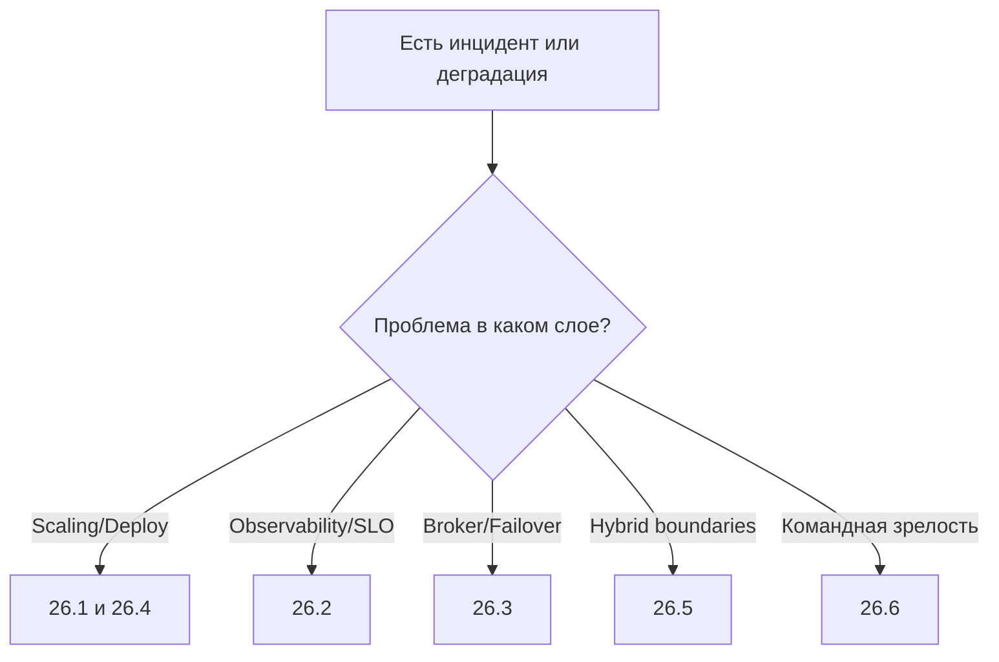

[← Назад к индексу части](index.md)
[↑ К глобальному плану](../mastery_plan.md)

## Быстрый навигатор: симптом -> куда идти в части 26

| Симптом | Сначала открыть | Почему |
|---|---|---|
| lag растет, autoscaling "работает" | `26.1`, `26.4` | проблема может быть в policy scaling и queue-специализации |
| алерты шумят, root cause неясен | `26.2` | нужна сквозная корреляция и burn-rate модель |
| после restart/failover хаос в очередях | `26.3` | broker resilience и reconnect policy |
| rolling update вызывает дубли | `26.4` | lifecycle, probes, graceful stop |
| гибрид `Celery + Kafka/Workflow` нестабилен | `26.5` | не хватает контрактов границ и ownership |
| команда "изучает", но не растет | `26.6` | нужен roadmap с артефактами и регулярным ревью |

#### Проверь себя: быстрый навигатор

1. Почему навигатор начинается с симптома, а не с выбора инструмента?

Ответ

Потому что в инциденте важно сначала локализовать слой проблемы. Иначе команда рискует применять “любимое” решение не к той причине.

2. Что делать, если симптом подходит сразу к двум веткам навигатора?

Ответ

Запустить параллельную быструю проверку по двум наиболее вероятным слоям и выбрать дальнейший путь по фактическим метрикам/трейсам.

---
