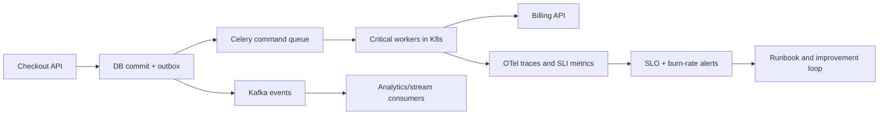

[← Назад к индексу части](index.md)
[↑ К глобальному плану](../../mastery_plan.md)

## Сквозной интеграционный кейс (26.1-26.6 вместе)

### Ситуация

У команды e-commerce платформы:
- растет lag в `critical` очереди в часы пик;
- после restart брокера иногда появляются всплески redelivery;
- наблюдаемость частично есть, но root cause ищется долго;
- планируется гибрид `Celery + Kafka` для событий заказов.

### Как применять часть 26 пошагово

1. По `26.1`: вводим scaling guardrails и разделяем worker-группы по очередям.
2. По `26.2`: внедряем сквозной trace `checkout API -> task -> external billing`.
3. По `26.3`: проводим failover drill и фиксируем recovery time в runbook.
4. По `26.4`: проверяем graceful stop при rolling update и node drain.
5. По `26.5`: фиксируем контракт `event vs command` и ownership границ Kafka/Celery.
6. По `26.6`: оформляем 90-дневный план с артефактами и контрольными ревью.

### Сквозная диаграмма интеграции

### Что будет считаться успешным результатом

- `queue_wait_p95` в критичной очереди стабильно в пределах SLO;
- recovery после broker restart укладывается в agreed objective;
- trace позволяет за минуты локализовать bottleneck;
- гибридный контур не дает "плавающих" дублей из-за контрактов и idempotency.

### Проверь себя: интеграционный кейс

1. Почему этот кейс нельзя решить только добавлением реплик worker-ов?

Ответ

Потому что проблема многослойная: часть рисков лежит в наблюдаемости, broker-resilience, lifecycle Kubernetes и контрактах гибридной архитектуры. Реплики лечат только один аспект — пропускную способность.

2. Какой индикатор показывает, что команда действительно применяет часть 26 системно, а не точечно?

Ответ

Наличие связанной цепочки артефактов: SLO dashboard, failover drill report, runbook, контракты границ и roadmap-ревью с владельцами.

---
