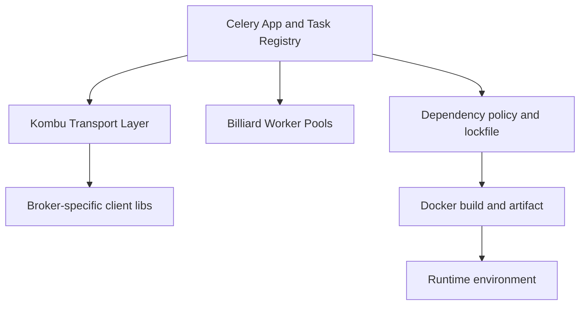

[← Назад к индексу части](index.md)
[↑ К глобальному плану](../mastery_plan.md)

## Сквозная модель зависимостей и поставки

### Цель раздела

Построить целостную "картинку в голове": где живёт код задач, где живут транспортные зависимости, где контроль версий, и как это превращается в runtime-артефакт.

### Теория и правила

У Celery-платформы есть четыре слоя:

1. **Код и registry** (`celery`): определение задач, маршрутизация, worker/beat.
2. **Транспорт и соединения** (`kombu`, `amqp` и transport-specific libs): доставка сообщений.
3. **Исполнение процессов** (`billiard`): worker pools, fork/process lifecycle.
4. **Supply chain и delivery** (lockfiles, Docker, SBOM, CI policy): как всё это стабильно доезжает до среды.

Если ломается слой ниже, верхние настройки не всегда помогут.

### Картинка в голове

### Простыми словами

Celery — это не "одна библиотека", а оркестр. Если скрипка (Kombu) расстроена, дирижёр (Celery core) не сделает музыку чистой только жестами.

### Проверь себя

1. Почему проблемы transport-клиента часто выглядят как "ошибка Celery"?

Ответ

Потому что Celery использует transport-слой как зависимость. На уровне приложения видно исключение в Celery, но первопричина находится ниже — в клиенте, брокере или сети.

2. Какой слой чаще всего недооценивают при "быстром старте"?

Ответ

Supply chain слой: lockfiles, reproducibility, policy обновлений и безопасность образов.

---
