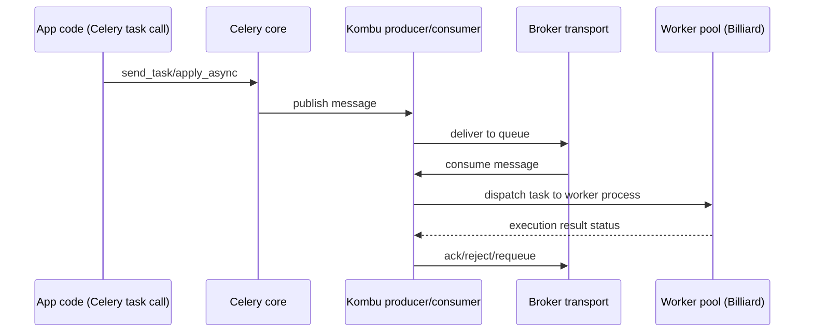
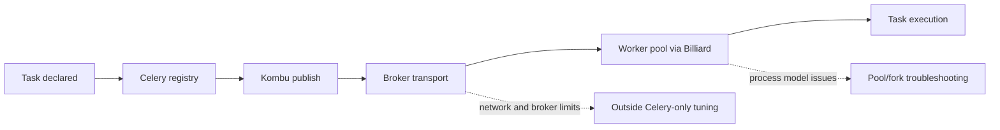

[← Назад к индексу части](index.md)
[↑ К глобальному плану](../mastery_plan.md)

## 27.1 Роли компонентов стека

### Цель раздела

Разобрать, кто в стеке Celery за что отвечает, чтобы не чинить проблему "не тем рычагом".

### В этом разделе главное

- `celery` координирует выполнение задач и конфигурацию;
- `kombu` управляет сообщениями и транспортами;
- `billiard` отвечает за модель процессов worker-пула;
- `vine` и AMQP-клиенты закрывают низкоуровневые механики;
- границы ответственности критичны для диагностики.

### Термины

| Компонент | Формально | Простыми словами |
|---|---|---|
| **Celery** | Task queue framework | "Мозг" задач и workers |
| **Kombu** | Messaging abstraction | "Логистика" доставки сообщений |
| **Billiard** | Multiprocessing fork of Python primitives | "Диспетчер процессов" worker-пула |
| **Vine** | Promise/callback utility layer | "Клей" для callback-цепочек |
| **py-amqp/amqp** | AMQP protocol client | "Низкий уровень разговора" с AMQP-брокером |

### Теория и правила

1. **Celery как координатор приложения и registry.**  
   Он хранит сведения о задачах, запускает worker/beat и связывает конфиг с runtime.

2. **Kombu как транспортный слой.**  
   Создаёт connection/channel, producer/consumer, сериализует и доставляет сообщения.

3. **Billiard как процессная механика.**  
   Определяет поведение child-процессов, жизненный цикл пула и часть ограничений на уровне fork/exec.

4. **Низкоуровневые клиенты и утилиты (`amqp`, `vine`).**  
   Не являются "дополнением для красоты" — именно тут может проявляться несовместимость версий или крайние ошибки.

5. **Границы ответственности.**  
   Если брокер недоступен или транспортный URL неверен, настройка Celery-флагов сама по себе не восстановит доставку.

### Billiard и fork/forkserver-нюансы

Когда говорят "у нас проблемы с worker pool", часто недооценивают именно процессную механику:

- `prefork` (наиболее частый режим) наследует состояние процесса-родителя; это ускоряет старт, но может тянуть нежелательное состояние (например, небезопасные соединения/дескрипторы) в child-процессы.
- `forkserver`/похожие подходы (в зависимости от платформы и реализации) могут снизить класс проблем "грязного наследования", но повышают сложность и могут изменить latency старта задач.
- при комбинации `gunicorn/uvicorn + Celery` важно не смешивать жизненные циклы web-процессов и worker-процессов так, чтобы "унаследованные" ресурсы ломали обработку.

Практическая мысль: часть багов "иногда зависает/иногда падает child" это не бизнес-логика, а побочный эффект процесса форка и инициализации зависимостей до/после форка.

### ASCII-схема ответственности

```text
Task Code -> Celery App -> Kombu -> Broker Transport -> Worker Process(Billiard)
             ^                                         |
             |---------------- Result/Events ----------|
```

### Sequence: producer/consumer/ack на уровне стека



Эта диаграмма важна для диагностики: можно явно увидеть, на каком шаге цепочка ломается.

### Пошагово: как локализовать проблему по слоям

1. Проверить, загружается ли Celery app и registry задач.
2. Проверить connection к брокеру через transport-слой.
3. Проверить способность worker-процесса стабильно поднимать пул.
4. Проверить, где именно рушится цепочка: publish, consume, ack, execution.
5. Выбирать инструмент диагностики по слою, а не "всё через один лог Celery".

### Симптом -> вероятный слой -> первый шаг диагностики

| Симптом | Вероятный слой | Первый шаг |
|---|---|---|
| Задача не появляется в очереди | Celery publish/Kombu connection | проверить broker URL, auth и publish errors |
| Задача в очереди есть, но не берётся | consumer/worker подписка | проверить queue binding и worker `-Q` |
| Много redelivery без прогресса | ack/retry/transport semantics | проверить visibility/ack policy и idempotency |
| Child-процессы падают под нагрузкой | Billiard/process model | проверить pool settings, fork-side effects |
| Локально работает, в CI ломается | lock/build parity | проверить source of truth зависимостей |

### Кто за что отвечает (и кто чинит)

| Проблема | Главная зона ответственности | Кто обычно владелец исправления |
|---|---|---|
| Неверный импорт/регистрация задач | Celery app и код проекта | backend-команда |
| Ошибки publish/consume соединения | Kombu + transport config | backend + platform |
| Недоступность брокера/сети | инфраструктура брокера и сеть | platform/SRE |
| Падения child-процессов | Billiard/pool + поведение зависимостей | backend (runtime) |
| Невоспроизводимая сборка | lock/build pipeline | backend + DevOps/platform |

Практический смысл: таблица снижает "пинг-понг" между командами в инцидентах.

#### Проверь себя: ответственность

1. Почему ошибку publish нельзя автоматически считать “чисто инфраструктурной”?

<details><summary>Ответ</summary>

Потому что publish-цепочка проходит через конфигурацию приложения и транспортный слой. Ошибка может быть как в коде/конфиге producer, так и в инфраструктуре.

</details>

2. Чем опасен “пинг-понг ownership” между командами?

<details><summary>Ответ</summary>

Он увеличивает MTTR: время уходит на передачу ответственности, а не на диагностику конкретного слоя сбоя.

</details>

### Примеры

```python
# Пример проверки загрузки Celery app
from myproj.celery_app import app

print(app.main)
print(sorted(app.tasks.keys())[:10])
```

```bash
# Пример диагностики: может ли worker пинговаться
celery -A myproj inspect ping
```

#### Проверь себя: примеры диагностики

1. Почему `inspect ping` не заменяет проверку полного пути publish->consume->ack?

<details><summary>Ответ</summary>

Ping подтверждает частичную доступность worker-контроля, но не доказывает корректность транспортной доставки и ack-семантики под рабочей нагрузкой.

</details>

2. Какой быстрый вывод можно сделать, если задача не видна в `app.tasks.keys()`?

<details><summary>Ответ</summary>

Вероятно, есть проблема импорта/регистрации задач или инициализации Celery app до старта worker-процесса.

</details>


### Практика / реальные сценарии

- **Сценарий 1:** задачи не исполняются, но worker запущен.  
  Часто причина в transport/connectivity (Kombu + broker), а не в самом task-коде.

- **Сценарий 2:** после обновления Python начались странные падения child-процессов.  
  Проверяется связка Celery + Billiard + модель пула, а не только бизнес-логика.

- **Сценарий 3:** после добавления тяжёлого SDK в проект worker стал нестабильным только под нагрузкой.  
  Возможна проблема порядка инициализации при форке: библиотека не готова к безопасному наследованию состояния.

### Диаграмма "где ломается ответственность"



### Типичные ошибки

- считать, что Celery "владеет" всей сетью и брокером;
- обновлять только `celery`, игнорируя `kombu`/`billiard`;
- диагностировать process-pool проблемы как serialization bugs и наоборот.

### Что будет если...

Если не понимать роли компонентов:
- инциденты будут чиниться медленно и симптоматически;
- появится ложная уверенность "мы уже всё настроили в Celery";
- часть проблем повторится при следующем релизе, потому что первопричина останется.

Если пытаться "вылечить всё флагами worker", игнорируя брокер/сеть:
- возрастает операционный шум;
- реальные дефекты маскируются временными обходами;
- команда теряет время на нецелевые оптимизации.

### Проверь себя

1. Как понять, что проблема скорее в transport-слое, а не в task-функции?

<details><summary>Ответ</summary>

Если публикация/доставка/ack не проходят или связь с брокером нестабильна ещё до входа в task-код, проблема, вероятно, в transport-цепочке.

</details>

2. Почему Billiard важен даже если "код задач чистый и простой"?

<details><summary>Ответ</summary>

Потому что задачи исполняются в процессной модели worker-пула. Ошибки жизненного цикла процессов могут ломать выполнение независимо от качества task-кода.

</details>

3. Что нельзя исправить "чистой конфигурацией Celery", если брокер недоступен?

<details><summary>Ответ</summary>

Факт сетевой недоступности и отказ транспортного уровня. Нужны действия на уровне брокера, сети и инфраструктуры.

</details>

4. Почему fork-нюансы относятся к теме зависимостей, а не только к "настройкам worker"?

<details><summary>Ответ</summary>

Потому что поведение форка зависит от того, как и какие зависимости инициализируются в процессе. Несовместимые или не-fork-safe библиотеки напрямую влияют на стабильность пула.

</details>

### Запомните

Корректная эксплуатация Celery начинается с ясной карты: кто отвечает за orchestration задач, кто за транспорт, кто за процессы.

---
