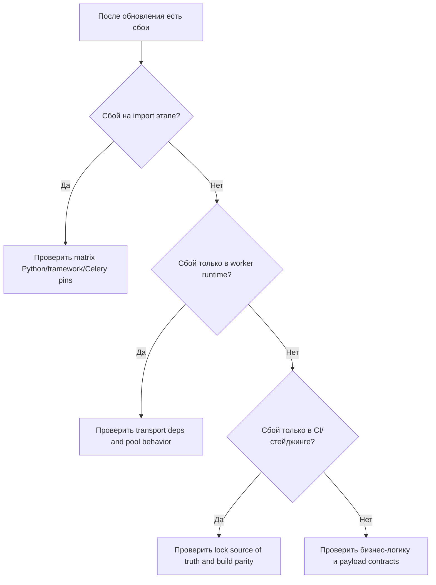
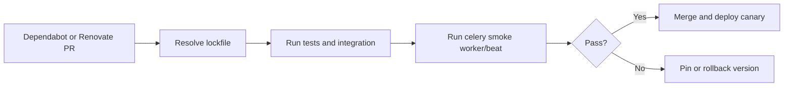

[← Назад к индексу части](index.md)
[↑ К глобальному плану](../../mastery_plan.md)

## 27.2 Optional extras и матрица совместимости

### Цель раздела

Научиться управлять зависимостями осознанно: какие extras реально нужны, какие конфликты типичны и как держать стабильный upgrade-процесс.

### В этом разделе главное

- extras добавляют функциональность, но также добавляют риски конфликтов;
- совместимость проверяется матрицей, а не "на одной машине работает";
- pinning должен быть явной политикой, а не случайным набором ограничений;
- автоматические апдейты полезны только вместе с тестами и контролем релизов.

### Теория и правила

1. **Extras подключаются под транспорт/интеграцию.**  
   Пример: `celery[redis]` подтягивает Redis-клиент и его транзитивные зависимости.

2. **Совместимость многомерная.**  
   Важны одновременно: версия Python, Celery, Kombu/Billiard, framework (Django/FastAPI), ORM/DB-client.

3. **Pinning policy.**  
   Обычно фиксируют major/minor критичных библиотек и используют lock-файл для точных патч-версий.

4. **Политика обновлений.**  
   Dependabot/Renovate открывают PR, но принимаются они только после тестов совместимости и smoke-run worker/beat.

### Частая путаница в extras

Важно различать:

- `celery[redis]` как набор Python-зависимостей для Redis-транспорта;
- фактическую архитектурную роль Redis: broker, backend или оба сразу;
- наличие Redis в проекте как кэша и Redis как транспортного слоя Celery (это разные риски и политики).

Аналогично для `celery[sqs]`: установка extra не равна production-ready настройке IAM, visibility timeout и retry semantics.

### Таблица extras (ориентир)

| Extra | Когда нужен | Что тянет / риск |
|---|---|---|
| `celery[redis]` | Redis как broker/backend | версия redis-клиента и TLS/URL-совместимость |
| `celery[sqs]` | AWS SQS transport | boto-зависимости, IAM/region-настройки |
| `celery[zookeeper]` | специфические сценарии coordination/legacy | редко встречается, требует аккуратной валидации |
| `celery[solar]` | solar schedule сценарии | узкоспециализированно, проверять фактическую нужность |

### Что реально тянет extras (практическая декомпозиция)

Идея, которую важно усвоить: extra добавляет не "фичу Celery", а **цепочку зависимостей**, каждая из которых имеет свой релизный цикл и свои риски.

```text
celery[sqs]
  -> transport adapter
  -> AWS SDK dependencies
  -> auth/region/retry behavior
  -> runtime semantics (visibility timeout, redelivery profile)
```

Поэтому вопрос "ставим ли extra?" всегда должен сопровождаться вопросом "готовы ли мы поддерживать всё дерево зависимостей и операционные последствия?"

### Отдельно про `celery[zookeeper]` и `celery[solar]`

Эти extras часто упоминают "для полноты", но в реальных production-контурах встречаются заметно реже, чем `redis`/`sqs`:

- `celery[zookeeper]` обычно относится к более нишевым или legacy-сценариям, где уже есть соответствующий инфраструктурный контур;
- `celery[solar]` полезен в узких задачах календарно-астрономического расписания, но редко нужен большинству backend-команд.

Практический вывод:
- не подключай их “на вырост”;
- если подключаешь, обязательно заводи отдельный integration-тест именно под этот контур;
- документируй, почему выбран этот путь и какой у него owner в команде.

### Быстрый decision-check по extras

| Вопрос | Если "нет" | Что делать |
|---|---|---|
| Есть реальный use-case для этого транспорта/фичи? | лишний complexity cost | не подключать extra заранее |
| Есть integration-тест в окружении близком к реальному? | риск скрытой несовместимости | добавить test-first перед внедрением |
| Есть владелец зависимости и политика обновлений? | бесхозный техдолг | назначить ownership |
| Понимаем transport-ограничения в проде? | ложные ожидания от Celery | зафиксировать ограничения в runbook |

#### Проверь себя: decision-check extras

1. Почему отсутствие owner для extra — это не “организационная мелочь”?

<details><summary>Ответ</summary>

Без owner зависимость остаётся без системного сопровождения: апдейты, инциденты и изменения ограничений не закрываются предсказуемо.

</details>

2. Какой минимальный набор до внедрения extra считается разумным?

<details><summary>Ответ</summary>

Use-case, integration-тест под нужный transport, определённый owner и базовый rollback-план.

</details>

### Пошаговый алгоритм выбора extra перед внедрением

1. Зафиксируй конкретный сценарий: какую проблему extra должен решить.
2. Выпиши новые транзитивные зависимости и их release cadence.
3. Проверь совместимость с текущим framework/ORM/Python matrix.
4. Добавь integration-тест под целевой transport (не только unit).
5. Включи canary rollout и заранее определи rollback trigger.
6. Назначь владельца сопровождения (кто принимает будущие апдейты).

Если на шагах 3-6 есть "непонятно", внедрение лучше отложить до закрытия рисков.

### Матрица совместимости (шаблон)

| Python | Celery | Kombu/Billiard | Framework | Статус |
|---|---|---|---|---|
| 3.11 | 5.x | pinned stable set | Django 4.x | validated |
| 3.12 | 5.x | candidate set | FastAPI latest | test required |
| 3.10 | 5.x | legacy support set | DRF stack | maintenance only |

### Типовые конфликтные зоны со стеком приложения

| Контур | Что конфликтует | Симптом |
|---|---|---|
| **Django/DRF** | несовместимые версии пакетов сериализации/HTTP-клиентов | задачи падают на import/runtime в worker, хотя web жив |
| **FastAPI** | рассинхрон async-библиотек и зависимостей worker-кода | локально async-часть работает, worker режим нестабилен |
| **SQLAlchemy** | lifecycle engine/session в форкнутых процессах | случайные connection-падения и pool corruption |
| **Pydantic/typing stack** | изменения моделей между версиями | несовместимость payload validation между сервисом и worker |

### Диагностическое дерево конфликтов зависимостей



Эта схема нужна для быстрой локализации: она уменьшает риск "чинить не тот слой".

### Anti-pattern: ложная совместимость

Частая ошибка — решить, что "всё совместимо", потому что:
- сервис поднялся;
- unit-тесты зелёные;
- одна smoke-задача выполнилась.

Это ещё не гарантирует стабильность в production.  
Ложная совместимость обычно проявляется позже: под нагрузкой, на другой архитектуре, в другом runtime Python или при failover брокера.

Минимальная защита:
1. transport-aware integration тест;
2. canary под реальным профилем нагрузки;
3. мониторинг SLO drift после dependency-релиза.

### Pinning: major vs minor для Celery/Kombu/Billiard

Рекомендуемая логика:

- **major pin** (`5.*`) подходит, когда команда быстро обновляется и имеет сильный регрессионный контур;
- **minor pin** (`5.4.*`) снижает риск неожиданного функционального сдвига;
- для `kombu` и `billiard` лучше явно фиксировать согласованный диапазон, а не оставлять "как подтянется", потому что они критичны для транспорта и процессов.

Практический компромисс: фиксировать Celery на minor, а транзитивные критичные зависимости полностью lock'ать до патч-уровня.

### Пошагово: как внедрить рабочую dependency-policy

1. Определить поддерживаемые версии Python и основных framework'ов.
2. Зафиксировать базовый стек Celery (`celery`, `kombu`, `billiard`) и extras.
3. Сформировать lock-файл для каждого целевого окружения.
4. Настроить bot-апдейты с правилом "одно изменение группы за PR".
5. Добавить регрессионный pipeline: unit + integration + smoke worker.
6. Вести changelog рисков: что обновили, какой impact ожидали, что проверили.

### Граничные случаи совместимости (часто недооценивают)

- **Пустой lock-файл в новом окружении CI:** локально всё работает за счёт кеша, в CI внезапно подтягиваются другие транзитивные версии.
- **Смешанный runtime Python (`3.10` на одной среде и `3.12` на другой):** одна и та же dependency-policy может вести себя по-разному.
- **Framework обновился, Celery-слой нет:** web-часть "зелёная", а worker падает на импортах/валидации payload.
- **SQS/Redis transport меняется без пересмотра таймаутов и retry-политик:** функционально "работает", но SLA деградирует.

### Политика Dependabot/Renovate (рабочий каркас)

```text
1) Группировать PR:
   - отдельная группа для Celery-core стека (celery/kombu/billiard/amqp)
   - отдельная группа для framework-зависимостей
   - отдельная группа для tooling

2) Ограничивать частоту:
   - не более N critical dependency PR одновременно

3) Обязательные gates:
   - unit + integration + worker smoke
   - проверка changelog/release notes для major/minor
   - canary deploy для dependency-группы
```

#### Проверь себя: политика обновлений

1. Почему major/minor изменения требуют чтения release notes, даже если тесты зелёные?

<details><summary>Ответ</summary>

Потому что тесты не всегда покрывают все эксплуатационные пути. Release notes часто содержат изменения поведения, deprecation и ограничения, которые проявятся позже.

</details>

2. Что даёт лимит числа одновременных dependency-PR?

<details><summary>Ответ</summary>

Он сохраняет качество ревью и диагностики: проще отслеживать причинно-следственную связь между изменением и регрессией.

</details>


### Минимальный регрессионный контур для апдейтов зависимостей

```text
Tier 1 (быстрый): import + lint + unit
Tier 2 (средний): integration с реальным transport
Tier 3 (критичный): canary worker under load 15-30 минут
Tier 4 (после релиза): мониторинг SLO drift и rollback trigger
```

Этот контур полезен тем, что разделяет "код работает" и "экосистема зависимостей стабильна".

### Rollout/rollback шаблон для dependency-апдейта

```text
Rollout:
1) Merge dependency PR после всех tiers
2) Deploy canary worker group (5-10% нагрузки)
3) Наблюдать lag/error/retry метрики 30-60 минут
4) При норме -> расширить rollout до 100%

Rollback trigger:
- резкий рост retry amplification
- нарушение queue wait SLO
- новые import/runtime exceptions в worker logs

Rollback action:
1) откатить lockfile и image tag
2) вернуть предыдущую стабильную группу worker
3) зафиксировать incident note и корневую причину
```

### Мини-template changelog для dependency PR

```text
Dependency change:
- What changed: <package and version>
- Why changed: <security/fix/feature>
- Risk class: <low/medium/high>
- Tested on: <tiers completed>
- Canary result: <ok/issues>
- Rollback plan: <previous lock/image tag>
```

Такой шаблон дисциплинирует ревью и упрощает пост-инцидентный анализ.

### Mermaid: поток безопасного обновления



### Что будет, если...

Если extra добавлен "просто потому что может пригодиться":
- увеличивается поверхность уязвимостей и конфликтов;
- возрастает время сборки и поддержки;
- команде сложнее локализовать источник проблемы при инциденте.

Если pinning слишком "свободный" и нет multi-tier регрессии:
- появляются плавающие баги между средами;
- откат занимает больше времени из-за неочевидной первопричины.

### Простыми словами

Extras и версии — это как детали в двигателе. Можно поставить "новую", но если она не совместима с остальным блоком, машина заведётся, а потом заглохнет на трассе.

### Практика / реальные сценарии

- **Сценарий "апдейт Redis-клиента":** тесты проходят локально, но ломается TLS в staging.  
  Вывод: нужен integration-тест с реальным transport-конфигом.

- **Сценарий "быстрый апдейт Celery":** из-за незафиксированного транзитивного пакета меняется поведение serialization.  
  Вывод: lock-файл и canary обязательны.

### Типичные ошибки

- ставить extras "про запас", без реального use-case;
- не документировать поддерживаемую матрицу версий;
- позволять bot-ам обновлять сразу много критичных пакетов в одном PR;
- не иметь откатной политики на случай регрессии.

### Что будет если...

Без dependency governance:
- каждое обновление станет лотереей;
- появятся "неуловимые" баги только в определённой среде;
- время восстановления после неудачного апдейта вырастет.

### Проверь себя

1. Почему lock-файл не заменяет матрицу совместимости?

<details><summary>Ответ</summary>

Lock-файл фиксирует конкретный набор версий, но не отвечает на вопрос, какие комбинации в принципе поддерживаются и протестированы в разных окружениях.

</details>

2. Когда `celery[redis]` может быть плохим выбором "по умолчанию"?

<details><summary>Ответ</summary>

Когда транспорт Redis фактически не используется или у проекта другие требования к брокеру. Лишние extras увеличивают attack surface и сложность зависимостей.

</details>

3. Зачем нужен canary после зелёного CI?

<details><summary>Ответ</summary>

Потому что часть проблем проявляется только под реальной нагрузкой и реальным транспортом в среде, близкой к production.

</details>

4. Почему для Celery-зависимостей опасно обновлять "всё одним большим PR"?

<details><summary>Ответ</summary>

Потому что при регрессии сложно локализовать виновника среди десятков изменений. Разделение по dependency-группам ускоряет диагностику и откат.

</details>

### Запомните

Совместимость — это процесс управления риском, а не разовая таблица в документации.

---
