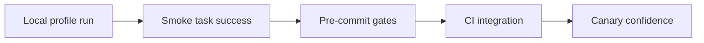
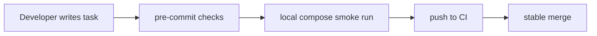

[← Назад к индексу части](index.md)
[↑ К глобальному плану](../../mastery_plan.md)

## 27.4 Локальная разработка и DX

### Цель раздела

Организовать предсказуемый локальный контур, чтобы разработчики запускали Celery одинаково и ловили проблемы раньше production.

### В этом разделе главное

- локальный контур должен быть максимально близок к реальному, но не перегруженным;
- docker-compose профили ускоряют запуск сценариев;
- Makefile/just дают единые команды для команды;
- pre-commit снижает количество регрессий в task-коде.

### Теория и правила

1. **Профили окружения.**  
   Например: минимальный профиль (app + redis), расширенный профиль (app + redis + flower + beat).

2. **Единые команды запуска.**  
   Разработчик не должен помнить длинные CLI-команды Celery вручную.

3. **Shift-left проверки качества.**  
   Линтер, форматтер, typecheck и базовые smoke-тесты выполняются до push.

4. **Документированная точка входа.**  
   `README` + `make help`/`just --list` должны объяснять "как стартовать за 5 минут".

5. **Профили по типу брокера.**  
   Полезно иметь отдельные DX-профили: `redis-only`, `broker-only` (например, RabbitMQ), `full`, чтобы быстро тестировать transport-specific поведение.

### Пример compose-профилей (идея)

```yaml
services:
  redis:
    image: redis:7
    profiles: ["core", "redis-only", "full"]

  rabbitmq:
    image: rabbitmq:3-management
    profiles: ["broker-only", "full"]

  app:
    build: .
    depends_on: [redis]
    profiles: ["core", "redis-only", "full"]

  worker_redis:
    build: .
    command: celery -A myproj worker -l info
    depends_on: [redis]
    profiles: ["core", "redis-only", "full"]

  worker_amqp:
    build: .
    command: celery -A myproj worker -l info
    depends_on: [rabbitmq]
    profiles: ["broker-only", "full"]

  beat:
    build: .
    command: celery -A myproj beat -l info
    depends_on: [redis]
    profiles: ["full"]
```

Комментарий к профилям:
- `redis-only` — быстрые локальные проверки Redis transport;
- `broker-only` — сценарии для AMQP/RabbitMQ без лишних сервисов;
- `full` — приближенный интеграционный контур.

### Пример Makefile/just-стиля команд

```makefile
.PHONY: worker beat compose-up lint typecheck test

compose-up:
	docker compose --profile core up -d

worker:
	celery -A myproj worker -l info

beat:
	celery -A myproj beat -l info

lint:
	ruff check .

typecheck:
	mypy myproj
```

### Pre-commit для Celery-проекта (минимум)

| Проверка | Зачем |
|---|---|
| `ruff/flake8` | поймать ошибки и smell до CI |
| `black/isort` | единообразный стиль |
| `mypy/pyright` | типобезопасность сигнатур задач |
| легкий smoke-test Celery import | не сломали ли app/registry |

#### Проверь себя: pre-commit блок

1. Почему smoke-import Celery app должен быть в pre-commit, а не только в CI?

<details><summary>Ответ</summary>

Он даёт максимально раннюю обратную связь: ошибки инициализации/регистрации ловятся до push, уменьшая шум в CI и ускоряя цикл исправления.

</details>

2. Как pre-commit связан с надёжностью production-контуров?

<details><summary>Ответ</summary>

Через снижение доли очевидных дефектов, доходящих до релизного контура. Чем больше ошибок отсекается локально, тем устойчивее pipeline.

</details>

### Мини runbook локального старта (DX)

```text
Шаг 1: make compose-up (или профиль redis-only / broker-only)
Шаг 2: make worker
Шаг 3: отправить smoke-задачу
Шаг 4: проверить, что задача дошла и исполнилась
Шаг 5: make lint && make typecheck
```

Если smoke-задача не исполнилась:
1) проверить broker URL и профиль compose;  
2) проверить импорт Celery app;  
3) проверить, что нужный queue routing совпадает с worker-подпиской.

### Граничные случаи в DX-контуре

- **На macOS/Linux разная файловая семантика volume-монтажа:** локально могут отличаться тайминги старта и поведение watcher-скриптов.
- **Переменные окружения в shell есть, а в compose-профиле нет:** задача запускается из терминала, но падает в контейнере.
- **Разные команды используют `make`, другие — `just`, третьи — ручной запуск:** через месяц появляется три "правильных" способа старта.

#### Проверь себя: граничные DX-случаи

1. Почему “works on my machine” в этой части чаще связано с конфигурацией, чем с кодом?

<details><summary>Ответ</summary>

Потому что различия в env/compose/profile/lock-source формируют разное поведение рантайма даже при одинаковом коде.

</details>

2. Какой первый шаг снижает риск DX-дрейфа в команде?

<details><summary>Ответ</summary>

Один официальный запускной путь и единая документация, синхронизированные с CI smoke-процедурой.

</details>

### Как запомнить раздел 27.4

Опорная формула:

```text
Один репозиторий -> один способ запуска -> один источник зависимостей -> одна проверяемая цепочка до CI
```

Если один из "один" исчезает, локальная предсказуемость быстро деградирует.

### DX-диаграмма "локальная проверка -> CI -> production confidence"



### Troubleshooting в локальном DX: быстрый маршрут

```text
1) Проверить профиль compose (core/redis-only/broker-only/full)
2) Проверить env variables в контейнере, а не только в shell
3) Проверить queue routing и worker subscription
4) Проверить lock source (poetry/pip-tools/uv) совпадает ли с CI
5) Перезапустить минимальный профиль и повторить smoke task
```

### Пример pre-commit конфигурации (минимум)

```yaml
repos:
  - repo: https://github.com/astral-sh/ruff-pre-commit
    rev: v0.6.2
    hooks:
      - id: ruff
      - id: ruff-format
  - repo: https://github.com/pre-commit/mirrors-mypy
    rev: v1.11.2
    hooks:
      - id: mypy
        additional_dependencies: ["types-redis"]
```

Смысл примера: pre-commit в Celery-проекте должен быть не "формальностью", а ранним фильтром ошибок, которые иначе проявятся уже в worker-runtime.

### Mermaid: поток локальной DX



### Простыми словами

DX — это "трение" в ежедневной работе. Если запуск Celery локально сложный, команда будет обходить проверки, а ошибки попадут в поздние этапы.

### Практика / реальные сценарии

- **Сценарий "новичок в команде":** за 10 минут поднимает `core` профиль и запускает первую задачу.
- **Сценарий "сломали импорт tasks":** pre-commit smoke-check блокирует commit до CI.
- **Сценарий "нужен только worker без beat":** профиль `core` не тянет лишние сервисы и ускоряет цикл разработки.
- **Сценарий "transport-баг проявляется только на RabbitMQ":** профиль `broker-only` позволяет быстро локализовать проблему без полного стенда.

### Типичные ошибки

- одна "магическая" локальная инструкция у каждого разработчика;
- отсутствие единых команд и профилей;
- слишком тяжёлый локальный контур, из-за чего команда перестаёт его поднимать;
- отсутствие pre-commit проверок для task-кода.

### Что будет если...

Если DX не стандартизирован:
- увеличится время онбординга;
- баги совместимости всплывут только в CI/стейджинге;
- команда начнёт обходить локальные проверки "чтобы быстрее".

### Проверь себя

1. Почему полезно иметь минимум два compose-профиля (`core` и `full`)?

<details><summary>Ответ</summary>

Это баланс скорости и полноты: для ежедневной разработки хватает `core`, для интеграционных сценариев используется `full`, без лишней нагрузки каждый раз.

</details>

2. Что должен гарантировать pre-commit минимум в Celery-проекте?

<details><summary>Ответ</summary>

Что базовое качество и исполнимость кода задач проверены до push: стиль, типы и как минимум корректный импорт/инициализация Celery app.

</details>

3. Чем `make worker` лучше "длинной команды из чата"?

<details><summary>Ответ</summary>

Повторяемостью: команда зафиксирована в репозитории, едина для всех и не теряется со временем.

</details>

4. Зачем нужны отдельные профили `redis-only` и `broker-only`, если есть `full`?

<details><summary>Ответ</summary>

Они ускоряют целевые проверки конкретного транспорта и снижают шум: можно быстро воспроизвести класс проблемы без подъёма всего окружения.

</details>

### Запомните

Хорошая DX-практика экономит не минуты, а недели на масштабе команды.

---
