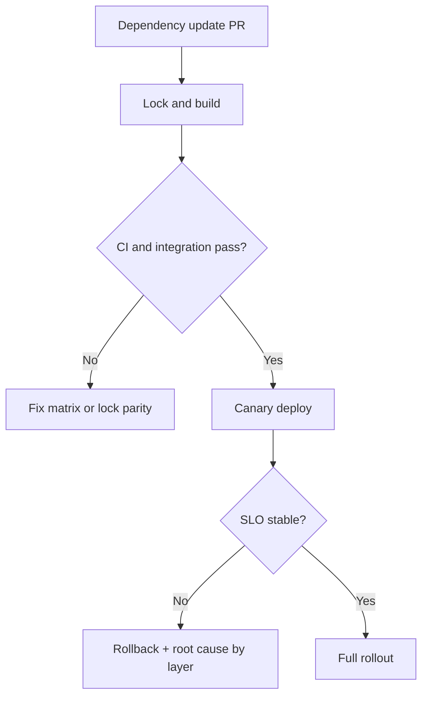

[← Назад к индексу части](index.md)
[↑ К глобальному плану](../mastery_plan.md)

## Сквозной интеграционный кейс (27.1-27.4 вместе)

### Ситуация

Команда обновляет `celery[redis]`, переходит на новый базовый Docker-образ и замечает:
- часть worker-ов стабильно стартует;
- часть падает только в CI/staging;
- в production растёт retry и queue wait.

### Как разбирать по шагам

1. **`27.1` (роли стека):** отделить transport-ошибки от process-pool и от task-кода.
2. **`27.2` (совместимость):** проверить matrix Python/framework и lock source of truth.
3. **`27.3` (сборка):** сравнить SBOM/образ до и после, проверить multi-arch и policy gates.
4. **`27.4` (DX):** воспроизвести проблему через `redis-only` профиль и smoke-runbook.
5. Запустить canary rollback decision по заранее заданным trigger'ам.

### Диаграмма разбора кейса

### Ключевой вывод кейса

Проблема почти никогда не решается в одном месте.  
Стабильность части 27 — это связка: **границы ответственности + совместимость + reproducible build + дисциплина локального воспроизведения**.

#### Проверь себя: интеграционный кейс

1. Почему в кейсе нельзя начать сразу с изменения retry-параметров worker?

Ответ

Потому что симптомы могут быть вызваны несовместимостью зависимостей или рассинхроном сборки. Изменение retry без локализации слоя проблемы может усилить шум и затянуть инцидент.

2. Какой ключевой сигнал говорит, что canary нужно откатывать, а не расширять?

Ответ

Устойчивое ухудшение SLO/SLI (рост queue wait, retry amplification, runtime exceptions), которое появилось после dependency-релиза и не объясняется внешними факторами.

---
