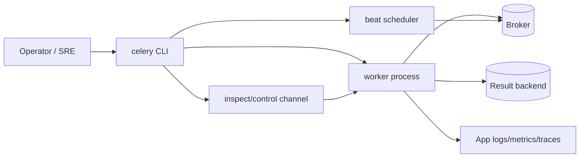

[← Назад к индексу части](index.md)
[↑ К глобальному плану](../celery_mastery_plan.md)

## Сквозная модель CLI-операций Celery

**Интуиция:** у вас есть «один терминал», но он воздействует на разные уровни системы.  
**Формулировка:** CLI-команды Celery делятся на:

- команды **запуска runtime** (`worker`, `beat`);
- команды **наблюдения** (`inspect`, `events`);
- команды **изменения состояния** (`control`, `revoke`, `purge`);
- команды **операционного сервиса** (`report`, `multi`).

**Картинка в голове:** как cockpit самолета — приборы (inspect/events), рычаги управления (control), аварийные переключатели (purge/terminate) и система запуска двигателей (worker/beat). Нельзя дергать все подряд без процедуры.

#### Проверь себя: сквозная модель

1. Почему `report` и `inspect` относятся к разным классам полезности, хотя обе команды диагностические?

Ответ

`inspect` показывает текущее живое состояние worker-ов и задач, а `report` фиксирует контекст окружения и конфигурации. Вместе они дают и динамику, и статический снимок среды.

2. Какой риск появляется, если использовать только команды управления (`control`) без этапа наблюдения?

Ответ

Можно принять неверное решение и усилить инцидент: например, остановить не тот worker или изменить лимиты не для той очереди.

---
